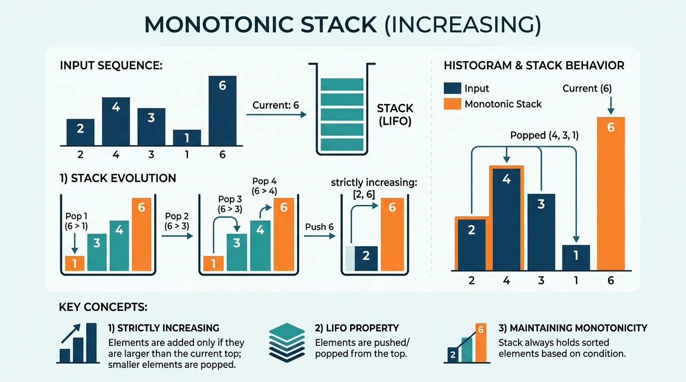

# Pattern 19: Monotonic Stack

A large family of array problems asks the same underlying question in different costumes: <b>for each element, what is the next (or previous) element that is greater (or smaller) than it?</b> "How many days until a warmer day", "how far right can this bar stretch before a shorter bar stops it", "which car eventually blocks this car" — they are all the same question. Let us start with the most literal version of it:

> Given an array, for every element find the first element to its right that is <i>strictly greater</i> than it. If there is no such element, report `-1`.

The <b>brute-force</b> algorithm is the obvious one: stand on each element and scan forward until you find something bigger.



````js
function nextGreaterBruteForce(arr) {
  const result = new Array(arr.length).fill(-1)

  for (let i = 0; i < arr.length; i++) {
    //scan forward looking for the first bigger number
    for (let j = i + 1; j < arr.length; j++) {
      if (arr[j] > arr[i]) {
        result[i] = arr[j]
        break
      }
    }
  }

  return result
}

console.log(JSON.stringify(nextGreaterBruteForce([2, 1, 2, 4, 3])))//[4,2,4,-1,-1]
console.log(JSON.stringify(nextGreaterBruteForce([5, 4, 3, 2, 1])))//[-1,-1,-1,-1,-1]
````

<b>Time complexity: </b> the inner scan can run to the end of the array for every element, so the time complexity is `O(N^2)`, where `N` is the number of elements in the input array. On a strictly decreasing array like `[5, 4, 3, 2, 1]` we do the full quadratic work and find nothing at all.

#### Can we find a better solution? Do you see any inefficiency in the above approach?

The inefficiency is that we <b>re-scan the same region over and over</b>. In `[5, 4, 3, 2, 1, 7]`, the element `5` scans past `4, 3, 2, 1` to reach `7`; then `4` scans past `3, 2, 1` to reach `7`; then `3` scans past `2, 1`... Every element independently walks over the same run of smaller numbers. But notice something: the moment `7` appears, it is <i>simultaneously</i> the answer for all five of them. We did five separate walks to learn one fact.

The fix is to stop scanning forward and instead keep a <b>stack of elements that are still waiting for an answer</b>. As we sweep left to right, we push each element onto the stack. An element sits on the stack precisely as long as we have not yet seen anything greater than it. When a new element arrives that <i>is</i> greater than the top of the stack, we have found the top's answer, so we pop it and record it — and we keep popping, because the new element may resolve several waiting elements at once.

The crucial consequence: the elements left on the stack are always in <b>monotonic order</b>. Nothing on the stack is ever smaller than something above it, because the smaller one would have been popped the moment the larger arrived. This is what gives the pattern its name — the stack is not just a stack, it is a stack that maintains a sorted invariant, and that invariant is what makes the algorithm correct.

Because <b>each element is pushed exactly once and popped at most once</b>, the total number of stack operations across the whole run is at most `2N`. The inner `while` loop looks nested, but it is not doing nested work — it is doing <i>amortized</i> work, spending pops that were paid for by earlier pushes. So the algorithm is `O(N)` instead of `O(N^2)`.

### Increasing or decreasing? How to decide

This is the part people get wrong, and it is worth memorizing the rule rather than guessing every time. The trick is to ask <b>what the arriving element is allowed to destroy</b>:

- If you want the <b>next GREATER</b> element, you pop while the stack top is <i>smaller</i> than the arriving element. Whatever survives is therefore non-increasing, so you are maintaining a <b><i>decreasing</i> (monotonically non-increasing) stack</b>.
- If you want the <b>next SMALLER</b> element, you pop while the stack top is <i>greater</i> than the arriving element. Whatever survives is non-decreasing, so you are maintaining an <b><i>increasing</i> (monotonically non-decreasing) stack</b>.

Said even more briefly: <b>the popping condition is the answer you want, and the stack order is the opposite of it</b>. Want greater? Pop the smaller ones, keep a decreasing stack. Want smaller? Pop the greater ones, keep an increasing stack.

Two more details worth internalizing, because every problem below is a variation on them:

1. <b>Store indices, not values</b>, whenever the answer involves a <i>distance</i> or a <i>width</i> rather than just a value. `Daily Temperatures`, `Trapping Rain Water` and `Largest Rectangle in Histogram` all need `i - j` arithmetic, so they must push indices.
2. <b>The element below the popped one is the other boundary.</b> When you pop element `x` because element `i` arrived, `i` is the nearest greater/smaller element on `x`'s <i>right</i>, and the new stack top is the nearest one on `x`'s <i>left</i>. Getting both boundaries from a single pop is what makes the histogram and rain-water problems collapse into one pass.
3. <b>Leftovers need a plan.</b> Elements still on the stack when the sweep ends never found their answer. Depending on the problem you either fill them with a default (`-1`), or drain them with a <b>sentinel</b> value appended past the end of the array (`0` for the histogram), or make a second wrap-around pass (the circular variant).

## Next Greater Element I (easy)
https://leetcode.com/problems/next-greater-element-i/

> The <b>next greater element</b> of some element `x` in an array is the <b>first greater element that is to the right of `x`</b> in the same array.
>
> You are given two <b>distinct 0-indexed</b> integer arrays `nums1` and `nums2`, where `nums1` is a <b>subset</b> of `nums2`.
>
> For each `0 <= i < nums1.length`, find the index `j` such that `nums1[i] === nums2[j]` and determine the <b>next greater element</b> of `nums2[j]` in `nums2`. If there is no next greater element, then the answer for this query is `-1`.
>
> Return an array `ans` of length `nums1.length` such that `ans[i]` is the next greater element as described above.

This is the <b>core template</b> for the whole pattern, so it is worth reading slowly — every later problem is this loop with a different accounting step in the middle.

We want the <b>next greater</b> element, so by the rule above we pop while the stack top is smaller than the arriving element, which means the stack stays in <b>decreasing</b> order. The only extra wrinkle here is the indirection through `nums1`: the answers are defined over `nums2`, but we only have to report a subset of them. Since the problem guarantees the values are <b>distinct</b>, we can solve the whole of `nums2` first and store `value -> nextGreater` in a <b>HashMap</b>, then simply look up each element of `nums1`. That guarantee about distinctness is what makes keying the map by value (rather than by index) safe.

For this problem the stack can hold plain values, because the answer is a value and no distance arithmetic is involved.

````js
function nextGreaterElement(nums1, nums2) {
  //value -> its next greater element inside nums2
  const nextGreater = new Map()

  //the stack holds values in DECREASING order
  const stack = []

  for (let i = 0; i < nums2.length; i++) {
    const current = nums2[i]

    //current breaks the decreasing order, so it is the answer
    //for every smaller value still waiting on the stack
    while (stack.length > 0 && stack[stack.length - 1] < current) {
      const smaller = stack.pop()
      nextGreater.set(smaller, current)
    }

    stack.push(current)
  }

  //whatever is left never found anything greater to its right
  while (stack.length > 0) {
    nextGreater.set(stack.pop(), -1)
  }

  //nums1 is a subset of nums2, so every lookup is a hit
  return nums1.map((num) => nextGreater.get(num))
}

console.log(JSON.stringify(nextGreaterElement([4, 1, 2], [1, 3, 4, 2])))//[-1,3,-1]
console.log(JSON.stringify(nextGreaterElement([2, 4], [1, 2, 3, 4])))//[3,-1]
console.log(JSON.stringify(nextGreaterElement([1, 3, 5, 2, 4], [6, 5, 4, 3, 2, 1, 7])))//[7,7,7,7,7]
console.log(JSON.stringify(nextGreaterElement([5], [5])))//[-1]
console.log(JSON.stringify(nextGreaterElement([], [1, 2, 3])))//[]
````

That third example is the one that shows off the pattern. `nums2` is `[6, 5, 4, 3, 2, 1, 7]`, so the stack grows to hold all six decreasing values, and then the single arrival of `7` pops all six in one burst. The <b>brute force</b> would have walked the tail of the array six separate times.

- The <b>time complexity</b> of the above algorithm is `O(N + M)`, where `N` is the length of `nums2` and `M` is the length of `nums1`. Each of the `N` elements is pushed once and popped at most once, and the final mapping over `nums1` costs `O(M)`.
- The <b>space complexity</b> is `O(N)` for the <b>HashMap</b> and the stack, which in the worst case (a strictly decreasing `nums2`) holds every element at the same time.

## Next Greater Element II (medium)
https://leetcode.com/problems/next-greater-element-ii/

> Given a <b>circular integer array</b> `nums` (i.e., the next element of `nums[nums.length - 1]` is `nums[0]`), return the <b>next greater number</b> for every element in `nums`.
>
> The <b>next greater number</b> of a number `x` is the first greater number to its <i>traversing-order</i> next in the array, which means you could search circularly to find its next greater number. If it doesn't exist, return `-1` for this number.

This is <b>[Next Greater Element I](#next-greater-element-i-easy)</b> with the array bent into a ring, and it is a nice illustration of how little the template has to change to absorb a new constraint.

The only thing the circularity changes is what happens to the <b>leftovers</b>. In the linear version, anything still on the stack at the end genuinely has no answer. Here, those elements get a second chance: they may find their next greater element by wrapping around to the front of the array. So instead of draining the stack into `-1`, we simply <b>keep sweeping for another full lap</b>, using `i % n` to index.

Two details make this correct. First, we only <b>push during the first lap</b> — the second lap exists purely to resolve elements left over from the first, and pushing again would let an element find an "answer" more than one full revolution away. Second, we must store <b>indices</b> now rather than values, because after wrapping we need to write into `result[originalIndex]`, and duplicate values are allowed in this problem so a value-keyed map would be ambiguous. Anything still unresolved after two laps truly has no greater element anywhere in the ring, and the `-1` we pre-filled stands.

````js
function nextGreaterElements(nums) {
  const n = nums.length
  const result = new Array(n).fill(-1)

  //stack of INDICES whose values are in decreasing order
  const stack = []

  //walk the array twice to simulate the wrap-around
  for (let i = 0; i < 2 * n; i++) {
    const current = nums[i % n]

    while (stack.length > 0 && nums[stack[stack.length - 1]] < current) {
      result[stack.pop()] = current
    }

    //only push on the first pass, the second pass exists
    //purely to resolve the leftovers from the first
    if (i < n) {
      stack.push(i)
    }
  }

  return result
}

console.log(JSON.stringify(nextGreaterElements([1, 2, 1])))//[2,-1,2]
console.log(JSON.stringify(nextGreaterElements([1, 2, 3, 4, 3])))//[2,3,4,-1,4]
console.log(JSON.stringify(nextGreaterElements([5, 4, 3, 2, 1])))//[-1,5,5,5,5]
console.log(JSON.stringify(nextGreaterElements([2, 2, 2])))//[-1,-1,-1]
console.log(JSON.stringify(nextGreaterElements([])))//[]
````

Notice `[2, 2, 2]` returns all `-1`. The comparison is `<`, i.e. <i>strictly</i> greater, so equal elements never resolve each other — a detail that quietly decides several of the problems below.

- The <b>time complexity</b> of the above algorithm is `O(N)`, where `N` is the number of elements in `nums`. We iterate `2N` times and each index is still pushed once and popped at most once, so the constant factor doubles but the asymptotics do not change.
- The <b>space complexity</b> is `O(N)` for the stack and the result array.

## Daily Temperatures (medium)
https://leetcode.com/problems/daily-temperatures/

> Given an array of integers `temperatures` that represents the daily temperatures, return an array `answer` such that `answer[i]` is the <b>number of days you have to wait after the `i`th day to get a warmer temperature</b>. If there is no future day for which this is possible, keep `answer[i] === 0` instead.

This problem is <b>Next Greater Element</b> asking for the <i>distance</i> to the answer rather than the answer itself, and it is the cleanest possible demonstration of detail #1 from the intro: <b>when the answer is a distance, push indices</b>.

Everything else is identical. We still want the next <i>greater</i> temperature, so we still pop while the top of the stack is colder than today, and the stack still stays <b>decreasing</b>. The only change is what we write down when we pop: instead of recording the arriving value, we record `day - colderDay`, the gap between the two indices. And instead of filling leftovers with `-1`, the default is `0`, which the `fill(0)` handles for free — a day with no warmer day ahead of it simply keeps its initial value.

It is worth reading the stack as a queue of unfinished business: at any moment it holds exactly the days that are <i>still waiting</i> for a warmer day, and they are necessarily in decreasing temperature order, because a warmer day would have already discharged the colder ones below it.

````js
function dailyTemperatures(temperatures) {
  const n = temperatures.length
  const answer = new Array(n).fill(0)

  //stack of DAY INDICES with decreasing temperatures
  const stack = []

  for (let day = 0; day < n; day++) {
    const today = temperatures[day]

    //today is warmer than every colder day still on the stack,
    //and the distance is simply the difference of the two indices
    while (stack.length > 0 && temperatures[stack[stack.length - 1]] < today) {
      const colderDay = stack.pop()
      answer[colderDay] = day - colderDay
    }

    stack.push(day)
  }

  return answer
}

console.log(JSON.stringify(dailyTemperatures([73, 74, 75, 71, 69, 72, 76, 73])))//[1,1,4,2,1,1,0,0]
console.log(JSON.stringify(dailyTemperatures([30, 40, 50, 60])))//[1,1,1,0]
console.log(JSON.stringify(dailyTemperatures([30, 60, 90])))//[1,1,0]
console.log(JSON.stringify(dailyTemperatures([90, 80, 70])))//[0,0,0]
console.log(JSON.stringify(dailyTemperatures([50, 50, 50])))//[0,0,0]
console.log(JSON.stringify(dailyTemperatures([])))//[]
````

The two degenerate cases are instructive. A strictly <b>increasing</b> input `[30, 40, 50, 60]` never lets the stack grow beyond one element — every arrival immediately pops its predecessor. A strictly <b>decreasing</b> input `[90, 80, 70]` never pops anything at all, so the stack grows to size `N` and every answer stays `0`. Those are exactly the two extremes of the space usage.

- The <b>time complexity</b> of the above algorithm is `O(N)`, where `N` is the number of days. Each day is pushed onto the stack once and popped at most once, so the `while` loop performs at most `N` pops in total across the entire outer loop.
- The <b>space complexity</b> is `O(N)` for the stack, which in the worst case of a monotonically decreasing temperature series holds every day at once. Ignoring the output array, that is the only extra space used.

## Remove K Digits (medium)
https://leetcode.com/problems/remove-k-digits/

> Given string `num` representing a non-negative integer `num`, and an integer `k`, return the <b>smallest possible integer</b> after removing `k` digits from `num`.

Here the pattern shows its other face. We are not being asked for "the next smaller element" at all — we are being asked for a <b>greedy construction</b> — and yet the monotonic stack is exactly the right tool. Recognizing this shape is most of the value of learning the pattern.

The insight is about <b>place value</b>. A digit hurts the final number in proportion to how significant its position is. So if we scan left to right and find that a digit is followed by a <i>smaller</i> digit, that first digit is a <b>peak</b>, and deleting it is strictly the best move available: it pulls every following digit up one place, replacing a high-order digit with something smaller. Concretely, in `"1432219"` the `4` is followed by `3`, so deleting the `4` turns `14...` into `13...`, an immediate win at the most significant position we can still influence.

So we want to eliminate digits that are greater than what follows them. By the rule from the intro, popping the <i>greater</i> ones means we maintain an <b>increasing</b> stack — the mirror image of every problem so far. Each pop consumes one of our `k` allowed removals, so the `while` loop carries `k > 0` as an extra guard.

Two loose ends have to be tied off, and both are common sources of wrong answers:

1. <b>We may exit the loop with removals unspent.</b> That happens exactly when the remaining digits are already non-decreasing (`"112"`, for instance). In a non-decreasing string the largest digits are at the end, so the correct move is to <b>truncate from the back</b>.
2. <b>Leading zeros and the empty string.</b> `"10200"` with `k = 1` produces the digits `"0200"`, which as an integer is `200`; and removing every digit must yield `"0"`, not `""`.

````js
function removeKdigits(num, k) {
  //the stack holds the digits we are keeping, in INCREASING order
  const stack = []

  for (let i = 0; i < num.length; i++) {
    const digit = num[i]

    //a digit bigger than the one arriving is a "peak"
    //deleting it shrinks a high-order place value, the best possible trade
    while (k > 0 && stack.length > 0 && stack[stack.length - 1] > digit) {
      stack.pop()
      k--
    }

    stack.push(digit)
  }

  //if removals are still left the remaining string is non-decreasing,
  //so the most expensive digits are the ones at the very end
  while (k > 0) {
    stack.pop()
    k--
  }

  //strip leading zeros, and never return an empty string
  const result = stack.join('').replace(/^0+/, '')
  return result === '' ? '0' : result
}

console.log(removeKdigits('1432219', 3))//1219
console.log(removeKdigits('10200', 1))//200
console.log(removeKdigits('10', 2))//0
console.log(removeKdigits('112', 1))//11
console.log(removeKdigits('9876543210', 5))//43210
console.log(removeKdigits('1234567890', 9))//0
console.log(removeKdigits('100', 1))//0
````

Trace `'112'` with `k = 1` to see loose end #1 in action: the string is non-decreasing, so no pop ever fires inside the main loop, and the answer `"11"` comes entirely from the trailing truncation. Then trace `'1234567890'` with `k = 9`: the stack climbs to `123456789`, and the arriving `'0'` pops all nine of them, leaving `"0"`.

- The <b>time complexity</b> of the above algorithm is `O(N)`, where `N` is the number of digits in `num`. Each digit is pushed once and popped at most once; the trailing truncation and the zero-stripping are both bounded by `N` as well.
- The <b>space complexity</b> is `O(N)` for the stack of kept digits.

## Car Fleet (medium)
https://leetcode.com/problems/car-fleet/

> There are `n` cars going to the same destination along a one-lane road. The destination is `target` miles away.
>
> You are given two integer arrays `position` and `speed`, both of length `n`, where `position[i]` is the position of the `i`th car and `speed[i]` is the speed of the `i`th car (in miles per hour).
>
> A car can never pass another car ahead of it, but it can catch up to it and <b>drive bumper to bumper</b> at the same speed. A <b>car fleet</b> is some non-empty set of cars driving at the same position and same speed. Note that a single car is also a car fleet.
>
> If a car catches up to a car fleet right at the destination point, it will still be considered as one car fleet.
>
> Return the <b>number of car fleets</b> that will arrive at the destination.

This one is disguised well, and the disguise is the interesting part. Nothing in the statement mentions greater or smaller neighbours; it is a physics word problem. The monotonic stack appears once you find the right quantity to compare.

That quantity is <b>time to reach the target if nothing were in the way</b>, `(target - position) / speed`. Now think about two adjacent cars, and process the cars <b>from the one closest to the target backwards</b>. If the car behind would arrive at a time <i>less than or equal to</i> the time of the fleet directly ahead of it, then it must have caught that fleet somewhere at or before the destination — so it merges and does <b>not</b> arrive as its own fleet. If instead it would arrive <i>later</i>, it is genuinely slower than everything ahead of it, it never catches up, and it becomes the leader of a new fleet.

So we sort by position descending and keep a stack of <b>fleet arrival times</b>. A car is pushed only when its time exceeds the current top; otherwise it is absorbed. The stack therefore stays <b>increasing</b> from the bottom up, which is the invariant that makes a single comparison against the top sufficient — the top is always the maximum time among the fleets ahead, so if the arriving car cannot beat the top it cannot beat any of them either. The answer is simply the stack's final height.

The `<=` rather than `<` in the merge test is doing real work: it encodes the rule that catching a fleet <i>exactly at</i> the destination still counts as merging.

````js
function carFleet(target, position, speed) {
  //pair every car with its speed, then sort from the car
  //closest to the target backwards to the one furthest away
  const cars = position.map((pos, i) => [pos, speed[i]])
  cars.sort((a, b) => b[0] - a[0])

  //stack of arrival times, kept increasing from the bottom up
  const stack = []

  for (let i = 0; i < cars.length; i++) {
    const carPosition = cars[i][0]
    const carSpeed = cars[i][1]

    //how long this car needs if nothing ever blocked it
    const time = (target - carPosition) / carSpeed

    //if it would arrive no later than the fleet immediately ahead,
    //it catches that fleet before the target and merges into it
    if (stack.length > 0 && time <= stack[stack.length - 1]) {
      continue
    }

    //otherwise it is slower than everything ahead, so it leads a new fleet
    stack.push(time)
  }

  return stack.length
}

console.log(carFleet(12, [10, 8, 0, 5, 3], [2, 4, 1, 1, 3]))//3
console.log(carFleet(10, [3], [3]))//1
console.log(carFleet(100, [0, 2, 4], [4, 2, 1]))//1
console.log(carFleet(10, [0, 4, 2], [2, 1, 3]))//1
console.log(carFleet(10, [6, 8], [3, 2]))//2
console.log(carFleet(10, [], []))//0
````

Because we only ever compare against the top and never need the earlier times again, this can also be written with a single `maxTime` variable instead of an array. Keeping the stack is worth it here mainly because it makes the shared structure with the rest of the pattern visible.

- The <b>time complexity</b> of the above algorithm is `O(N * logN)`, where `N` is the number of cars. The sort dominates; the stack sweep itself is only `O(N)` since each car is pushed at most once and never popped.
- The <b>space complexity</b> is `O(N)` for the paired array and the stack of fleet times.

## Trapping Rain Water (hard)
https://leetcode.com/problems/trapping-rain-water/

> Given `n` non-negative integers representing an elevation map where the width of each bar is `1`, compute <b>how much water it can trap after raining</b>.

Now we get the payoff from detail #2 in the intro: <b>one pop gives you both boundaries</b>.

The standard way to think about rain water is column by column: the water sitting above column `i` is `min(maxHeightToTheLeft, maxHeightToTheRight) - height[i]`. That framing leads naturally to the <b>Two Pointers</b> solution. The monotonic stack framing is different and, once it clicks, rather elegant: instead of accounting for water column by column, we account for it <b>basin by basin, in horizontal slabs</b>.

Keep a stack of indices with <b>non-increasing</b> heights (we want the next <i>greater</i> bar, so we pop the smaller ones — the usual rule). When bar `i` arrives and is taller than the stack top, that top is not a wall; it is the <b>floor</b> of a basin. Pop it. Now:

- The bar that arrived, `i`, is the basin's <b>right wall</b>.
- The bar now exposed at the top of the stack is the basin's <b>left wall</b> — and it is guaranteed to be at least as tall as the floor we just popped, precisely because of the monotonic invariant.

The slab of water above that floor is therefore `width * boundedHeight` where `width = i - leftWall - 1` (the floor's own span, excluding both walls) and `boundedHeight = min(height[leftWall], height[i]) - height[floor]`. If the stack is empty after the pop there is no left wall, so nothing is trapped and we stop popping.

Two subtleties worth noting. First, the water is summed in <i>layers</i>, not columns: a deep basin gets filled by several successive pops, each contributing one horizontal slab. Second, equal heights are handled correctly by the strict `<` in the pop condition — equal bars stay on the stack, and when one is eventually popped its `boundedHeight` computes to `0`, contributing nothing rather than double counting.

````js
function trap(height) {
  //stack of INDICES whose bar heights are non-increasing
  const stack = []
  let water = 0

  for (let i = 0; i < height.length; i++) {
    //bar i is taller than the stack top, so the top is the FLOOR
    //of a basin whose right wall is i
    while (stack.length > 0 && height[stack[stack.length - 1]] < height[i]) {
      const floor = stack.pop()

      //no bar to the left means no left wall, so nothing is trapped
      if (stack.length === 0) {
        break
      }

      const leftWall = stack[stack.length - 1]

      //the floor itself is excluded from the span on both sides
      const width = i - leftWall - 1

      //water rises only as high as the SHORTER of the two walls
      const boundedHeight = Math.min(height[leftWall], height[i]) - height[floor]

      water += width * boundedHeight
    }

    stack.push(i)
  }

  return water
}

console.log(trap([0, 1, 0, 2, 1, 0, 1, 3, 2, 1, 2, 1]))//6
console.log(trap([4, 2, 0, 3, 2, 5]))//9
console.log(trap([4, 2, 3]))//1
console.log(trap([5, 0, 0, 0, 5]))//15
console.log(trap([]))//0
console.log(trap([1, 2, 3, 4, 5]))//0
console.log(trap([5, 4, 3, 2, 1]))//0
console.log(trap([3, 3, 3, 3]))//0
````

The last four cases are the ones that catch bugs. A <b>strictly increasing</b> ramp traps nothing, because every pop finds an empty stack beneath it and bails out. A <b>strictly decreasing</b> ramp traps nothing either, because no pop ever fires. <b>All-equal</b> bars trap nothing, which is the `boundedHeight === 0` case. And the <b>empty array</b> must return `0` rather than throwing.

- The <b>time complexity</b> of the above algorithm is `O(N)`, where `N` is the number of bars. Every index is pushed once and popped at most once, so the total work in the `while` loop is bounded by `N` regardless of how the heights are arranged.
- The <b>space complexity</b> is `O(N)` for the stack, which grows to hold the whole array when the input is monotonically decreasing.

### Contrast: the Two Pointers solution

It is worth putting the alternative next to it, because this problem sits in the overlap between two patterns — see <b>Pattern 02: Two Pointers</b> for the general technique of converging pointers on an array.

The two-pointer version goes back to the column-by-column framing. Walk `left` and `right` inwards, tracking `leftMax` and `rightMax`. The key realization is that you never need to <i>know</i> both maxima exactly: if `height[left] < height[right]`, then whatever the true right-hand maximum turns out to be, it is at least `height[right]`, so the water above `left` is limited by `leftMax` alone and can be settled immediately. So you always advance the pointer standing on the shorter bar.

````js
function trapTwoPointers(height) {
  let left = 0
  let right = height.length - 1
  let leftMax = 0
  let rightMax = 0
  let water = 0

  while (left < right) {
    //always move the pointer standing on the SHORTER bar, because
    //that side's wall is the one limiting how high the water can rise
    if (height[left] < height[right]) {
      leftMax = Math.max(leftMax, height[left])
      water += leftMax - height[left]
      left++
    } else {
      rightMax = Math.max(rightMax, height[right])
      water += rightMax - height[right]
      right--
    }
  }

  return water
}

console.log(trapTwoPointers([0, 1, 0, 2, 1, 0, 1, 3, 2, 1, 2, 1]))//6
console.log(trapTwoPointers([4, 2, 0, 3, 2, 5]))//9
console.log(trapTwoPointers([4, 2, 3]))//1
console.log(trapTwoPointers([5, 0, 0, 0, 5]))//15
console.log(trapTwoPointers([]))//0
console.log(trapTwoPointers([1, 2, 3, 4, 5]))//0
console.log(trapTwoPointers([5, 4, 3, 2, 1]))//0
console.log(trapTwoPointers([3, 3, 3, 3]))//0
````

- The <b>time complexity</b> of the above algorithm is `O(N)`, the same as the stack version, since the two pointers together traverse the array exactly once.
- The <b>space complexity</b> is `O(1)`, which is the reason to prefer <b>Two Pointers</b> for this specific problem. The monotonic stack is still the more valuable thing to understand, because it generalizes to the histogram problem below where no two-pointer formulation exists.

## Largest Rectangle in Histogram (hard)
https://leetcode.com/problems/largest-rectangle-in-histogram/

> Given an array of integers `heights` representing the histogram's bar heights where the width of each bar is `1`, return the <b>area of the largest rectangle in the histogram</b>.

This is the <b>hard payoff</b> of the pattern, and the problem that best justifies learning it, because the naive formulations are all `O(N^2)` and the stack solution is genuinely non-obvious.

Reframe the question. Any maximal rectangle is <b>pinned in height by its own shortest bar</b>. So rather than enumerating rectangles, enumerate bars: for each bar, ask "if this bar were the shortest one in the rectangle, how wide could that rectangle get?" The answer is bounded on each side by the <b>nearest strictly shorter bar</b> — the rectangle can stretch across every bar that is at least as tall, and must stop at the first shorter one. Every candidate rectangle is covered by exactly one bar under this scheme, so taking the maximum over all bars gives the true answer.

"Nearest strictly shorter bar on each side" is precisely what a monotonic stack computes, and by detail #2 we get <b>both sides from a single pop</b>. Because we want the next <i>smaller</i> element, we pop while the top is <i>greater</i>, so the stack is <b>increasing</b> — the mirror of the rain-water code.

When bar `i` forces a pop of bar `j`:
- `i` is the nearest bar to the right of `j` that is shorter, so the right boundary is `i`.
- After the pop, the new stack top is the nearest bar to the left of `j` that is shorter, so the left boundary is that index (or `-1` if the stack is empty, meaning `j` can stretch all the way to the start).
- The width is therefore `i - leftBoundary - 1`, and the area is `heights[j] * width`.

The remaining problem is the <b>leftovers</b>: bars still on the stack when the loop ends have no shorter bar to their right, so they should extend to the very end of the array. Rather than writing a second drain loop, we use the <b>sentinel trick</b> — iterate to `i === heights.length` and treat the height there as `0`. Since `0` is shorter than every real bar, it forces the entire stack to unwind with the correct right boundary of `heights.length`. This is the single cleanest way to write this algorithm, and it is why the loop condition is `i <= heights.length` rather than `i < heights.length`.

One last detail: the pop condition uses `>=`, not `>`. With equal heights, the earlier bar gets popped and computes a rectangle that is too narrow — but that is harmless, because the <i>last</i> bar of the equal run is popped later and computes the full correct width. Using `>=` keeps the stack smaller at no cost to correctness.

````js
function largestRectangleArea(heights) {
  //stack of INDICES whose bar heights are increasing
  const stack = []
  let maxArea = 0

  //iterate one step PAST the end using a sentinel height of 0,
  //which forces every bar still on the stack to be settled
  for (let i = 0; i <= heights.length; i++) {
    const currentHeight = i === heights.length ? 0 : heights[i]

    while (stack.length > 0 && heights[stack[stack.length - 1]] >= currentHeight) {
      //this bar cannot extend any further to the right
      const height = heights[stack.pop()]

      //after the pop, the new stack top is the nearest bar to the left
      //that is shorter, so the rectangle spans strictly between them
      const leftBoundary = stack.length === 0 ? -1 : stack[stack.length - 1]
      const width = i - leftBoundary - 1

      maxArea = Math.max(maxArea, height * width)
    }

    stack.push(i)
  }

  return maxArea
}

console.log(largestRectangleArea([2, 1, 5, 6, 2, 3]))//10
console.log(largestRectangleArea([2, 4]))//4
console.log(largestRectangleArea([6, 7, 5, 2, 4, 5, 9, 3]))//16
console.log(largestRectangleArea([]))//0
console.log(largestRectangleArea([1, 2, 3, 4, 5]))//9
console.log(largestRectangleArea([5, 4, 3, 2, 1]))//9
console.log(largestRectangleArea([3, 3, 3, 3]))//12
console.log(largestRectangleArea([0]))//0
console.log(largestRectangleArea([2, 1, 2]))//3
````

The `[2, 1, 5, 6, 2, 3]` case yields `10` from the bars `5` and `6` taken at height `5` over width `2`. The edge cases are worth checking by hand: both `[1, 2, 3, 4, 5]` and `[5, 4, 3, 2, 1]` give `9` (the bar of height `3` spanning three columns), <b>all-equal</b> bars give the full `3 * 4 = 12`, and `[2, 1, 2]` gives `3` — the height-`1` bar stretching across all three columns, which beats either height-`2` bar alone. That last one is the case a broken implementation almost always gets wrong.

- The <b>time complexity</b> of the above algorithm is `O(N)`, where `N` is the number of bars. The outer loop runs `N + 1` times and each index is pushed exactly once and popped at most once, so the total number of iterations of the inner `while` loop across the whole run is bounded by `N + 1`.
- The <b>space complexity</b> is `O(N)` for the stack, which holds every index at once when the histogram is monotonically increasing.

## Sliding Window Maximum (hard)
https://leetcode.com/problems/sliding-window-maximum/

> You are given an array of integers `nums`, there is a sliding window of size `k` which is moving from the very left of the array to the very right. You can only see the `k` numbers in the window. Each time the sliding window moves right by one position.
>
> Return an array of the <b>max sliding window</b>.

The pattern's final variation. Everything so far used a stack, where both the pushing and the popping happen at the same end. Here we need to evict from <i>both</i> ends, so we upgrade to a <b>monotonic deque</b> (double-ended queue) — but the invariant, and the amortized `O(N)` argument, are exactly the same.

This problem also sits in <b>Pattern 01: Sliding Window</b>, and it is instructive to see why the plain sliding-window technique is not enough. A running <i>sum</i> can be maintained incrementally because subtraction undoes addition. A running <i>maximum</i> cannot: when the current maximum slides out of the window, there is no way to recover the second-largest from a single scalar. You need to have remembered the runners-up. The monotonic deque is exactly the data structure that remembers the right runners-up and nothing more.

Hold a deque of <b>indices</b> whose values are <b>decreasing</b>, so the front is always the maximum of the current window. Each new element `i` triggers two evictions:

1. <b>From the front</b>, if the front index has slid out of the window, i.e. `deque[0] <= i - k`. At most one element can expire per step, so a single `if` suffices rather than a loop.
2. <b>From the back</b>, every index whose value is `<= nums[i]`. Those elements are <b>shadowed</b>: they are both older <i>and</i> no larger than the incoming element, so any future window containing them also contains `i`, and they can never be a maximum again. This is the monotonic-stack pop, unchanged.

Then push `i`, and once the first full window has formed (`i >= k - 1`), read the answer off the front.

Note the `<=` in the back-eviction: dropping equal values is safe because the newer index survives longer, and it keeps the deque compact.

````js
function maxSlidingWindow(nums, k) {
  const result = []

  //deque of INDICES; the values they point at are decreasing,
  //so the FRONT is always the maximum of the current window
  const deque = []

  for (let i = 0; i < nums.length; i++) {
    //1. evict from the FRONT if it has slid out of the window
    if (deque.length > 0 && deque[0] <= i - k) {
      deque.shift()
    }

    //2. evict from the BACK every index whose value is <= the incoming
    //value, they are shadowed and can never be a maximum again
    while (deque.length > 0 && nums[deque[deque.length - 1]] <= nums[i]) {
      deque.pop()
    }

    deque.push(i)

    //3. once the first full window exists, the front is the answer
    if (i >= k - 1) {
      result.push(nums[deque[0]])
    }
  }

  return result
}

console.log(JSON.stringify(maxSlidingWindow([1, 3, -1, -3, 5, 3, 6, 7], 3)))//[3,3,5,5,6,7]
console.log(JSON.stringify(maxSlidingWindow([1], 1)))//[1]
console.log(JSON.stringify(maxSlidingWindow([1, 2, 3, 4, 5], 2)))//[2,3,4,5]
console.log(JSON.stringify(maxSlidingWindow([5, 4, 3, 2, 1], 2)))//[5,4,3,2]
console.log(JSON.stringify(maxSlidingWindow([7, 7, 7, 7], 2)))//[7,7,7]
console.log(JSON.stringify(maxSlidingWindow([9, 8, 7, 6, 5], 5)))//[9]
console.log(JSON.stringify(maxSlidingWindow([], 1)))//[]
````

The `[5, 4, 3, 2, 1]` case shows the front-eviction earning its keep: the deque holds the whole decreasing run, and each step the expired maximum is dropped off the front, exposing the next one already waiting behind it. The `[7, 7, 7, 7]` case shows the `<=` back-eviction keeping the deque at size `1` throughout instead of letting duplicates pile up.

- The <b>time complexity</b> of the above algorithm is `O(N)`, where `N` is the number of elements in `nums`. Each index enters the deque exactly once and leaves exactly once, from either end, so the total number of evictions across the whole run is at most `N`. (Strictly speaking, using `Array.prototype.shift()` on a JavaScript array is not `O(1)`; for very large inputs a real linked-list deque or a head pointer into a preallocated array keeps the bound exact.)
- The <b>space complexity</b> is `O(k)` for the deque, since it only ever holds indices belonging to the current window. Ignoring the output array, that is the only extra space used.

###### #MonotonicStack #Stack #JavaScript #GrokkingTheCodingInterviewPatterns #LeetCode #DataStructures #Algorithms
