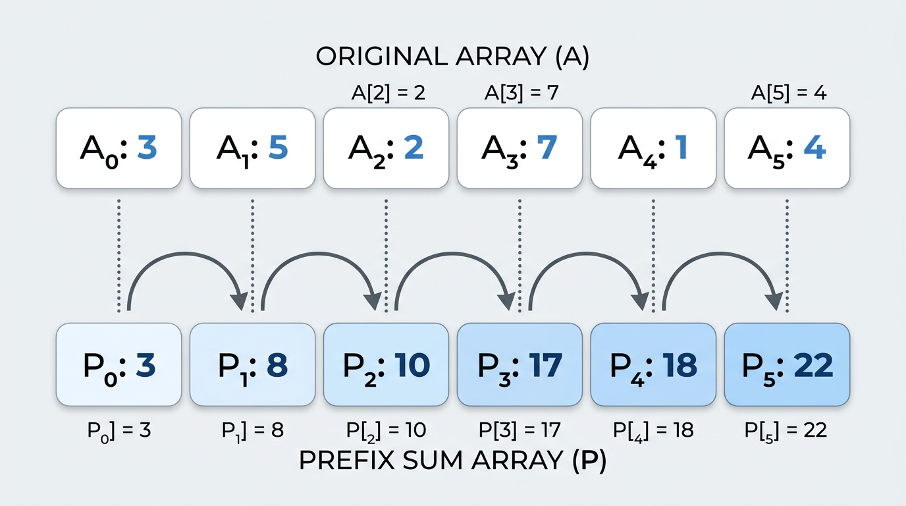

# Pattern 20: Prefix Sum

Whenever a problem asks us something about the <b>sum of a contiguous range</b> of an array, the naive instinct is to walk that range and add the numbers up. That is fine for a single question, but it is disastrous when we are asked many questions, because every query re-walks elements we have already added a dozen times before.

The <b>Prefix Sum</b> pattern removes that duplicated work with one cheap precomputation. We build an array `prefixSum` where each entry holds the <b>running total of everything seen so far</b>:

`prefixSum[i] = nums[0] + nums[1] + ... + nums[i-1]`

Notice the off-by-one: `prefixSum[i]` deliberately stops <i>before</i> index `i`. We size the array at `nums.length + 1` and let `prefixSum[0] = 0` stand for the <b>empty prefix</b>. That single sentinel is what makes the rest of the pattern free of edge cases, and it is worth internalizing early because it shows up in every problem below. Once that array exists, the sum of any range `nums[left...right]` is a <b>single subtraction</b>:



`rangeSum(left, right) = prefixSum[right + 1] - prefixSum[left]`

The intuition is simply <i>"everything up to `right`, minus everything before `left`"</i>. The overlapping head of the two prefixes cancels out, leaving exactly the slice we wanted. A range query that used to cost `O(N)` now costs `O(1)`.

```java
import java.util.Arrays;

class Solution {
    public static int[] buildPrefixSum(int[] nums) {
        //prefixSum[i] holds the sum of nums[0...i-1]
        //prefixSum[0] = 0 is the "empty prefix" sentinel
        int[] prefixSum = new int[nums.length + 1];

        for (int i = 0; i < nums.length; i++) {
            prefixSum[i + 1] = prefixSum[i] + nums[i];
        }

        return prefixSum;
    }

    public static int rangeSum(int[] prefixSum, int left, int right) {
        //sum of nums[left...right] inclusive
        return prefixSum[right + 1] - prefixSum[left];
    }

    public static void main(String[] args) {
        int[] nums = {1, 3, 2, 6, -1, 4, 1, 8, 2};
        int[] prefixSum = buildPrefixSum(nums);

        System.out.println(Arrays.toString(prefixSum));
        //[0, 1, 4, 6, 12, 11, 15, 16, 24, 26]

        System.out.println(rangeSum(prefixSum, 2, 5));
        //11

        System.out.println(rangeSum(prefixSum, 0, 8));
        //26

        System.out.println(rangeSum(prefixSum, 4, 4));
        //-1
    }
}
```

- The <b>time complexity</b> of building the array is `O(N)`, where `N` is the number of elements, and every subsequent range query is `O(1)`.
- The <b>space complexity</b> is `O(N)` for the `prefixSum` array.

## The second half of the pattern: Prefix Sum + HashMap

Range queries are the obvious use. The genuinely powerful trick is what happens when we pair prefix sums with a <b>HashMap</b>.

Rearrange the range-sum identity. A subarray ending at index `i` sums to `k` exactly when `prefixSum[i + 1] - prefixSum[start] === k`, which is the same as saying:

`prefixSum[start] === prefixSum[i + 1] - k`

So the question <i>"how many subarrays ending here sum to `k`?"</i> becomes <i>"how many earlier prefix sums equalled `currentPrefixSum - k`?"</i> — and that is a <b>HashMap lookup</b>. We sweep the array once, and at each step we ask the map a single `O(1)` question. A problem that looks inherently quadratic collapses to `O(N)`.

This reframing is the heart of the pattern. Keep it in mind: <b>we never search for the subarray, we search for its left edge in the map.</b>

## When does Prefix Sum beat Sliding Window?

<b>[Pattern 01: Sliding Window](./%E2%9C%85%20%20Pattern%2001%20:%20Sliding%20Window.md)</b> also answers subarray-sum questions in `O(N)`, so it is fair to ask why we need another tool at all. The answer comes down to one assumption that <i>Sliding Window</i> quietly depends on.

The <i>Sliding Window</i> shrink step — <i>"while the window sum is too big, drop elements from the left"</i> — is only valid if the window sum <b>behaves monotonically</b>: growing the window must never decrease the sum, and shrinking it must never increase it. That holds when every value is <b>non-negative</b>. It does not hold the moment a negative number appears, because then extending the window can <i>lower</i> the sum, and the algorithm will happily discard a left edge it actually needed.

Here is that failure, side by side with an honest `O(N²)` reference:

```java
class Solution {
    //This is the Sliding Window solution from Pattern 01, unchanged.
    public static int smallestSubarrayWithGivenSum(int[] arr, int s) {
        int windowSum = 0;
        int minLength = Integer.MAX_VALUE;
        int windowStart = 0;

        for (int windowEnd = 0; windowEnd < arr.length; windowEnd++) {
            windowSum += arr[windowEnd];

            //shrink from the left while the window still reaches s
            while (windowSum >= s) {
                minLength = Math.min(minLength, windowEnd - windowStart + 1);
                windowSum -= arr[windowStart];
                windowStart++;
            }
        }

        return minLength == Integer.MAX_VALUE ? 0 : minLength;
    }

    public static void main(String[] args) {
        //all positive: the window's sum grows as the window grows,
        //so shrinking from the left can never skip a better answer
        System.out.println(smallestSubarrayWithGivenSum(new int[]{2, 1, 5, 2, 3, 2}, 7));
        //2, and 2 is genuinely correct here

        //add one negative number and that guarantee is gone
        System.out.println(smallestSubarrayWithGivenSum(new int[]{1, 2, -3, 4, 5}, 9));
        //5, but the true answer is 2, because [4, 5] also sums to 9
    }
}
```

The <i>Sliding Window</i> settles for the whole array while the true answer is `2`, because `[4, 5]` also sums to `9`. Once the window sum reached `9` at the last index, shrinking stopped as soon as the running sum dipped below `9`, and the shorter window further right was never considered. This is not a one-off: sweeping thousands of random arrays containing negatives turns up disagreements with an `O(N²)` reference constantly.

<b>Prefix Sum</b> has no such assumption. It never shrinks anything and never assumes an ordering — it just records every prefix it has seen and looks up the one it needs. So:

- Use <b>[Sliding Window](./%E2%9C%85%20%20Pattern%2001%20:%20Sliding%20Window.md)</b> when values are <b>non-negative</b> and you want a <b>minimum/maximum length</b> window, or a <b>fixed-size</b> window. It runs in `O(1)` extra space.
- Use <b>Prefix Sum + HashMap</b> when the array can contain <b>negatives or zeros</b>, when you need to <b>count</b> subarrays rather than find one, or when you need <b>repeated range queries</b> on a static array. It costs `O(N)` space, and that is the price of dropping the monotonicity assumption.

A useful tiebreaker: if the phrase <i>"count the number of subarrays"</i> appears, reach for <b>Prefix Sum</b>. Counting requires knowing how many valid left edges exist for each right edge, and only the <b>HashMap</b> gives that in constant time.

## Range Sum Query - Immutable (easy)

https://leetcode.com/problems/range-sum-query-immutable/

> Given an integer array `nums`, handle multiple queries of the following type:
>
> Calculate the <b>sum of the elements</b> of `nums` between indices `left` and `right` <b>inclusive</b>, where `left <= right`.
>
> Implement the `NumArray` class with a constructor that initializes the object with `nums`, and a `sumRange(left, right)` method that returns the sum of `nums[left...right]`.

This is the <b>core template</b> for the whole pattern, so it is worth being deliberate about it.

The word that matters in the title is <b>Immutable</b>. The array never changes after construction, which means any work we do once in the constructor is amortized across every query that follows. The naive class would store `nums` and re-add the range on every call — `O(1)` to build but `O(N)` <i>per query</i>, which is `O(N*Q)` overall and far too slow for the `10^4` queries this problem allows. Instead we spend `O(N)` once in the constructor and make every query a single subtraction.

Note how the `prefixSum[0] = 0` sentinel earns its keep: `sumRange(0, right)` needs <i>"everything before index 0"</i>, and without the sentinel we would need a special case for `left === 0`. With it, the formula is uniform.

```java
import java.util.Arrays;

class NumArray {
    int[] prefixSum;

    public NumArray(int[] nums) {
        //prefixSum[i] = sum of nums[0...i-1]
        //prefixSum has length nums.length + 1 so that
        //prefixSum[0] = 0 represents the empty prefix
        prefixSum = new int[nums.length + 1];

        for (int i = 0; i < nums.length; i++) {
            prefixSum[i + 1] = prefixSum[i] + nums[i];
        }
    }

    public int sumRange(int left, int right) {
        //sum(nums[0...right]) - sum(nums[0...left-1])
        return prefixSum[right + 1] - prefixSum[left];
    }
}

class Solution {
    public static void main(String[] args) {
        NumArray numArray = new NumArray(new int[]{-2, 0, 3, -5, 2, -1});

        System.out.println(Arrays.toString(numArray.prefixSum));
        //[0, -2, -2, 1, -4, -2, -3]

        System.out.println(numArray.sumRange(0, 2));
        //1
        System.out.println(numArray.sumRange(2, 5));
        //-1
        System.out.println(numArray.sumRange(0, 5));
        //-3
        System.out.println(numArray.sumRange(3, 3));
        //-5
    }
}
```

Note that the input contains negative numbers and the algorithm does not care in the slightest — nothing about the subtraction identity depends on sign.

- The <b>time complexity</b> of the above algorithm is `O(N)` for the constructor, where `N` is the number of elements in `nums`, and `O(1)` for each call to `sumRange`. For `Q` queries the total is `O(N + Q)`.
- The <b>space complexity</b> of the above algorithm is `O(N)` to store the `prefixSum` array.

## Find Pivot Index (easy)

https://leetcode.com/problems/find-pivot-index/

> Given an array of integers `nums`, calculate the <b>pivot index</b> of this array.
>
> The <b>pivot index</b> is the index where the sum of all the numbers <b>strictly to the left</b> of the index is equal to the sum of all the numbers <b>strictly to the right</b> of the index.
>
> If the index is on the left edge of the array, then the left sum is `0` because there are no elements to the left. This also applies to the right edge of the array.
>
> Return the <b>leftmost</b> pivot index. If no such index exists, return `-1`.

This problem follows the <b>Prefix Sum pattern</b>, and it is a nice demonstration that we do not always need to materialize the whole array. Sometimes a <b>single running variable</b> is enough.

The key observation is that the array splits into three pieces at any index `i`: the left part, the element `nums[i]` itself, and the right part. Since all three together are the `totalSum`, we get the right part for free:

`rightSum = totalSum - leftSum - nums[i]`

So we compute `totalSum` in one pass, then sweep left to right maintaining `leftSum` as a running prefix sum. At each index we check the equality directly. Because we scan left to right and return on the first match, we automatically satisfy the <i>leftmost</i> requirement.

The ordering inside the loop is the part that trips people up. We must test the condition <b>before</b> folding `nums[i]` into `leftSum`, because `leftSum` is defined as the sum of everything <i>strictly to the left</i> of `i`. Adding first and testing second would silently include the pivot element on the left side.

```java
class Solution {
    public static int pivotIndex(int[] nums) {
        //totalSum is the sum of the whole array
        int totalSum = 0;
        for (int i = 0; i < nums.length; i++) {
            totalSum += nums[i];
        }

        //leftSum is the running prefix sum of everything BEFORE index i
        int leftSum = 0;

        for (int i = 0; i < nums.length; i++) {
            //rightSum = totalSum - leftSum - nums[i]
            //we want leftSum === rightSum
            if (leftSum == totalSum - leftSum - nums[i]) {
                return i;
            }
            leftSum += nums[i];
        }

        return -1;
    }

    public static void main(String[] args) {
        System.out.println(pivotIndex(new int[]{1, 7, 3, 6, 5, 6}));
        //3, left sum is 1 + 7 + 3 = 11 and right sum is 5 + 6 = 11
        System.out.println(pivotIndex(new int[]{1, 2, 3}));
        //-1, there is no index that satisfies the condition
        System.out.println(pivotIndex(new int[]{2, 1, -1}));
        //0, left sum is 0 (no elements) and right sum is 1 + -1 = 0
        System.out.println(pivotIndex(new int[]{-1, -1, -1, 0, 1, 1}));
        //0, left sum is 0 and right sum is -1 + -1 + 0 + 1 + 1 = 0
        System.out.println(pivotIndex(new int[]{0}));
        //0, both sides are empty and therefore both 0
    }
}
```

The last three cases are the ones worth studying. They confirm that the <i>"edges count as `0`"</i> rule falls out of the code for free, and that negative numbers cause no trouble.

- The <b>time complexity</b> of the above algorithm is `O(N)`, where `N` is the number of elements in `nums`. We make two passes over the array, which is `O(2N)` and asymptotically `O(N)`.
- The <b>space complexity</b> of the above algorithm is `O(1)`, since we only keep two running numbers rather than a full prefix array.

## Subarray Sum Equals K (medium)

https://leetcode.com/problems/subarray-sum-equals-k/

> Given an array of integers `nums` and an integer `k`, return the <b>total number of subarrays whose sum equals `k`</b>.
>
> A <b>subarray</b> is a contiguous non-empty sequence of elements within an array.

This is <b>the key idea</b> of the pattern, and the one problem here most worth understanding cold. Note carefully that `nums` may contain <b>negative numbers</b>, which is precisely why <b>[Sliding Window](./%E2%9C%85%20%20Pattern%2001%20:%20Sliding%20Window.md)</b> cannot be used.

### Brute Force

We could enumerate every subarray and keep a running sum for each starting point.

```java
class Solution {
    public static int subarraySumBruteForce(int[] nums, int k) {
        int count = 0;

        for (int start = 0; start < nums.length; start++) {
            int sum = 0;
            //re-walk every subarray that begins at start
            for (int end = start; end < nums.length; end++) {
                sum += nums[end];
                if (sum == k) {
                    count++;
                }
            }
        }

        return count;
    }

    public static void main(String[] args) {
        System.out.println(subarraySumBruteForce(new int[]{1, 1, 1}, 2));
        //2
        System.out.println(subarraySumBruteForce(new int[]{1, 2, 3}, 3));
        //2
        System.out.println(subarraySumBruteForce(new int[]{3, 4, 7, 2, -3, 1, 4, 2}, 7));
        //4
    }
}
```

- The <b>time complexity</b> is `O(N²)` and the <b>space complexity</b> is `O(1)`. With `N` up to `2 * 10^4` this will time out.

### Prefix Sum + HashMap Approach

Now the important part. Let us derive the solution rather than memorize it.

Suppose we are standing at index `i` with a running `prefixSum` covering `nums[0...i]`. We want to count the subarrays <b>ending at `i`</b> that sum to `k`. Any such subarray starts at some index `start`, and its sum is:

`sum(nums[start...i]) = prefixSum(up to i) - prefixSum(up to start - 1)`

We want that to equal `k`:

`prefixSum - prefixSumBefore = k`

Solving for the unknown left edge:

`prefixSumBefore = prefixSum - k`

<b>This is why we look up `prefixSum - k`.</b> We are not asking <i>"is there a subarray summing to `k`?"</i> — we are asking <i>"how many earlier positions had a running total of exactly `prefixSum - k`?"</i> Every such position is the left boundary of a distinct valid subarray ending right here. So the map must store <b>counts</b>, not just presence, and we add the whole count rather than incrementing by one. If three earlier prefixes shared that value, this index contributes three subarrays.

Two details deserve attention:

1. <b>Seed the map with `prefixSumCount.set(0, 1)`.</b> This registers the empty prefix — the running total before we consumed any elements. Without it, a subarray that starts at index `0` would have no left edge to find and would be missed entirely. It is the same sentinel idea as `prefixSum[0] = 0` from the template.
2. <b>Look up before inserting.</b> We query the map for `prefixSum - k` and only then record the current `prefixSum`. If we inserted first, then when `k === 0` the current prefix would match itself and we would count a bogus empty subarray.

```java
import java.util.*;

class Solution {
    public static int subarraySum(int[] nums, int k) {
        //maps a prefix sum value -> how many times we have seen it
        Map<Integer, Integer> prefixSumCount = new HashMap<>();

        //the empty prefix has sum 0, and we have seen it once
        //this is what lets a subarray starting at index 0 be counted
        prefixSumCount.put(0, 1);

        int prefixSum = 0;
        int count = 0;

        for (int i = 0; i < nums.length; i++) {
            prefixSum += nums[i];

            //if some earlier prefix had sum (prefixSum - k), then the
            //slice between that earlier point and here sums to exactly k
            if (prefixSumCount.containsKey(prefixSum - k)) {
                count += prefixSumCount.get(prefixSum - k);
            }

            //record the current prefix sum for future indices
            prefixSumCount.put(prefixSum, prefixSumCount.getOrDefault(prefixSum, 0) + 1);
        }

        return count;
    }

    public static void main(String[] args) {
        System.out.println(subarraySum(new int[]{1, 1, 1}, 2));
        //2, the subarrays are [1, 1] starting at index 0 and [1, 1] starting at index 1

        System.out.println(subarraySum(new int[]{1, 2, 3}, 3));
        //2, the subarrays are [1, 2] and [3]

        System.out.println(subarraySum(new int[]{3, 4, 7, 2, -3, 1, 4, 2}, 7));
        //4, the subarrays are [3, 4], [7], [7, 2, -3, 1] and [1, 4, 2]

        System.out.println(subarraySum(new int[]{1, -1, 0}, 0));
        //3, the subarrays are [1, -1], [1, -1, 0] and [0]

        System.out.println(subarraySum(new int[]{-1, -1, 1}, 0));
        //1, the only subarray is [-1, 1] at indices 1 and 2

        System.out.println(subarraySum(new int[]{1}, 0));
        //0, the seeded 0 is never miscounted as an empty subarray
    }
}
```

Trace the third example to see the counting work. The prefix sums are `3, 7, 14, 16, 13, 14, 18, 20`. When we reach the running total `14` a second time (at index `5`), the map already holds `14` once, so we add `1` — that is the subarray `[7, 2, -3, 1]` sitting between the two occurrences. Equal prefix sums always bracket a subarray summing to zero, and `k = 7` is the same statement shifted by `7`.

The last two examples are the guard rails. `subarraySum([1], 0)` returning `0` confirms the look-up-before-insert ordering is right; had we inserted first we would have wrongly reported `1`.

- The <b>time complexity</b> of the above algorithm is `O(N)`, where `N` is the number of elements in `nums`. We make a single pass, and each <b>HashMap</b> read and write is `O(1)` on average.
- The <b>space complexity</b> of the above algorithm is `O(N)`, since in the worst case every prefix sum is distinct and all `N` of them land in the <b>HashMap</b>.

## Continuous Subarray Sum (medium)

https://leetcode.com/problems/continuous-subarray-sum/

> Given an integer array `nums` and an integer `k`, return `true` if `nums` has a <b>good subarray</b> or `false` otherwise.
>
> A <b>good subarray</b> is a subarray where its length is <b>at least two</b> and the sum of the elements of the subarray is a <b>multiple of `k`</b>.
>
> Note that a subarray of size at least two whose sum is a multiple of `k` includes the case where the sum is `0`, since `0` is a multiple of every integer.

This problem follows the <b>Prefix Sum pattern</b> with a twist: instead of storing prefix sums, we store <b>prefix sums modulo `k`</b>.

The insight is a small piece of modular arithmetic. A subarray `nums[start...i]` has sum `prefixSum[i + 1] - prefixSum[start]`. That difference is divisible by `k` exactly when the two prefix sums leave the <b>same remainder</b> when divided by `k`:

`(prefixSum[i + 1] - prefixSum[start]) % k === 0`  ⟺  `prefixSum[i + 1] % k === prefixSum[start] % k`

So we no longer need the sums themselves — only their remainders. We sweep once, and if we ever see a remainder we have seen before, the slice between the two sightings is divisible by `k`.

That leaves the <i>"length at least two"</i> constraint. We handle it by storing, for each remainder, the <b>earliest index</b> at which it appeared, and never overwriting that entry. Keeping the earliest index maximizes the distance to any future sighting, which gives us the best chance of clearing the length-`2` bar. If we overwrote with the latest index we could shrink a perfectly good subarray below the threshold and wrongly return `false`.

As in the previous problem we seed the map, this time with remainder `0` at index `-1`, representing the empty prefix. Using `-1` rather than `0` makes the length arithmetic `i - storedIndex` come out right for subarrays that begin at index `0`.

<b>A note on the modulo.</b> `nums` here is constrained to non-negative values, but `k` may be negative, and a running sum can still produce a negative remainder in the general case. So we normalize defensively — see the next problem for why this matters so much.

```java
import java.util.*;

class Solution {
    public static boolean checkSubarraySum(int[] nums, int k) {
        //maps a prefix-sum remainder -> the EARLIEST index where we saw it
        Map<Integer, Integer> remainderIndex = new HashMap<>();

        //the empty prefix (before index 0) has remainder 0 at index -1
        remainderIndex.put(0, -1);

        int prefixSum = 0;

        for (int i = 0; i < nums.length; i++) {
            prefixSum += nums[i];

            //normalize so the remainder is always in [0, |k|)
            int remainder = prefixSum % k;
            if (remainder < 0) {
                remainder += Math.abs(k);
            }

            if (remainderIndex.containsKey(remainder)) {
                //the subarray between that earlier index and i is divisible by k
                //we need its length to be at least 2
                if (i - remainderIndex.get(remainder) >= 2) {
                    return true;
                }
            } else {
                //only store the FIRST time we see a remainder, to keep
                //the subarray we find as long as possible
                remainderIndex.put(remainder, i);
            }
        }

        return false;
    }

    public static void main(String[] args) {
        System.out.println(checkSubarraySum(new int[]{23, 2, 4, 6, 7}, 6));
        //true, [2, 4] sums to 6 which is a multiple of 6
        System.out.println(checkSubarraySum(new int[]{23, 2, 6, 4, 7}, 6));
        //true, the whole array sums to 42 which is 7 * 6
        System.out.println(checkSubarraySum(new int[]{23, 2, 6, 4, 7}, 13));
        //false, no subarray of length at least 2 sums to a multiple of 13
        System.out.println(checkSubarraySum(new int[]{1, 0}, 2));
        //false, the only subarray of length 2 sums to 1
        System.out.println(checkSubarraySum(new int[]{0, 0}, -1));
        //true, 0 is a multiple of -1, and the negative k is handled by the normalization
        System.out.println(checkSubarraySum(new int[]{-1, -1, 3}, 2));
        //true, [-1, -1] sums to -2 which is a multiple of 2
        System.out.println(checkSubarraySum(new int[]{5, 0, 0, 0}, 3));
        //true, [0, 0] sums to 0 which is a multiple of every integer
    }
}
```

The `[1, 0]` case with `k = 2` is a good sanity check on the <i>earliest index</i> rule. Both index `0` and index `1` produce remainder `1`, but we stored only index `0`, and `1 - 0 = 1` is below the length-`2` threshold, so we correctly return `false` rather than being fooled by the repeat.

- The <b>time complexity</b> of the above algorithm is `O(N)`, where `N` is the number of elements in `nums`, as we make a single pass with `O(1)` <b>HashMap</b> operations.
- The <b>space complexity</b> of the above algorithm is `O(min(N, k))`, since there are only `|k|` possible remainders, so the <b>HashMap</b> can never hold more than that many entries.

## Subarray Sums Divisible by K (medium)

https://leetcode.com/problems/subarray-sums-divisible-by-k/

> Given an integer array `nums` and an integer `k`, return the <b>number of non-empty subarrays</b> that have a sum <b>divisible by `k`</b>.
>
> A <b>subarray</b> is a contiguous part of an array.

This problem is the natural merger of the two previous ones. From <b>[Subarray Sum Equals K](#subarray-sum-equals-k-medium)</b> we take the <i>counting</i> map, and from <b>[Continuous Subarray Sum](#continuous-subarray-sum-medium)</b> we take the <i>remainder</i> idea. Because we are counting rather than merely detecting, we store <b>how many times</b> each remainder has occurred instead of the earliest index, and we add that count to the running total.

If a given remainder has been seen `n` times before, then the current index closes `n` distinct divisible subarrays — one for each earlier sighting. This is exactly the same counting argument as before.

### The negative modulo trap

Here is the <b>classic trap</b>, and it bites almost everyone the first time. Unlike Python, <b>Java's `%` operator is a remainder, not a true modulo</b>: its result takes the sign of the <b>dividend</b> (the left operand), not the divisor. So:

```java
class Solution {
    public static void main(String[] args) {
        System.out.println(-7 % 5);
        //-2
    }
}
```

Mathematically we want `-7 mod 5 = 3`, because `-7 = (-2 * 5) + 3`. Java hands us `-2` instead.

Why does that break the algorithm? Because `-2` and `3` describe the <b>same congruence class</b> — the prefix sums `-7` and `3` differ by `10`, a multiple of `5`, so the subarray between them is divisible by `5` and must be counted. But if one of them keys the map under `-2` and the other under `3`, they never meet, and we undercount. The bug is silent: the code runs, returns a plausible number, and is simply wrong on any input containing negatives.

The fix is the standard normalization idiom, which maps every remainder into the range `[0, k)`:

```java
class Solution {
    public static void main(String[] args) {
        System.out.println(((-7 % 5) + 5) % 5);
        //3
    }
}
```

Adding `k` shifts a negative remainder into positive territory, and the second `% k` handles the case where the remainder was already non-negative (adding `k` would have pushed it out of range). Both `%` operations are necessary.

```java
import java.util.*;

class Solution {
    public static int subarraysDivByK(int[] nums, int k) {
        //maps a normalized remainder -> how many prefixes had it
        Map<Integer, Integer> remainderCount = new HashMap<>();

        //the empty prefix has remainder 0
        remainderCount.put(0, 1);

        int prefixSum = 0;
        int count = 0;

        for (int i = 0; i < nums.length; i++) {
            prefixSum += nums[i];

            //Java's % keeps the sign of the DIVIDEND, so
            //-7 % 5 is -2, not 3. we push it back into [0, k)
            int remainder = ((prefixSum % k) + k) % k;

            if (remainderCount.containsKey(remainder)) {
                count += remainderCount.get(remainder);
            }

            remainderCount.put(remainder, remainderCount.getOrDefault(remainder, 0) + 1);
        }

        return count;
    }

    public static void main(String[] args) {
        //the trap, demonstrated
        System.out.println(-7 % 5);
        //-2
        System.out.println(((-7 % 5) + 5) % 5);
        //3

        System.out.println(subarraysDivByK(new int[]{4, 5, 0, -2, -3, 1}, 5));
        //7, the subarrays are [4, 5, 0, -2, -3], [5], [5, 0], [5, 0, -2, -3], [0], [0, -2, -3] and [-2, -3]
        System.out.println(subarraysDivByK(new int[]{5}, 9));
        //0, 5 is not divisible by 9
        System.out.println(subarraysDivByK(new int[]{-1, 2, 9}, 2));
        //2, the subarrays are [-1, 2, 9] summing to 10 and [2]
        System.out.println(subarraysDivByK(new int[]{-5, -5, -5}, 5));
        //6, every one of the 6 subarrays is divisible by 5
        System.out.println(subarraysDivByK(new int[]{2, -2, 2, -4}, 6));
        //2, the subarrays are [2, -2] and [-2, 2], both summing to 0
    }
}
```

The examples above are chosen to exercise the negative path hard. `[-5, -5, -5]` with `k = 5` produces the raw prefix sums `-5, -10, -15`, all of which Java's `%` would report as `0` (or negative zero if using floats, but integers gives 0); the normalization maps them all to `0`, they collide with the seeded empty prefix, and we correctly count all `6` subarrays. Without the normalization the mixed-sign case `[4, 5, 0, -2, -3, 1]` is where the undercount shows up.

- The <b>time complexity</b> of the above algorithm is `O(N)`, where `N` is the number of elements in `nums`, since we make one pass with constant-time <b>HashMap</b> operations.
- The <b>space complexity</b> of the above algorithm is `O(min(N, k))`, because there are only `k` distinct normalized remainders.

## Product of Array Except Self (medium)

https://leetcode.com/problems/product-of-array-except-self/

> Given an integer array `nums`, return an array `answer` such that `answer[i]` is equal to the <b>product of all the elements of `nums` except `nums[i]`</b>.
>
> You must write an algorithm that runs in `O(N)` time and <b>without using the division operation</b>.

This problem shows that the pattern is not really about <i>sums</i> at all. It is about <b>reusing cumulative work</b>, and any associative operation will do — here it is multiplication.

The tempting solution is to compute the total product once and divide by `nums[i]`. The problem forbids division, and for good reason: a single zero in the input makes the total product `0` and the division meaningless.

So we apply the prefix idea in both directions. For each index `i` the answer is:

`answer[i] = (product of everything before i) * (product of everything after i)`

Those are a <b>prefix product</b> and a <b>suffix product</b>, and each is computable in a single sweep. We could build two explicit arrays — `prefix[i]` holding the product of everything strictly before `i`, `suffix[i]` the product of everything strictly after — and multiply them pointwise. Both would be seeded with `1` rather than `0`, since `1` is the identity for multiplication just as `0` is for addition; that is the multiplicative version of our empty-prefix sentinel.

But we can do better on space. The trick is to use the output array itself as the prefix-product buffer on the way up, then multiply the suffix products in on the way back down, carrying the suffix in a single variable. That drops the auxiliary arrays entirely.

```java
import java.util.Arrays;

class Solution {
    public static int[] productExceptSelf(int[] nums) {
        int n = nums.length;
        int[] result = new int[n];
        Arrays.fill(result, 1);

        //first pass, left to right
        //result[i] becomes the product of everything BEFORE i
        int prefixProduct = 1;
        for (int i = 0; i < n; i++) {
            result[i] = prefixProduct;
            prefixProduct *= nums[i];
        }

        //second pass, right to left
        //multiply in the product of everything AFTER i
        int suffixProduct = 1;
        for (int i = n - 1; i >= 0; i--) {
            result[i] *= suffixProduct;
            suffixProduct *= nums[i];
        }

        return result;
    }

    public static void main(String[] args) {
        System.out.println(Arrays.toString(productExceptSelf(new int[]{1, 2, 3, 4})));
        //[24, 12, 8, 6]

        System.out.println(Arrays.toString(productExceptSelf(new int[]{-1, 1, 0, -3, 3})));
        //[0, 0, 9, 0, 0]

        System.out.println(Arrays.toString(productExceptSelf(new int[]{2, 3})));
        //[3, 2]

        System.out.println(Arrays.toString(productExceptSelf(new int[]{0, 0, 3})));
        //[0, 0, 0]

        System.out.println(Arrays.toString(productExceptSelf(new int[]{-2, -3, -4})));
        //[12, 8, 6]
    }
}
```

Note also that the two-zero case `[0, 0, 3]` correctly gives all zeros, which is exactly where the division-based shortcut would have fallen apart.

- The <b>time complexity</b> of the above algorithm is `O(N)`, where `N` is the number of elements in `nums`, as we make two passes over the array.
- The <b>space complexity</b> of the above algorithm is `O(1)` if we do not count the output array, which the problem explicitly permits. The two-array variant described above would instead need `O(N)` auxiliary space.

## Range Sum Query 2D - Immutable (medium)

https://leetcode.com/problems/range-sum-query-2d-immutable/

> Given a 2D matrix `matrix`, handle multiple queries of the following type:
>
> Calculate the <b>sum of the elements</b> of `matrix` inside the rectangle defined by its <b>upper left corner</b> `(row1, col1)` and <b>lower right corner</b> `(row2, col2)`.
>
> Implement the `NumMatrix` class with a constructor that initializes the object with `matrix`, and a `sumRegion(row1, col1, row2, col2)` method that returns the sum of the elements inside that rectangle.

This is the two-dimensional generalization of our very first problem, and it is where the pattern becomes genuinely elegant. The mechanism that replaces plain subtraction is <b>inclusion-exclusion</b>.

We define `prefixSum[r][c]` as the sum of the entire rectangle from the origin `(0, 0)` to `(r-1, c-1)`. Exactly as in 1D, we pad with an extra row and column of zeros so that `prefixSum[0][*]` and `prefixSum[*][0]` represent empty regions and no boundary special-casing is needed.

<b>Building the table.</b> To compute the rectangle ending at cell `(r, c)`, we combine the rectangle directly above it and the rectangle directly to its left. But those two rectangles <b>overlap</b> in the smaller rectangle above-and-to-the-left, so that region gets counted twice and must be subtracted back out once:

`prefixSum[r+1][c+1] = matrix[r][c] + above + left - overlap`

<b>Answering a query.</b> The same logic runs in reverse. Start with the big rectangle from the origin to `(row2, col2)`, then remove the horizontal strip above our target rectangle and the vertical strip to its left. Those two strips overlap in the corner rectangle above-and-left of our target, so having removed it twice we add it back once:

`sum = big - aboveStrip - leftStrip + corner`

The alternating signs are the signature of inclusion-exclusion, and once you have seen it in 2D the pattern extends naturally to higher dimensions.

```java
class NumMatrix {
    int[][] prefixSum;

    public NumMatrix(int[][] matrix) {
        int rows = matrix.length;
        int cols = matrix[0].length;

        //prefixSum[r][c] = sum of the rectangle from (0,0) to (r-1, c-1)
        //the extra row & column of zeros removes all the edge cases
        prefixSum = new int[rows + 1][cols + 1];

        for (int r = 0; r < rows; r++) {
            for (int c = 0; c < cols; c++) {
                prefixSum[r + 1][c + 1] =
                        matrix[r][c] +
                                prefixSum[r][c + 1] + //rectangle above
                                prefixSum[r + 1][c] - //rectangle to the left
                                prefixSum[r][c]; //the overlap, added twice above
            }
        }
    }

    public int sumRegion(int row1, int col1, int row2, int col2) {
        //inclusion-exclusion on the four corners
        return prefixSum[row2 + 1][col2 + 1] -
                prefixSum[row1][col2 + 1] - //strip above the rectangle
                prefixSum[row2 + 1][col1] + //strip left of the rectangle
                prefixSum[row1][col1]; //we removed this corner twice
    }
}

class Solution {
    public static void main(String[] args) {
        NumMatrix numMatrix = new NumMatrix(new int[][]{
                {3, 0, 1, 4, 2},
                {5, 6, 3, 2, 1},
                {1, 2, 0, 1, 5},
                {4, 1, 0, 1, 7},
                {1, 0, 3, 0, 5}
        });

        System.out.println(numMatrix.sumRegion(2, 1, 4, 3));
        //8

        System.out.println(numMatrix.sumRegion(1, 1, 2, 2));
        //11

        System.out.println(numMatrix.sumRegion(1, 2, 2, 4));
        //12

        System.out.println(numMatrix.sumRegion(0, 0, 4, 4));
        //58, the sum of the entire matrix

        System.out.println(numMatrix.sumRegion(3, 3, 3, 3));
        //1, a single cell

        NumMatrix negMatrix = new NumMatrix(new int[][]{
                {-1, 2},
                {3, -4}
        });

        System.out.println(negMatrix.sumRegion(0, 0, 1, 1));
        //0, -1 + 2 + 3 + -4

        System.out.println(negMatrix.sumRegion(0, 0, 0, 1));
        //1, -1 + 2
    }
}
```

The degenerate queries are the useful ones to check. `sumRegion(3, 3, 3, 3)` asks for a single cell and `sumRegion(0, 0, 4, 4)` asks for the whole matrix; both come out right with no special handling, which is the payoff for the zero-padding. The small negative matrix confirms that, as ever, signs are irrelevant to the arithmetic.

- The <b>time complexity</b> of the above algorithm is `O(M*N)` for the constructor, where `M` and `N` are the number of rows and columns, and `O(1)` for every call to `sumRegion` regardless of how large the queried rectangle is. For `Q` queries the total is `O(M*N + Q)`.
- The <b>space complexity</b> of the above algorithm is `O(M*N)` to store the padded `prefixSum` table.

## Summary

The pattern comes down to a handful of reusable moves:

1. <b>Build a running total.</b> `prefixSum[i]` is the sum of everything before index `i`. Pad with a `0` sentinel so that queries touching index `0` need no special case.
2. <b>Range sums are subtractions.</b> `sum(left...right) = prefixSum[right + 1] - prefixSum[left]`. Precompute once, answer forever in `O(1)`.
3. <b>Rearrange to find left edges.</b> A subarray ending here sums to `k` when some earlier prefix equals `prefixSum - k`. Ask a <b>HashMap</b> that question and an `O(N²)` scan becomes `O(N)`.
4. <b>Store counts to count, store earliest index to measure length.</b> Counting problems want frequencies; problems with a minimum-length constraint want the first index a value appeared.
5. <b>Divisibility means equal remainders.</b> Key the map on `prefixSum % k` instead of `prefixSum`, and <b>always normalize with `((x % k) + k) % k`</b> in Java, because `%` inherits the sign of the dividend.
6. <b>The operation need not be addition.</b> Prefix and suffix <i>products</i> solve <b>[Product of Array Except Self](#product-of-array-except-self-medium)</b>; the identity element becomes `1` instead of `0`.
7. <b>It generalizes past 1D.</b> In two dimensions, build and query with <b>inclusion-exclusion</b> over four corners.

And the decision rule against its closest neighbour: reach for <b>[Sliding Window](./%E2%9C%85%20%20Pattern%2001%20:%20Sliding%20Window.md)</b> when values are non-negative and you want one shortest or longest window in `O(1)` space; reach for <b>Prefix Sum</b> when negatives are in play, when you must <b>count</b> subarrays, or when the array is static and the queries are many.

###### #PrefixSum #Java #GrokkingTheCodingInterviewPatterns #LeetCode #DataStructures #Algorithms
