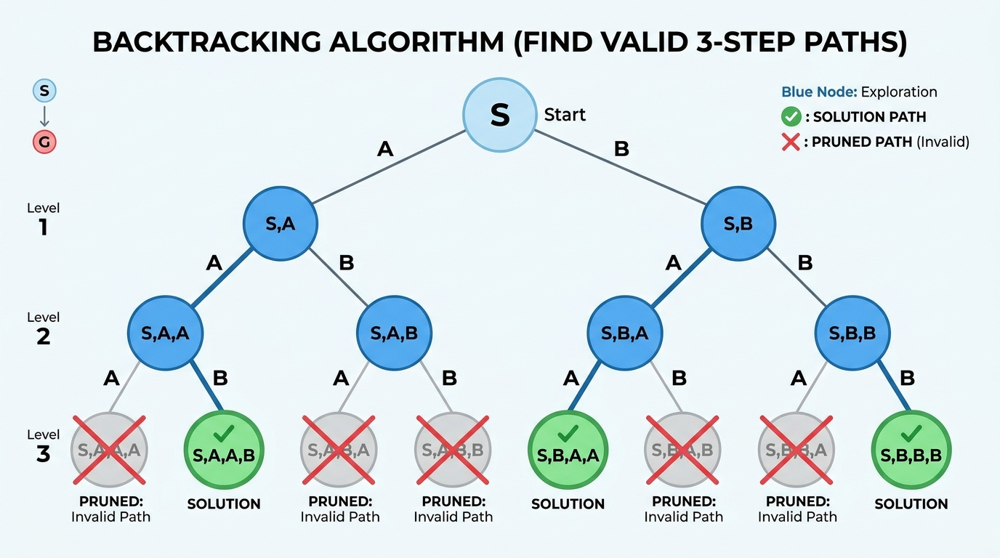

# Pattern 22: Backtracking

<b>Backtracking</b> is a <b>Depth First Search (DFS)</b> over the space of <i>partial solutions</i>. We build a candidate one decision at a time, and the instant a partial candidate can no longer possibly grow into a valid solution, we throw it away and walk back up to try something else. That "throw it away early" step is called <b>pruning</b>, and it is the entire point of the pattern.

It helps a lot to know how this pattern differs from <b>[Pattern 10: Subsets](#pattern-10-subsets)</b>. That pattern is about <i>generation</i>: given a set, mechanically produce all `2ᴺ` subsets or all `N!` permutations, usually with an iterative <b>Breadth First Search (BFS)</b> that keeps doubling a list of results. Every branch there is a keeper — there is nothing to reject, so there is nothing to prune. <b>Backtracking</b> is about <i>constraint satisfaction</i>: the answer is a subset of a much larger search space, most branches are illegal, and our job is to notice illegality as early as possible. The two patterns overlap on problems like <b>Permutations</b> and <b>Generate Parentheses</b>, which appear in both files — and the point of seeing them twice is precisely to compare the framings.

### The mental model: a decision tree



Every backtracking problem is a tree. The <b>root</b> is the empty partial solution; each <b>level</b> is one decision (which number goes next, which letter this digit maps to, which column this queen sits in); each <b>edge</b> is one choice available at that decision; a <b>leaf</b> is either a complete solution or a dead end. Crucially, the <b>path from the root</b> to the current node <i>is</i> our partial solution. We never build this tree in memory — we walk it with recursion, and the call stack <i>is</i> the path. That is why the space complexity of a backtracking algorithm is almost always `O(depth of the tree)` plus whatever the output takes.

### The skeleton: choose → explore → un-choose

Every solution in this file is the same three lines wrapped in different constraints: <b>push</b> a choice onto the path, <b>recurse</b> one level deeper, then <b>pop</b> that choice back off. The <i>un-choose</i> step is the "backtrack" the pattern is named after. We mutate one shared `path` array on the way down and un-mutate it on the way up, so at any moment `path` holds exactly the choices along the current root-to-node route. Compare <b>[Pattern 08: Tree Depth First Search](#pattern-8-tree-depth-first-search-dfs)</b>, where `currentPath.push(...)` / `currentPath.pop()` around the recursive calls does the identical job on a real tree instead of an imaginary one. Below is that skeleton as a real, runnable function, with its decisions factored into three hooks — `choicesAt` (what can I do here?), `isComplete` (am I done?), and `isPromising` (is this choice worth exploring?):

```java
import java.util.*;

class Solution {
    //the generic backtracking skeleton, expressed as three hooks
    public static List<List<Integer>> backtrackingTemplate() {
        List<List<Integer>> result = new ArrayList<>();
        List<Integer> path = new ArrayList<>();
        backtrack(0, path, result);
        return result;
    }

    private static void backtrack(int depth, List<Integer> path, List<List<Integer>> result) {
        //1. BASE CASE: the path is a complete, valid solution
        if (isComplete(depth, path)) {
            //snapshot the path - NEVER push the live array itself
            result.add(new ArrayList<>(path));
            return;
        }

        //2. enumerate every choice available at this level of the tree
        int[] choices = choicesAt(depth, path);

        for (int i = 0; i < choices.length; i++) {
            int choice = choices[i];

            //3. PRUNE: abandon a choice that provably cannot lead to a solution
            if (!isPromising(depth, path, choice)) continue;

            path.add(choice); //choose
            backtrack(depth + 1, path, result); //explore
            path.remove(path.size() - 1); //un-choose
        }
    }

    private static boolean isComplete(int depth, List<Integer> path) {
        return depth == 4;
    }

    private static int[] choicesAt(int depth, List<Integer> path) {
        return new int[]{0, 1};
    }

    private static boolean isPromising(int depth, List<Integer> path, int choice) {
        return !(choice == 1 && !path.isEmpty() && path.get(path.size() - 1) == 1);
    }

    public static void main(String[] args) {
        //a concrete instantiation: all binary strings of length 4
        //that never contain two adjacent 1s
        List<List<Integer>> bitStrings = backtrackingTemplate();
        
        System.out.println(bitStrings.size()); //8
        
        List<String> formatted = new ArrayList<>();
        for (List<Integer> bits : bitStrings) {
            StringBuilder sb = new StringBuilder();
            for (int bit : bits) sb.append(bit);
            formatted.add(sb.toString());
        }
        System.out.println(formatted);
        //[0000, 0001, 0010, 0100, 0101, 1000, 1001, 1010]
    }
}
```

### Why pruning is the whole game

Notice what the `isPromising` hook bought us above. There are `2⁴ = 16` binary strings of length four and only `8` satisfy the constraint; without pruning we would generate all `16` and filter, whereas with pruning we never even <i>create</i> the node after a `1` that would take a second `1` — the subtree below it is cut off before it is entered.

At this scale that is a curiosity. At real scale it is frequently the difference between an algorithm that finishes and one that does not. Take <b>N-Queens</b> for `N = 8`: placing one queen per row anywhere gives `8⁸ = 16,777,216` candidate boards, but pruning the moment a queen is attacked means the recursion enters only `2,057` nodes to find all `92` solutions. Same tree, same answer — we simply refuse to walk into subtrees whose root is already illegal. <b>Sudoku Solver</b> is sharper still: a grid with `51` blanks has `9⁵¹` fillings, a `49`-digit number no computer will ever enumerate, yet constraint pruning solves it in milliseconds. The worst-case exponent does not change — what changes is that the worst case stops being the <i>typical</i> case.

Two flavours of pruning show up over and over:
1. <b>Feasibility pruning</b> — this choice violates a hard constraint right now, so skip it. (A queen on an attacked square; a digit already in the row; a closing parenthesis with nothing to close.)
2. <b>Bound pruning</b> — this choice cannot possibly reach the goal even if everything after it goes perfectly, so skip it and, if the choices are sorted, `break` out of the loop entirely. (The running sum already exceeds the target.)

### 🌟 The one bug that ruins every backtracking solution

Because we reuse a single mutable `path` array, `result.push(path)` stores a <i>reference</i> to that live array. Every later `push` and `pop` mutates the object already sitting in `result`, and by the time the recursion unwinds `path` is empty again — so every entry in `result` is the same empty array. You must snapshot with `result.push([...path])`. This is worth seeing rather than being told; the two runs below differ by exactly one expression:

```java
import java.util.*;

class Solution {
    //a tiny permutation generator, written twice
    public static List<List<Integer>> generate(int[] nums, boolean copyOnPush) {
        List<List<Integer>> result = new ArrayList<>();
        List<Integer> path = new ArrayList<>();
        boolean[] used = new boolean[nums.length];
        
        backtrack(nums, used, path, result, copyOnPush);
        
        return result;
    }

    private static void backtrack(int[] nums, boolean[] used, List<Integer> path, List<List<Integer>> result, boolean copyOnPush) {
        if (path.size() == nums.length) {
            //the ONLY difference between the two runs
            result.add(copyOnPush ? new ArrayList<>(path) : path);
            return;
        }
        
        for (int i = 0; i < nums.length; i++) {
            if (used[i]) continue;
            
            used[i] = true;
            path.add(nums[i]);
            
            backtrack(nums, used, path, result, copyOnPush);
            
            path.remove(path.size() - 1);
            used[i] = false;
        }
    }

    public static void main(String[] args) {
        int[] nums = {1, 2, 3};
        
        System.out.println(generate(nums, false));
        //[[], [], [], [], [], []]
        
        System.out.println(generate(nums, true));
        //[[1, 2, 3], [1, 3, 2], [2, 1, 3], [2, 3, 1], [3, 1, 2], [3, 2, 1]]
    }
}
```

The buggy run has the right <i>count</i> — six — which is exactly why this bug survives a careless test. Always check the contents, not just the length. One exception is worth naming: when the solution is a <i>string</i>, `path.join('')` already produces a fresh immutable value, so no explicit copy is needed — which is why <b>Letter Combinations</b> and <b>Generate Parentheses</b> below get away with pushing a `join`ed result directly.

## Combination Sum (medium)
https://leetcode.com/problems/combination-sum/

> Given an array of <b>distinct</b> integers `candidates` and a target integer `target`, return a list of all <b>unique combinations</b> of `candidates` where the chosen numbers sum to `target`. The <b>same number may be chosen from `candidates` an unlimited number of times</b>. Two combinations are unique if the frequency of at least one of the chosen numbers is different.

The decision at each level is "which candidate do I add next?" Because a number may be reused, the recursive call passes `i` rather than `i + 1` — we stay at the same candidate and are allowed to pick it again. To avoid generating `[2,3]` and `[3,2]` as two different answers we never look <i>backwards</i>: the loop starts at `startIndex`, so each combination is produced in non-decreasing order exactly once.

The pruning is the interesting part. We first `sort` the candidates, then inside the loop we `break` — not `continue` — when `candidates[i] > remaining`. That distinction matters: because the array is sorted, every candidate after position `i` is at least as large, so <i>none</i> of them can fit either. A `continue` would pointlessly test each one; the `break` amputates all the remaining siblings at once. This is <b>bound pruning</b> — we are not rejecting an illegal state, we are rejecting a state from which the goal is unreachable. Tracking `remaining = target - (sum so far)` instead of re-summing `currentCombination` keeps the check `O(1)` per node.

```java
import java.util.*;

class Solution {
    public static List<List<Integer>> combinationSum(int[] candidates, int target) {
        List<List<Integer>> result = new ArrayList<>();
        List<Integer> currentCombination = new ArrayList<>();

        //sorting is not strictly required here, but it lets us
        //break out of the loop as soon as a candidate is too big
        Arrays.sort(candidates);

        backtrack(candidates, target, 0, currentCombination, result);

        return result;
    }

    private static void backtrack(int[] candidates, int remaining, int startIndex, List<Integer> currentCombination, List<List<Integer>> result) {
        //base case: we hit the target exactly, record a COPY of the path
        if (remaining == 0) {
            result.add(new ArrayList<>(currentCombination));
            return;
        }

        for (int i = startIndex; i < candidates.length; i++) {
            //PRUNE: since the array is sorted, every candidate from
            //here on is too large, so this whole branch is dead
            if (candidates[i] > remaining) break;

            //choose
            currentCombination.add(candidates[i]);

            //explore: pass 'i' (not 'i + 1') because we may reuse the same number
            backtrack(candidates, remaining - candidates[i], i, currentCombination, result);

            //un-choose
            currentCombination.remove(currentCombination.size() - 1);
        }
    }

    public static void main(String[] args) {
        System.out.println(combinationSum(new int[]{2, 3, 6, 7}, 7));
        //[[2, 2, 3], [7]]
        
        System.out.println(combinationSum(new int[]{2, 3, 5}, 8));
        //[[2, 2, 2, 2], [2, 3, 3], [3, 5]]
        
        System.out.println(combinationSum(new int[]{2}, 1));
        //[]
    }
}
```
- The <b>time complexity</b> of the above algorithm is `O(N^(T/M + 1))`, where `N` is the number of candidates, `T` is the target and `M` is the smallest candidate. The recursion tree has a depth of at most `T/M` (we cannot add more than `T/M` copies of the smallest number before overshooting), and each node branches at most `N` ways, giving `N^(T/M)` nodes; copying a combination of length up to `T/M` at each leaf contributes the extra factor. The `sort` costs `O(NlogN)`, which is dominated.
- The <b>space complexity</b> of the above algorithm is `O(T/M)` if we ignore the output, since that is the maximum depth of the <b>recursion</b> stack and the maximum length of `currentCombination`. Including the `result` list, the space is bounded by the total size of the output.

## Combination Sum II (medium)
https://leetcode.com/problems/combination-sum-ii/

> Given a collection of candidate numbers `candidates` (which <b>may contain duplicates</b>) and a target number `target`, find all unique combinations in `candidates` where the candidate numbers sum to `target`. <b>Each number in `candidates` may only be used once</b> in the combination. The solution set must not contain duplicate combinations.

Two things change from <b>Combination Sum</b>, and they pull in opposite directions. Each number may now be used at most once, so the recursion advances to `i + 1`. But the input may contain repeated <i>values</i>, and using the `1` at index `1` versus the `1` at index `5` would produce two identical-looking combinations.

The fix is the classic <b>duplicate-skipping</b> guard. After sorting, equal values sit next to each other, so inside the loop we skip a candidate when `i > startIndex && candidates[i] === candidates[i - 1]`. Read that as "at this position in the combination, an earlier sibling branch already tried this exact value." The comparison is against `startIndex`, <b>not</b> against `0`: when `i === startIndex` we are the <i>first</i> choice at this depth, so we must be allowed to take the value even if `candidates[i - 1]` equals it — that previous copy belongs to a shallower level of the path, which is precisely how `[1,1,6]` gets built. Writing `i > 0` instead would wrongly forbid ever using two equal numbers together and would silently lose valid answers.

Note the framing difference from <b>[Pattern 10: Subsets](#pattern-10-subsets)</b>'s <b>Subsets With Duplicates</b>: that solution deduplicates by carefully choosing a <i>range</i> of existing subsets to extend (`start = end + 1`). Here we deduplicate by pruning sibling edges in the decision tree — same idea, expressed against the tree instead of against a growing list.

```java
import java.util.*;

class Solution {
    public static List<List<Integer>> combinationSum2(int[] candidates, int target) {
        List<List<Integer>> result = new ArrayList<>();
        List<Integer> currentCombination = new ArrayList<>();

        //sorting brings duplicates next to each other AND enables the prune
        Arrays.sort(candidates);

        backtrack(candidates, target, 0, currentCombination, result);

        return result;
    }

    private static void backtrack(int[] candidates, int remaining, int startIndex, List<Integer> currentCombination, List<List<Integer>> result) {
        if (remaining == 0) {
            result.add(new ArrayList<>(currentCombination));
            return;
        }

        for (int i = startIndex; i < candidates.length; i++) {
            //PRUNE 1: sorted array, so nothing after this fits either
            if (candidates[i] > remaining) break;

            //PRUNE 2: skip duplicates at the SAME depth. 'i > startIndex'
            //means some sibling already used this value at this position
            if (i > startIndex && candidates[i] == candidates[i - 1]) continue;

            currentCombination.add(candidates[i]);

            //'i + 1' because each number may be used at most once
            backtrack(candidates, remaining - candidates[i], i + 1, currentCombination, result);

            currentCombination.remove(currentCombination.size() - 1);
        }
    }

    public static void main(String[] args) {
        System.out.println(combinationSum2(new int[]{10, 1, 2, 7, 6, 1, 5}, 8));
        //[[1, 1, 6], [1, 2, 5], [1, 7], [2, 6]]
        
        System.out.println(combinationSum2(new int[]{2, 5, 2, 1, 2}, 5));
        //[[1, 2, 2], [5]]
    }
}
```
- The <b>time complexity</b> of the above algorithm is `O(N * 2^N)`, where `N` is the number of candidates. In the worst case every subset of the candidates is explored, giving `2^N` nodes, and copying a combination of up to `N` elements at each accepted leaf adds the factor of `N`. The duplicate-skipping and sum-bound prunes cut this down dramatically in practice but do not improve the worst-case bound.
- The <b>space complexity</b> of the above algorithm is `O(N)` excluding the output, for the <b>recursion</b> stack and `currentCombination`. The `result` list can itself hold up to `O(N * 2^N)`.

## Permutations (medium)
https://leetcode.com/problems/permutations/

> Given an array `nums` of distinct integers, return <b>all the possible permutations</b>. You can return the answer in any order.

This problem also appears in <b>[Pattern 10: Subsets](#pattern-10-subsets)</b>, where it is solved by taking every permutation built so far and splicing the new number into every position. That is a generation-first view. The backtracking view is different and, once seen, is the one most people reach for in an interview: at each level of the tree we pick <i>which unused number goes in this slot</i>. A permutation is complete when the path has consumed every number.

The only constraint is "don't reuse a number already in the path", so the only prune is a `used` boolean array, giving an `O(1)` legality check per candidate. You could instead call `currentPermutation.includes(nums[i])`, but that is `O(N)` per check and turns an `O(N * N!)` algorithm into `O(N² * N!)`.

Because the constraint is so weak — nothing gets rejected except repeats — this tree has almost no dead ends, which makes <b>Permutations</b> a good calibration point: it shows the skeleton in its purest form, and shows that with nothing to prune, backtracking degenerates into plain exhaustive generation. The problems after this one are where pruning starts earning its keep. Note also the symmetry of the un-choose block: it undoes the two mutations in the reverse order they were made. Forgetting to reset `used[i] = false` is the second most common bug in this pattern, and it silently produces too few results.

```java
import java.util.*;

class Solution {
    public static List<List<Integer>> permute(int[] nums) {
        List<List<Integer>> result = new ArrayList<>();
        List<Integer> currentPermutation = new ArrayList<>();
        boolean[] used = new boolean[nums.length];

        backtrack(nums, used, currentPermutation, result);

        return result;
    }

    private static void backtrack(int[] nums, boolean[] used, List<Integer> currentPermutation, List<List<Integer>> result) {
        //base case: the path uses every number, so it is a full permutation
        if (currentPermutation.size() == nums.length) {
            result.add(new ArrayList<>(currentPermutation));
            return;
        }

        for (int i = 0; i < nums.length; i++) {
            //PRUNE: this number is already somewhere in the current path
            if (used[i]) continue;

            //choose
            used[i] = true;
            currentPermutation.add(nums[i]);

            //explore
            backtrack(nums, used, currentPermutation, result);

            //un-choose
            currentPermutation.remove(currentPermutation.size() - 1);
            used[i] = false;
        }
    }

    public static void main(String[] args) {
        System.out.println(permute(new int[]{1, 2, 3}));
        //[[1, 2, 3], [1, 3, 2], [2, 1, 3], [2, 3, 1], [3, 1, 2], [3, 2, 1]]
        
        System.out.println(permute(new int[]{0, 1}));
        //[[0, 1], [1, 0]]
        
        System.out.println(permute(new int[]{1}));
        //[[1]]
    }
}
```
- The <b>time complexity</b> of the above algorithm is `O(N * N!)`, where `N` is the number of elements. There are `N!` permutations, and each one costs `O(N)` to copy into the result. The internal nodes of the tree add up to fewer nodes than the leaves, so they do not change the bound.
- The <b>space complexity</b> of the above algorithm is `O(N)` excluding the output — `O(N)` for the <b>recursion</b> stack, `O(N)` for `currentPermutation` and `O(N)` for the `used` array. The `result` list holds `O(N * N!)`.

## Letter Combinations of a Phone Number (medium)
https://leetcode.com/problems/letter-combinations-of-a-phone-number/

> Given a string containing digits from `2-9` inclusive, return all possible letter combinations that the number could represent. Return the answer in any order. A mapping of digits to letters (just like on the telephone buttons) is given below. Note that `1` does not map to any letters.

This is the cleanest possible illustration of the decision tree, because the tree's <i>shape</i> is fixed by the input: level `k` corresponds to digit `k`, and the branching factor there is the number of letters on that key (three for most, four for `7` and `9`). There is nothing to prune at all — every root-to-leaf path is a valid answer — so the problem is included here precisely to isolate the <b>choose → explore → un-choose</b> mechanics from the constraint logic. The number of leaves is the product of the key sizes, so `"23"` yields `3 * 3 = 9` and `"7896"` yields `4 * 3 * 4 * 3 = 144`.

Two details worth copying into other solutions. First, the empty-input guard: the problem requires `[]`, not `[""]`, for an empty string, and without the early return the base case fires immediately at depth `0` and emits a single empty string. Second, `currentCombination` is a character <i>array</i> that we `join` at the leaf rather than a string we concatenate — building a `k`-character string by repeated concatenation copies the prefix at every level, whereas pushing and popping characters is `O(1)` and we pay the `O(k)` join only at leaves we actually keep. Because `join` returns a brand new string, no explicit copy is needed here.

```java
import java.util.*;

class Solution {
    public static List<String> letterCombinations(String digits) {
        List<String> result = new ArrayList<>();

        if (digits == null || digits.isEmpty()) {
            return result;
        }

        Map<Character, String> keypad = new HashMap<>();
        keypad.put('2', "abc"); keypad.put('3', "def"); keypad.put('4', "ghi");
        keypad.put('5', "jkl"); keypad.put('6', "mno"); keypad.put('7', "pqrs");
        keypad.put('8', "tuv"); keypad.put('9', "wxyz");

        StringBuilder currentCombination = new StringBuilder();

        backtrack(digits, 0, keypad, currentCombination, result);

        return result;
    }

    private static void backtrack(String digits, int index, Map<Character, String> keypad, StringBuilder currentCombination, List<String> result) {
        //base case: we have picked one letter for every digit
        if (index == digits.length()) {
            result.add(currentCombination.toString());
            return;
        }

        String letters = keypad.get(digits.charAt(index));

        for (int i = 0; i < letters.length(); i++) {
            //choose
            currentCombination.append(letters.charAt(i));

            //explore the next digit
            backtrack(digits, index + 1, keypad, currentCombination, result);

            //un-choose
            currentCombination.deleteCharAt(currentCombination.length() - 1);
        }
    }

    public static void main(String[] args) {
        System.out.println(letterCombinations("23"));
        //[ad, ae, af, bd, be, bf, cd, ce, cf]
        
        System.out.println(letterCombinations(""));
        //[]
        
        System.out.println(letterCombinations("2"));
        //[a, b, c]
        
        System.out.println(letterCombinations("7896").size());
        //144
    }
}
```
- The <b>time complexity</b> of the above algorithm is `O(N * 4^N)`, where `N` is the length of `digits`. Each digit maps to at most four letters, so there are at most `4^N` leaves, and joining a combination of length `N` at each leaf costs `O(N)`.
- The <b>space complexity</b> of the above algorithm is `O(N)` excluding the output, for the <b>recursion</b> stack and the `currentCombination` array. The `result` list holds `O(N * 4^N)`.

## Generate Parentheses (medium)
https://leetcode.com/problems/generate-parentheses/

> Given `n` pairs of parentheses, write a function to generate all combinations of <b>well-formed</b> parentheses.

<b>[Pattern 10: Subsets](#pattern-10-subsets)</b> solves this with a <b>BFS</b> queue of `ParenthesesString` objects, each carrying its own open and close counts. The backtracking version is the same insight with the queue replaced by the call stack — and it is the better vehicle for talking about pruning, because here the pruning conditions are the <i>only</i> logic in the function.

At every position we have two candidate characters, so the unconstrained tree has `2^(2n)` leaves — `4096` for `n = 6`. But two facts let us refuse most of them before they exist:

1. We may add `(` only while `openCount < n`. Spending an open bracket we don't have would make the string too long to ever balance.
2. We may add `)` only while `closeCount < openCount`. If the counts are already equal, there is no unmatched `(` for this `)` to close, so the prefix would be invalid — and <i>every</i> string extending an invalid prefix is invalid.

That second condition is the important one. It is a statement about the <i>prefix</i>, not the finished string, and that is what makes it a prune rather than a filter. Because both conditions guarantee the prefix stays well-formed, every leaf we reach is a valid answer: there is no dead end anywhere in the tree and no validity check at the base case. We generate exactly the `Catalan(n)` answers — `5` for `n = 3`, `14` for `n = 4` — instead of generating `2^(2n)` strings and throwing most away. No third "is the string long enough" condition is needed, since reaching `currentString.length === 2 * num` is only possible via legal moves.

```java
import java.util.*;

class Solution {
    public static List<String> generateParenthesis(int num) {
        List<String> result = new ArrayList<>();
        StringBuilder currentString = new StringBuilder();

        backtrack(num, 0, 0, currentString, result);

        return result;
    }

    private static void backtrack(int num, int openCount, int closeCount, StringBuilder currentString, List<String> result) {
        //base case: we have placed all 2*num characters
        if (currentString.length() == 2 * num) {
            result.add(currentString.toString());
            return;
        }

        //PRUNE: only add '(' while we still have open brackets left to spend
        if (openCount < num) {
            currentString.append('(');
            backtrack(num, openCount + 1, closeCount, currentString, result);
            currentString.deleteCharAt(currentString.length() - 1);
        }

        //PRUNE: only add ')' when there is an unmatched '(' to close.
        //This is what keeps us from ever building an invalid prefix.
        if (closeCount < openCount) {
            currentString.append(')');
            backtrack(num, openCount, closeCount + 1, currentString, result);
            currentString.deleteCharAt(currentString.length() - 1);
        }
    }

    public static void main(String[] args) {
        System.out.println(generateParenthesis(3));
        //[((())), (()()), (())(), ()(()), ()()()]
        
        System.out.println(generateParenthesis(1));
        //[()]
        
        System.out.println(generateParenthesis(2));
        //[(()), ()()]
        
        System.out.println(generateParenthesis(4).size());
        //14
    }
}
```
- The <b>time complexity</b> of the above algorithm is `O(N * 4^N / sqrt(N))`, which is the `N`th <b>Catalan number</b> multiplied by the `O(N)` cost of joining each result. <i>In an interview it is entirely reasonable to state this as "bounded by `O(N * 2^(2N))` because there are two choices per position, and the pruning brings it down to the Catalan number" — the exact Catalan asymptotics are rarely the point.</i>
- The <b>space complexity</b> of the above algorithm is `O(N)` excluding the output, for the <b>recursion</b> stack (depth `2N`) and the `currentString` array.

## Word Search (medium)
https://leetcode.com/problems/word-search/

> Given an `m x n` grid of characters `board` and a string `word`, return `true` if `word` exists in the grid. The word can be constructed from letters of <b>sequentially adjacent</b> cells, where adjacent cells are horizontally or vertically neighbouring. <b>The same letter cell may not be used more than once.</b>

The tree here is not built from a list of items but from the grid's geometry: from each cell we have four choices — up, down, left, right. What makes this a genuine backtracking problem rather than a plain <b>DFS</b> is the "may not be used more than once" clause. A path that revisits a cell is illegal, so we need to remember which cells the <i>current path</i> occupies, and forget them again when the path retreats.

The idiomatic trick is <b>in-place marking</b>. Instead of allocating a separate `visited` matrix, we overwrite `board[row][col]` with a sentinel `'#'` on the way down and restore the original character on the way up. Since `'#'` never equals any character of `word`, the existing letter-mismatch check doubles as the visited check for free. The restore line is not optional politeness — it is the un-choose step, and the reason the function leaves the caller's `board` byte-for-byte unchanged when it returns (the last `console.log` below confirms this).

The pruning is aggressive and is what makes this tractable. Three conditions kill a branch immediately: off the grid, wrong letter, or already on the path. The letter check in particular means that from a cell we typically recurse into zero or one neighbours rather than four, so the effective branching factor is far below `4`.

Two ordering subtleties in the code. The base case `index === word.length` is tested <i>before</i> the bounds check, so a word that finishes exactly as we step off the board still succeeds. And the `||` chain short-circuits: as soon as one direction reports success we stop exploring the others — but we still fall through to the restore line before returning, which is why the board is left clean even on the successful path.

```java
import java.util.*;

class Solution {
    public static boolean exist(char[][] board, String word) {
        int rows = board.length;
        int cols = board[0].length;

        for (int row = 0; row < rows; row++) {
            for (int col = 0; col < cols; col++) {
                if (backtrack(board, word, row, col, 0)) {
                    return true;
                }
            }
        }

        return false;
    }

    private static boolean backtrack(char[][] board, String word, int row, int col, int index) {
        int rows = board.length;
        int cols = board[0].length;

        //base case: every character has been matched
        if (index == word.length()) {
            return true;
        }

        //PRUNE: off the grid, or the letter here is not the one we need
        if (row < 0 || row >= rows || col < 0 || col >= cols) return false;
        if (board[row][col] != word.charAt(index)) return false;

        //choose: mark this cell as visited IN PLACE so the same cell
        //cannot be reused inside this path
        char originalChar = board[row][col];
        board[row][col] = '#';

        //explore the four neighbours
        boolean found =
            backtrack(board, word, row + 1, col, index + 1) ||
            backtrack(board, word, row - 1, col, index + 1) ||
            backtrack(board, word, row, col + 1, index + 1) ||
            backtrack(board, word, row, col - 1, index + 1);

        //un-choose: restore the cell for other paths
        board[row][col] = originalChar;

        return found;
    }

    public static void main(String[] args) {
        char[][] board = {
            {'A', 'B', 'C', 'E'},
            {'S', 'F', 'C', 'S'},
            {'A', 'D', 'E', 'E'}
        };

        System.out.println(exist(board, "ABCCED")); //true
        System.out.println(exist(board, "SEE")); //true
        System.out.println(exist(board, "ABCB")); //false
        //the board is restored exactly as it was given to us
        System.out.println(Arrays.deepToString(board));
        //[[A, B, C, E], [S, F, C, S], [A, D, E, E]]
    }
}
```
- The <b>time complexity</b> of the above algorithm is `O(M * N * 3^L)`, where `M x N` are the grid dimensions and `L` is the length of `word`. We start a search from each of the `M * N` cells, and each search explores at most `3^L` paths — the branching factor is `3` rather than `4` because the cell we just came from is marked and immediately rejected.
- The <b>space complexity</b> of the above algorithm is `O(L)` for the <b>recursion</b> stack. The in-place marking means we use no extra `visited` structure, so this is the only additional space.

## Palindrome Partitioning (medium)
https://leetcode.com/problems/palindrome-partitioning/

> Given a string `s`, partition `s` such that every substring of the partition is a <b>palindrome</b>. Return all possible palindrome partitionings of `s`.

The decision here is "where do I put the next cut?" Standing at position `start`, every `end >= start` defines a candidate first piece `s[start..end]`, and the rest of the string is a smaller instance of the same problem. So the tree branches on cut positions, and the depth is the number of pieces.

The prune is the palindrome test itself, and its placement is what matters. We check `isPalindrome(start, end)` <i>before</i> recursing on `end + 1`. If the prefix isn't a palindrome, no partitioning of the remaining suffix can rescue it — the entire subtree under that cut is dead, and we skip it without generating a single node. Doing the check at the leaf instead (partition arbitrarily, then validate every piece) would generate all `2^(N-1)` cut placements for a string of length `N` and reject nearly all of them.

The `isPalindrome` helper takes <i>indices</i> rather than a substring, so it costs no allocation; we only call `substring` on a piece we have already decided to keep. For the worst-case input `"aaaa...a"` every substring is a palindrome, so nothing gets pruned and we really do produce all `2^(N-1)` partitions — the `partition('aaa')` example below shows all `4`. That is the honest worst case, and it is why the bound stays exponential. If a follow-up asks you to speed this up, the standard answer is to precompute an `N x N` table where `table[i][j]` says whether `s[i..j]` is a palindrome (itself a small <b>Dynamic Programming</b> problem), making each prune `O(1)` instead of `O(N)`.

```java
import java.util.*;

class Solution {
    public static List<List<String>> partition(String str) {
        List<List<String>> result = new ArrayList<>();
        List<String> currentPartition = new ArrayList<>();

        backtrack(str, 0, currentPartition, result);

        return result;
    }

    private static boolean isPalindrome(String str, int start, int end) {
        while (start < end) {
            if (str.charAt(start) != str.charAt(end)) return false;
            start++;
            end--;
        }
        return true;
    }

    private static void backtrack(String str, int start, List<String> currentPartition, List<List<String>> result) {
        //base case: we have consumed the whole string
        if (start == str.length()) {
            result.add(new ArrayList<>(currentPartition));
            return;
        }

        for (int end = start; end < str.length(); end++) {
            //PRUNE: if str[start..end] is not a palindrome there is no point
            //recursing on the rest of the string with this prefix
            if (!isPalindrome(str, start, end)) continue;

            //choose
            currentPartition.add(str.substring(start, end + 1));

            //explore the remainder
            backtrack(str, end + 1, currentPartition, result);

            //un-choose
            currentPartition.remove(currentPartition.size() - 1);
        }
    }

    public static void main(String[] args) {
        System.out.println(partition("aab"));
        //[[a, a, b], [aa, b]]
        
        System.out.println(partition("a"));
        //[[a]]
        
        System.out.println(partition("aba"));
        //[[a, b, a], [aba]]
        
        System.out.println(partition("aaa"));
        //[[a, a, a], [a, aa], [aa, a], [aaa]]
    }
}
```
- The <b>time complexity</b> of the above algorithm is `O(N * 2^N)`, where `N` is the length of the string. There are `2^(N-1)` ways to cut the string, and for each partition we spend `O(N)` on the palindrome checks and on copying the result. The palindrome prune removes most branches for realistic inputs but not for a string of identical characters.
- The <b>space complexity</b> of the above algorithm is `O(N)` excluding the output, for the <b>recursion</b> stack and `currentPartition`. The `result` list can hold `O(N * 2^N)`.

## N-Queens (hard)
https://leetcode.com/problems/n-queens/

> The <b>n-queens</b> puzzle is the problem of placing `n` queens on an `n x n` chessboard such that no two queens attack each other. Given an integer `n`, return all distinct solutions to the n-queens puzzle. Each solution contains a distinct board configuration where `'Q'` and `'.'` indicate a queen and an empty space respectively.

This is the problem backtracking was invented for, and it is where pruning stops being an optimisation and becomes the algorithm. The first insight is a structural prune that happens before we write any code: since no two queens may share a row, every solution has <b>exactly one queen per row</b>. So instead of choosing `n` squares out of `n²` — `C(64, 8) = 4,426,165,368` boards for `n = 8` — we walk the board row by row and choose only a <i>column</i> for each row. That alone shrinks the space to `n^n`, or `16,777,216` for `n = 8`.

The second insight makes the conflict test `O(1)`. A queen at `(row, col)` attacks three things we must track:
- its <b>column</b> `col`,
- its <b>"\" diagonal</b>, on which `row - col` is constant,
- its <b>"/" anti-diagonal</b>, on which `row + col` is constant.

Keeping three `Set`s of the occupied columns, diagonals and anti-diagonals means testing a square is three hash lookups, independent of how many queens are already placed. The naive alternative — scanning the board for each candidate square — costs `O(n)` per test and buys nothing.

With both prunes in place the recursion for `n = 8` enters `2,057` nodes instead of sixteen million, and finds all `92` solutions immediately. Notice that a choice now touches four pieces of state (`queenAtRow` plus the three sets) and the un-choose block undoes all four. That is the pattern's discipline: however much state a choice touches, the un-choose must restore every bit of it. We also store only the column per row while searching, materialising the `'.'`/`'Q'` strings at a leaf in `buildBoard`; building strings at every node would dominate the running time. `buildBoard` doubles as our snapshot, since it returns a fresh array every call, so the shared-array trap does not apply.

```java
import java.util.*;

class Solution {
    public static List<List<String>> solveNQueens(int n) {
        List<List<String>> result = new ArrayList<>();

        //queenAtRow[row] = the column where we placed the queen on that row
        int[] queenAtRow = new int[n];
        Arrays.fill(queenAtRow, -1);

        //O(1) conflict checks
        Set<Integer> usedColumns = new HashSet<>();
        Set<Integer> usedDiagonals = new HashSet<>(); //row - col, constant along a "\" diagonal
        Set<Integer> usedAntiDiagonals = new HashSet<>(); //row + col, constant along a "/" diagonal

        backtrack(n, 0, queenAtRow, usedColumns, usedDiagonals, usedAntiDiagonals, result);

        return result;
    }

    private static List<String> buildBoard(int[] queenAtRow, int n) {
        List<String> board = new ArrayList<>();
        for (int col : queenAtRow) {
            char[] rowChars = new char[n];
            Arrays.fill(rowChars, '.');
            rowChars[col] = 'Q';
            board.add(new String(rowChars));
        }
        return board;
    }

    private static void backtrack(int n, int row, int[] queenAtRow, Set<Integer> usedColumns, Set<Integer> usedDiagonals, Set<Integer> usedAntiDiagonals, List<List<String>> result) {
        //base case: a queen is safely placed on every row
        if (row == n) {
            result.add(buildBoard(queenAtRow, n));
            return;
        }

        for (int col = 0; col < n; col++) {
            int diagonal = row - col;
            int antiDiagonal = row + col;

            //PRUNE: this square is attacked, so abandon the branch immediately
            if (usedColumns.contains(col) || usedDiagonals.contains(diagonal) || usedAntiDiagonals.contains(antiDiagonal)) continue;

            //choose
            queenAtRow[row] = col;
            usedColumns.add(col);
            usedDiagonals.add(diagonal);
            usedAntiDiagonals.add(antiDiagonal);

            //explore the next row
            backtrack(n, row + 1, queenAtRow, usedColumns, usedDiagonals, usedAntiDiagonals, result);

            //un-choose
            usedColumns.remove(col);
            usedDiagonals.remove(diagonal);
            usedAntiDiagonals.remove(antiDiagonal);
            queenAtRow[row] = -1;
        }
    }

    public static void main(String[] args) {
        List<List<String>> res4 = solveNQueens(4);
        System.out.println(res4);
        //[[.Q.., ...Q, Q..., ..Q.], [..Q., Q..., ...Q, .Q..]]
        
        System.out.println(solveNQueens(1));
        //[[Q]]
        
        //2 and 3 are the classic unsolvable sizes
        System.out.println(solveNQueens(2).size() + " " + solveNQueens(3).size());
        //0 0
        
        System.out.println(solveNQueens(6).size());
        //4
        
        System.out.println(solveNQueens(8).size());
        //92
        
        System.out.println(solveNQueens(5).get(0));
        //[Q...., ..Q.., ....Q, .Q..., ...Q.]
    }
}
```
- The <b>time complexity</b> of the above algorithm is `O(N!)`, where `N` is the board size. On the first row there are `N` legal columns, on the second at most `N-1`, and so on, so the number of nodes explored is bounded by `N!`; each `Set` check is `O(1)`. Building a board costs `O(N²)`, paid only at the leaves.
- The <b>space complexity</b> of the above algorithm is `O(N)` excluding the output — `O(N)` for the <b>recursion</b> stack and `O(N)` for `queenAtRow` and the three `Set`s combined. The `result` list holds `O(N²)` characters per solution.

## Sudoku Solver (hard)
https://leetcode.com/problems/sudoku-solver/

> Write a program to solve a Sudoku puzzle by filling the empty cells. A sudoku solution must satisfy <b>all</b> of the following rules: each of the digits `1-9` must occur exactly once in each row, in each column, and in each of the nine `3 x 3` sub-boxes of the grid. The `'.'` character indicates empty cells. You may assume the input board has a single solution.

This is the payoff. The example board below has exactly `51` blanks, so its unconstrained search space is `9⁵¹` — a `49`-digit number that no amount of hardware will ever enumerate. Pruning against the three Sudoku constraints reduces it to a search that finishes in milliseconds. That gap is the entire lesson of this pattern. Three implementation decisions carry the weight.

<b>Flatten the blanks into a list.</b> We collect the coordinates of every `'.'` into `emptyCells` up front, so the recursion is indexed by a single integer `position` and the base case is simply `position === emptyCells.length`. Scanning the grid for the next blank inside every recursive call would be `O(81)` work per node.

<b>Track the constraints incrementally.</b> `rowUsed`, `colUsed` and `boxUsed` are arrays of nine `Set`s each, seeded from the puzzle's givens, so checking whether a digit is legal at `(row, col)` is three hash lookups instead of scanning `27` cells. The box a cell belongs to is `Math.floor(row / 3) * 3 + Math.floor(col / 3)` — the standard formula for numbering the boxes `0-8` in reading order.

<b>Return a boolean, and stop at the first success.</b> Unlike the earlier problems we want <i>one</i> solution, not all of them. So `backtrack` returns `true` up the stack, and `if (backtrack(position + 1)) return true;` short-circuits: once the rest of the grid is solved there is no reason to try other digits in this cell, and crucially we do <i>not</i> run the un-choose block on the way out, so the completed board survives. The un-choose block executes only when a digit failed, and the `return false` at the end of the loop is the signal "no digit fits here, so some earlier choice was wrong" — that is what propagates the backtrack. The grid is mutated in place, exactly as LeetCode requires; we also return it for convenience.

```java
import java.util.*;

class Solution {
    public static void solveSudoku(char[][] board) {
        //Set based constraint tracking so every "is this legal?"
        //check is O(1) instead of scanning 27 cells
        Set<Character>[] rowUsed = new HashSet[9];
        Set<Character>[] colUsed = new HashSet[9];
        Set<Character>[] boxUsed = new HashSet[9];
        
        for (int i = 0; i < 9; i++) {
            rowUsed[i] = new HashSet<>();
            colUsed[i] = new HashSet<>();
            boxUsed[i] = new HashSet<>();
        }

        //collect the empty cells and seed the constraint sets from the givens
        List<int[]> emptyCells = new ArrayList<>();

        for (int row = 0; row < 9; row++) {
            for (int col = 0; col < 9; col++) {
                char ch = board[row][col];
                if (ch == '.') {
                    emptyCells.add(new int[]{row, col});
                } else {
                    int box = (row / 3) * 3 + (col / 3);
                    rowUsed[row].add(ch);
                    colUsed[col].add(ch);
                    boxUsed[box].add(ch);
                }
            }
        }

        backtrack(board, emptyCells, 0, rowUsed, colUsed, boxUsed);
    }

    private static boolean backtrack(char[][] board, List<int[]> emptyCells, int position, Set<Character>[] rowUsed, Set<Character>[] colUsed, Set<Character>[] boxUsed) {
        //base case: every empty cell has been filled legally
        if (position == emptyCells.size()) {
            return true;
        }

        int[] cell = emptyCells.get(position);
        int row = cell[0];
        int col = cell[1];
        int box = (row / 3) * 3 + (col / 3);
        char[] digits = {'1', '2', '3', '4', '5', '6', '7', '8', '9'};

        for (char digit : digits) {
            //PRUNE: this digit already appears in the row, column or 3x3 box
            if (rowUsed[row].contains(digit) || colUsed[col].contains(digit) || boxUsed[box].contains(digit)) continue;

            //choose
            board[row][col] = digit;
            rowUsed[row].add(digit);
            colUsed[col].add(digit);
            boxUsed[box].add(digit);

            //explore: if the rest of the board can be solved we are done,
            //there is no need to try any other digit here
            if (backtrack(board, emptyCells, position + 1, rowUsed, colUsed, boxUsed)) {
                return true;
            }

            //un-choose
            rowUsed[row].remove(digit);
            colUsed[col].remove(digit);
            boxUsed[box].remove(digit);
            board[row][col] = '.';
        }

        //no digit works here, so an earlier choice was wrong
        return false;
    }

    public static void main(String[] args) {
        char[][] board = {
            {'5', '3', '.', '.', '7', '.', '.', '.', '.'},
            {'6', '.', '.', '1', '9', '5', '.', '.', '.'},
            {'.', '9', '8', '.', '.', '.', '.', '6', '.'},
            {'8', '.', '.', '.', '6', '.', '.', '.', '3'},
            {'4', '.', '.', '8', '.', '3', '.', '.', '1'},
            {'7', '.', '.', '.', '2', '.', '.', '.', '6'},
            {'.', '6', '.', '.', '.', '.', '2', '8', '.'},
            {'.', '.', '.', '4', '1', '9', '.', '.', '5'},
            {'.', '.', '.', '.', '8', '.', '.', '7', '9'}
        };

        solveSudoku(board);

        for (char[] row : board) {
            System.out.println(new String(row));
        }
        /*
        534678912
        672195348
        198342567
        859761423
        426853791
        713924856
        961537284
        287419635
        345286179
        */
    }
}
```
- The <b>time complexity</b> of the above algorithm is `O(9^M)`, where `M` is the number of empty cells — we try up to nine digits in each blank. Since the grid is fixed at `9 x 9`, `M <= 81` and this is technically a constant, so the honest way to describe it in an interview is "exponential in the number of blanks, but the constraint pruning makes the practical running time negligible."
- The <b>space complexity</b> of the above algorithm is `O(M)` for the <b>recursion</b> stack and the `emptyCells` list, plus `O(1)` for the twenty-seven constraint `Set`s (each holds at most nine digits). Since `M` is bounded by `81`, this is `O(1)` overall for a standard board.

### Recognising the pattern

Reach for <b>Backtracking</b> when a problem asks for <i>all</i> configurations satisfying some constraints, or for <i>any one</i> configuration satisfying them, and there is no greedy or <b>Dynamic Programming</b> structure to exploit. The tell-tale phrasings are "return all possible…", "find all combinations of…", "is there a way to…", and "place / partition / assign such that…".

Then work through four questions in order, and the code writes itself:
1. <b>What is one decision?</b> That fixes the levels of the tree and the meaning of `depth`.
2. <b>What are the choices at a decision?</b> That fixes the `for` loop.
3. <b>When is the path a solution?</b> That fixes the base case — and remember to snapshot with `[...path]`.
4. <b>What makes a choice hopeless?</b> That fixes the prune, and it is the question that decides whether your solution runs in milliseconds or never finishes.

###### #Backtracking #Recursion #JavaScript #GrokkingTheCodingInterviewPatterns #LeetCode #DataStructures #Algorithms
