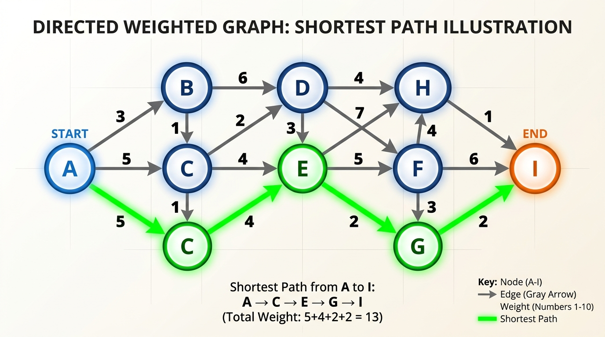

# Pattern 23: Shortest Path (Dijkstra & Friends)

<b>Shortest Path</b> problems all ask the same question — <i>what is the cheapest way to get from here to there?</i> — but the right algorithm depends entirely on what the <i>edges</i> look like. Picking the wrong one is the most common way to fail these questions, so before writing a line of code, run through this decision guide.

- <b>Unweighted graph</b> (every edge costs `1`): use plain <b>Breadth First Search</b>. The first time <b>BFS</b> reaches a node, it has reached it in the fewest hops, so no priority queue is needed at all. This is the <b>[Pattern 07: Tree Breadth First Search](./✅%20%20Pattern%2007:%20Tree%20Breadth%20First%20Search.md)</b> machinery applied to a graph, and it runs in `O(V+E)`. Reach for a heap here and you pay a `logV` factor for nothing.
- <b>Non-negative weights</b>: use <b>Dijkstra</b>. Keep the <i>frontier</i> in a <b>min-heap</b> and always expand the cheapest node discovered so far — `O(E*logV)` with a binary heap. Dijkstra's correctness rests on one assumption: extending a path can never make it cheaper. The moment a weight can be <i>negative</i>, that assumption dies and so does Dijkstra.
- <b>Negative edges, or a limit on the number of hops</b>: use <b>Bellman-Ford</b>. It relaxes <i>every</i> edge `V-1` times in `O(V*E)`, which is slower, but it tolerates negative weights and — the property we exploit below — after `i` rounds it knows the best path using at most `i` edges. That makes it the natural fit for any "at most `K` stops" constraint.
- <b>All pairs, on a small dense graph</b>: use <b>Floyd-Warshall</b>. Three nested loops over a distance matrix give every pair's shortest path in `O(V³)` time and `O(V²)` space. For `V ≤ ~400` this beats running Dijkstra `V` times, and it is a fraction of the code.
- <b>Weights are only `0` or `1`</b>: use <b>0-1 BFS</b>. Swap the heap for a <b>Deque</b>: a `0`-weight edge goes to the <i>front</i> (same cost, process it next), a `1`-weight edge goes to the <i>back</i>. The deque stays sorted by construction, which buys you `O(V+E)` — no `logV` at all. Problems phrased as "minimum walls to break" or "minimum edges to reverse" are usually this in disguise.

One more relative worth knowing: on a <b>Directed Acyclic Graph</b> you can beat Dijkstra outright. Relax edges in <b>[Pattern 16: Topological Sort](./✅%20Pattern%2016:%20🔎%20Topological%20Sort%20(Graph).md)</b> order and every node is finalized in a single `O(V+E)` sweep, negative weights and all, because a topological order guarantees you never need to revisit a node.

Notice that most of these options want a <b>priority queue</b>, and <i>Java ships with a built-in heap: `PriorityQueue`</i>. We will use it extensively in the subsequent problems, but it is worth understanding how a binary heap is implemented under the hood — so let's write one good one.



## The MinHeap we will reuse

A <b>binary heap</b> is an array pretending to be a tree: the children of index `i` live at `2i+1` and `2i+2`, and its parent lives at `(i-1)/2`. Two operations keep the shape honest:

- <b>bubbleUp</b> — after `push`, the new value sits at the last leaf and may be smaller than its parent, so we swap it upward until it isn't. The loop condition <b>must</b> be `child > 0`: index `0` is the root and `(0-1)/2` is `0` due to integer division, so a loop guarded on the parent instead of the child happily swaps the root with itself endlessly or reads out of bounds.
- <b>bubbleDown</b> — after `pop`, we move the last leaf into the root and sink it, at each step swapping with the <i>smaller of its two children</i>. Comparing against only one child is the classic bug: it leaves the heap unordered without ever throwing.

The other trap is the <b>comparator</b>. We store `[distance, node]` <i>tuples</i> (as integer arrays), so we need to provide a custom `Comparator` to sort these arrays correctly. Making the comparator injectable also means the same class serves as a <b>max-heap</b> when we flip the comparison logic.

```java
import java.util.*;

class MinHeap {
    private List<int[]> heap;
    private Comparator<int[]> comparator;

    public MinHeap() {
        this((a, b) -> Integer.compare(a[0], b[0]));
    }

    public MinHeap(Comparator<int[]> comparator) {
        this.heap = new ArrayList<>();
        this.comparator = comparator;
    }

    public int size() {
        return this.heap.size();
    }

    public boolean isEmpty() {
        return this.heap.isEmpty();
    }

    public int[] peek() {
        return this.heap.isEmpty() ? null : this.heap.get(0);
    }

    public int push(int[] value) {
        this.heap.add(value);
        this.bubbleUp(this.heap.size() - 1);
        return this.heap.size();
    }

    public int[] pop() {
        if (this.heap.isEmpty()) return null;
        int[] top = this.heap.get(0);
        int[] last = this.heap.remove(this.heap.size() - 1);
        
        if (!this.heap.isEmpty()) {
            this.heap.set(0, last);
            this.bubbleDown(0);
        }
        return top;
    }

    private void bubbleUp(int startIndex) {
        int child = startIndex;
        while (child > 0) {
            int parent = (child - 1) / 2;
            if (this.comparator.compare(this.heap.get(child), this.heap.get(parent)) >= 0) break;
            this.swap(child, parent);
            child = parent;
        }
    }

    private void bubbleDown(int startIndex) {
        int length = this.heap.size();
        int parent = startIndex;
        while (true) {
            int left = 2 * parent + 1;
            int right = 2 * parent + 2;
            int best = parent;
            
            if (left < length && this.comparator.compare(this.heap.get(left), this.heap.get(best)) < 0) best = left;
            if (right < length && this.comparator.compare(this.heap.get(right), this.heap.get(best)) < 0) best = right;
            
            if (best == parent) break;
            this.swap(parent, best);
            parent = best;
        }
    }

    private void swap(int i, int j) {
        int[] temp = this.heap.get(i);
        this.heap.set(i, this.heap.get(j));
        this.heap.set(j, temp);
    }
}

class Solution {
    public static void main(String[] args) {
        //a min-heap of [distance, node] tuples
        MinHeap minHeap = new MinHeap();
        int[][] entries = {{7, 3}, {2, 1}, {9, 4}, {4, 2}, {2, 5}};
        for (int[] entry : entries) {
            minHeap.push(entry);
        }
        System.out.println("size: " + minHeap.size() + ", peek: " + Arrays.toString(minHeap.peek()));
        //size: 5, peek: [2, 1]

        List<int[]> drained = new ArrayList<>();
        while (!minHeap.isEmpty()) drained.add(minHeap.pop());
        System.out.print("drained: ");
        for (int[] arr : drained) System.out.print(Arrays.toString(arr) + " ");
        System.out.println();
        //drained: [2, 1] [2, 5] [4, 2] [7, 3] [9, 4] 
        
        System.out.println("pop on empty: " + minHeap.pop());
        //pop on empty: null

        //the same class works as a MAX-heap by flipping the comparator
        MinHeap maxHeap = new MinHeap((a, b) -> Integer.compare(b[0], a[0]));
        int[][] maxEntries = {{2, 2}, {9, 1}, {5, 3}, {7, 4}};
        for (int[] entry : maxEntries) maxHeap.push(entry);
        
        List<Integer> byLargest = new ArrayList<>();
        while (!maxHeap.isEmpty()) byLargest.add(maxHeap.pop()[0]);
        System.out.println("max-heap order: " + byLargest);
        //max-heap order: [9, 7, 5, 2]
    }
}
```
- The <b>time complexity</b> of `push` and `pop` is `O(logN)`, where `N` is the number of elements in the heap: a binary heap of `N` elements has height `O(logN)`, and both operations walk one root-to-leaf path.
- `peek` and `size` are `O(1)`. The <b>space complexity</b> is `O(N)` for the backing array.

In the solutions below, we will use Java's built-in `PriorityQueue` which gives us the same functionality out of the box.

## Network Delay Time (medium)
https://leetcode.com/problems/network-delay-time/

> You are given a network of `n` nodes, labeled from `1` to `n`. You are also given `times`, a list of travel times as directed edges `times[i] = [uᵢ, vᵢ, wᵢ]`, where `uᵢ` is the source node, `vᵢ` is the target node, and `wᵢ` is the time it takes for a signal to travel from source to target.
>
> We will send a signal from a given node `k`. Return the <b>minimum time</b> it takes for all the `n` nodes to receive the signal. If it is impossible for all the `n` nodes to receive the signal, return `-1`.

This is <b>Dijkstra</b> in its purest form, with one small twist at the end. Signals leave `k` and spread along every edge at once, so the time at which a node hears the signal is precisely the <i>shortest path</i> from `k` to that node. The network is done broadcasting when the <b>last</b> node hears it — so the answer is the <b>maximum</b> over all the shortest distances, and `-1` if any node is still at `Infinity`.

All the weights are non-negative, which is exactly Dijkstra's licence to be greedy: once we pop a node off the heap, no later path can improve it, because every remaining route starts from something already at least as expensive and only adds more.

One detail trips people up. We never delete stale entries from the heap — finding them would cost `O(N)`. Instead we allow <i>duplicates</i> and skip any entry whose `distance` is worse than the best we have on record:

`if (distance > dist[node]) continue;`

This "lazy deletion" is what keeps the implementation short, and it is why the heap can hold up to `O(E)` entries rather than `O(V)`.

```java
import java.util.*;

class Solution {
    public static int networkDelayTime(int[][] times, int n, int k) {
        //1. build the adjacency list: graph[u] = [[v, weight], ...]
        List<List<int[]>> graph = new ArrayList<>();
        for (int i = 0; i <= n; i++) {
            graph.add(new ArrayList<>());
        }
        for (int[] time : times) {
            graph.get(time[0]).add(new int[]{time[1], time[2]});
        }

        //2. dist[node] is the best known cost from k to node
        int[] dist = new int[n + 1];
        Arrays.fill(dist, Integer.MAX_VALUE);
        dist[k] = 0;

        //3. the frontier, ordered by cheapest known distance
        PriorityQueue<int[]> minHeap = new PriorityQueue<>((a, b) -> Integer.compare(a[0], b[0]));
        minHeap.offer(new int[]{0, k});

        while (!minHeap.isEmpty()) {
            int[] current = minHeap.poll();
            int distance = current[0];
            int node = current[1];

            //a stale copy of this node, we already finalized it with a cheaper distance
            if (distance > dist[node]) continue;

            for (int[] edge : graph.get(node)) {
                int neighbor = edge[0];
                int weight = edge[1];
                int candidate = distance + weight;
                
                //only relax when we found a strictly better route
                if (candidate < dist[neighbor]) {
                    dist[neighbor] = candidate;
                    minHeap.offer(new int[]{candidate, neighbor});
                }
            }
        }

        //4. the broadcast is finished when the LAST node receives it
        int answer = 0;
        for (int node = 1; node <= n; node++) {
            if (dist[node] == Integer.MAX_VALUE) return -1;
            answer = Math.max(answer, dist[node]);
        }
        return answer;
    }

    public static void main(String[] args) {
        System.out.println("Network delay time: " + networkDelayTime(new int[][]{{2, 1, 1}, {2, 3, 1}, {3, 4, 1}}, 4, 2));
        //Network delay time: 2
        //Nodes 1 and 3 hear it at time 1, node 4 at time 2 via 2 -> 3 -> 4.

        System.out.println("Network delay time: " + networkDelayTime(new int[][]{{1, 2, 1}}, 2, 1));
        //Network delay time: 1

        System.out.println("Network delay time: " + networkDelayTime(new int[][]{{1, 2, 1}}, 2, 2));
        //Network delay time: -1
        //The edge points 1 -> 2, so node 1 never hears a signal that started at node 2.

        System.out.println("Network delay time: " + networkDelayTime(new int[][]{{1, 2, 1}, {2, 3, 2}, {1, 3, 4}}, 3, 1));
        //Network delay time: 3
        //The direct 1 -> 3 edge costs 4, but 1 -> 2 -> 3 costs only 3.
    }
}
```
- The <b>time complexity</b> of the above algorithm is `O(E*logV)`, where `V` is the number of nodes and `E` is the number of edges. Each edge pushes at most one entry onto the heap, and every `push`/`pop` costs `O(logE)`, which is `O(logV)` since `E ≤ V²`.
- The <b>space complexity</b> is `O(V+E)` — the adjacency list is `O(V+E)`, `dist` is `O(V)`, and the heap can reach `O(E)` because of the stale duplicates we deliberately tolerate.

## Path with Minimum Effort (medium)
https://leetcode.com/problems/path-with-minimum-effort/

> You are a hiker preparing for an upcoming hike. You are given `heights`, a 2D array of size `rows x columns`, where `heights[row][col]` represents the height of cell `(row, col)`. You are situated in the top-left cell, `(0, 0)`, and you hope to travel to the bottom-right cell, `(rows-1, columns-1)`. You can move <b>up, down, left, or right</b>.
>
> A route's <b>effort</b> is the <b>maximum absolute difference</b> in heights between two consecutive cells of the route. Return the minimum effort required to travel from the top-left cell to the bottom-right cell.

Two shifts from the previous problem. First, the graph is <i>implicit</i> — we never build an adjacency list, because a grid cell's neighbours are always the four cells around it. Second, and this is the interesting part, the cost of a path is not the <b>sum</b> of its edges but the <b>maximum</b> of them. This is called a <i>minimax</i> or <i>bottleneck</i> path.

Remarkably, Dijkstra needs only one line changed. Where the standard version accumulates `distance + weight`, we accumulate `Math.max(currentEffort, step)`. The greedy argument still holds, because `Math.max` shares the property Dijkstra actually depends on: extending a path can never <i>decrease</i> its cost. So the first time we pop the destination, its effort is already optimal and we can return immediately.

Worth noting that <b>Union-Find</b> also solves this — sort the edges by weight and keep adding them until `(0,0)` and the bottom-right cell join the same component. That is `O(E*logE)`, essentially the same bound, and the same insight from the other direction.

```java
import java.util.*;

class Solution {
    public static int minimumEffortPath(int[][] heights) {
        int rows = heights.length;
        int cols = heights[0].length;

        //effort[r][c] = the smallest possible "largest single step" to reach (r, c)
        int[][] effort = new int[rows][cols];
        for (int[] row : effort) {
            Arrays.fill(row, Integer.MAX_VALUE);
        }
        effort[0][0] = 0;

        //the heap holds [effortSoFar, row, col]
        PriorityQueue<int[]> minHeap = new PriorityQueue<>((a, b) -> Integer.compare(a[0], b[0]));
        minHeap.offer(new int[]{0, 0, 0});

        int[][] directions = {{-1, 0}, {1, 0}, {0, -1}, {0, 1}};

        while (!minHeap.isEmpty()) {
            int[] current = minHeap.poll();
            int currentEffort = current[0];
            int row = current[1];
            int col = current[2];

            //the first time we pop the bottom-right cell, its effort is already optimal
            if (row == rows - 1 && col == cols - 1) return currentEffort;

            //stale entry, a cheaper path to this cell was already settled
            if (currentEffort > effort[row][col]) continue;

            for (int[] dir : directions) {
                int nextRow = row + dir[0];
                int nextCol = col + dir[1];
                
                if (nextRow < 0 || nextRow >= rows || nextCol < 0 || nextCol >= cols) continue;

                //the cost of a PATH is the max of its steps, not the sum
                int step = Math.abs(heights[nextRow][nextCol] - heights[row][col]);
                int candidate = Math.max(currentEffort, step);

                if (candidate < effort[nextRow][nextCol]) {
                    effort[nextRow][nextCol] = candidate;
                    minHeap.offer(new int[]{candidate, nextRow, nextCol});
                }
            }
        }

        //a grid is always connected, so we only get here for a 1x1 grid
        return 0;
    }

    public static void main(String[] args) {
        System.out.println("Minimum effort: " + minimumEffortPath(new int[][]{{1, 2, 2}, {3, 8, 2}, {5, 3, 5}}));
        //Minimum effort: 2
        //Going right then down through the 2s peaks at a step of 2, which beats
        //any route that has to cross the 8.

        System.out.println("Minimum effort: " + minimumEffortPath(new int[][]{{1, 2, 3}, {3, 8, 4}, {5, 3, 5}}));
        //Minimum effort: 1
        //The route 1 -> 2 -> 3 -> 4 -> 5 never steps by more than 1.

        int[][] flatRoute = {
            {1, 2, 1, 1, 1},
            {1, 2, 1, 2, 1},
            {1, 2, 1, 2, 1},
            {1, 2, 1, 2, 1},
            {1, 1, 1, 2, 1}
        };
        System.out.println("Minimum effort: " + minimumEffortPath(flatRoute));
        //Minimum effort: 0
        //A snaking route made entirely of 1s exists, so no step costs anything.

        System.out.println("Minimum effort: " + minimumEffortPath(new int[][]{{3}}));
        //Minimum effort: 0
        //Start and destination are the same cell, so there are no steps to take.
    }
}
```
- The <b>time complexity</b> of the above algorithm is `O(R*C*log(R*C))`, where `R` and `C` are the number of rows and columns. Every cell has at most `4` neighbours, so `E = O(R*C)` and the `O(E*logV)` Dijkstra bound collapses to this.
- The <b>space complexity</b> is `O(R*C)` for the `effort` matrix plus the heap.

## Swim in Rising Water (hard)
https://leetcode.com/problems/swim-in-rising-water/

> You are given an `n x n` integer matrix `grid` where each value `grid[i][j]` represents the elevation at that point. It starts raining. At time `t`, the water level is `t`. You can swim from a square to a 4-directionally adjacent square if and only if the elevation of both squares individually are <b>at most</b> `t`.
>
> Return the least time until you can reach the bottom-right square `(n-1, n-1)` from the top-left square `(0, 0)`.

Read past the rain and this is the <i>same minimax path</i> as <b>[Path with Minimum Effort](#path-with-minimum-effort-medium)</b>. You can traverse a route at time `t` exactly when `t` is at least the <b>highest elevation anywhere on that route</b> — so we want the route whose maximum elevation is as small as possible, and that minimum-of-maximums <i>is</i> the answer.

The only change from the previous solution is what we feed into `Math.max`. There, the step cost was the height <i>difference</i> between two cells; here it is simply the <i>elevation</i> of the cell we are entering. Note the initialization too: `best[0][0]` starts at `grid[0][0]` and not `0`, because we must wait for the water to cover the starting square before we can even set off.

The temptation here is to <b>binary search</b> the answer and run a <b>BFS</b> flood-fill for each candidate `t`. That works, and it is a perfectly good interview answer at `O(n²*logn)` — but Dijkstra gets there in a single pass with the same bound and no outer search loop.

```java
import java.util.*;

class Solution {
    public static int swimInWater(int[][] grid) {
        int n = grid.length;

        //best[r][c] = the lowest water level at which (r, c) becomes reachable
        int[][] best = new int[n][n];
        for (int[] row : best) {
            Arrays.fill(row, Integer.MAX_VALUE);
        }
        best[0][0] = grid[0][0];

        //the heap holds [waterLevel, row, col]
        PriorityQueue<int[]> minHeap = new PriorityQueue<>((a, b) -> Integer.compare(a[0], b[0]));
        minHeap.offer(new int[]{grid[0][0], 0, 0});

        int[][] directions = {{-1, 0}, {1, 0}, {0, -1}, {0, 1}};

        while (!minHeap.isEmpty()) {
            int[] current = minHeap.poll();
            int level = current[0];
            int row = current[1];
            int col = current[2];

            //the first time we reach the bottom-right corner, `level` is the answer
            if (row == n - 1 && col == n - 1) return level;

            //stale entry
            if (level > best[row][col]) continue;

            for (int[] dir : directions) {
                int nextRow = row + dir[0];
                int nextCol = col + dir[1];
                
                if (nextRow < 0 || nextRow >= n || nextCol < 0 || nextCol >= n) continue;

                //we must wait until the water covers the tallest cell on the path
                int candidate = Math.max(level, grid[nextRow][nextCol]);

                if (candidate < best[nextRow][nextCol]) {
                    best[nextRow][nextCol] = candidate;
                    minHeap.offer(new int[]{candidate, nextRow, nextCol});
                }
            }
        }

        return -1;
    }

    public static void main(String[] args) {
        System.out.println("Least time to swim: " + swimInWater(new int[][]{{0, 2}, {1, 3}}));
        //Least time to swim: 3
        //The bottom-right square itself has elevation 3, so we can never finish sooner.

        int[][] island = {
            {0, 1, 2, 3, 4},
            {24, 23, 22, 21, 5},
            {12, 13, 14, 15, 16},
            {11, 17, 18, 19, 20},
            {10, 9, 8, 7, 6}
        };
        System.out.println("Least time to swim: " + swimInWater(island));
        //Least time to swim: 16
        //The snaking route along the low numbers peaks at elevation 16.

        System.out.println("Least time to swim: " + swimInWater(new int[][]{{3, 2}, {0, 1}}));
        //Least time to swim: 3
        //This time the START is the tall square, so we wait for t = 3 before setting off.

        System.out.println("Least time to swim: " + swimInWater(new int[][]{{0}}));
        //Least time to swim: 0
    }
}
```
- The <b>time complexity</b> of the above algorithm is `O(n²*logn)`, where `n` is the side of the grid. There are `n²` cells and `O(n²)` edges, and each heap operation costs `O(log(n²))`, which is `O(logn)`.
- The <b>space complexity</b> is `O(n²)` for the `best` matrix and the heap.

## Cheapest Flights Within K Stops (medium)
https://leetcode.com/problems/cheapest-flights-within-k-stops/

> There are `n` cities connected by some number of flights. You are given an array `flights` where `flights[i] = [fromᵢ, toᵢ, priceᵢ]` indicates that there is a flight from city `fromᵢ` to city `toᵢ` with cost `priceᵢ`.
>
> You are also given three integers `src`, `dst`, and `k`. Return the <b>cheapest price</b> from `src` to `dst` with <b>at most `k` stops</b>. If there is no such route, return `-1`.

<b>Here is where Dijkstra is the wrong tool</b>, and it is worth being precise about why. Dijkstra's whole engine is the claim that once a node is popped its distance is final — so it records exactly <i>one</i> number per node and never looks back. But with a hop budget, "best" is no longer one-dimensional. A route that reaches a city <i>cheaply</i> may have burned so many hops that it cannot continue, while a slightly <i>pricier</i> route that arrived in fewer hops still can. Dijkstra has already thrown that pricier arrival away.

You can watch it happen with `flights = [[0,1,100], [1,2,100], [0,2,500]]`, `src = 0`, `dst = 2`, `k = 0`. Plain Dijkstra settles city `2` at `200` via city `1` — but that route makes one stop and our budget is zero. The correct answer is the `500` direct flight. The code below runs an unconstrained Dijkstra on that exact graph on purpose, so you can see it return the wrong number.

<b>Bellman-Ford</b> is built for this, because its rounds <i>are</i> hop counts: after round `i`, every entry is the cheapest price reachable using at most `i` edges. Since `k` stops means at most `k+1` flights, we run `k+1` rounds and read off the answer.

The one thing you must get right is <i>freezing the previous round</i>. Relax against the array you are currently writing into and a single round can chain flight after flight — `0 → 1` then immediately `1 → 2` — silently spending two hops in one round. Copying `cost` into `previous` at the top of each round is what keeps a round worth exactly one hop.

```java
import java.util.*;

class Solution {
    public static int findCheapestPrice(int n, int[][] flights, int src, int dst, int k) {
        //cost[node] = cheapest price to reach `node` using at most `round + 1` edges
        int[] cost = new int[n];
        Arrays.fill(cost, Integer.MAX_VALUE);
        cost[src] = 0;

        //`k` stops means at most `k + 1` flights, so we run k+1 relaxation rounds
        for (int round = 0; round <= k; round++) {
            //FREEZE the previous round, otherwise a single round could chain two
            //flights together and quietly use more hops than the budget allows
            int[] previous = Arrays.copyOf(cost, cost.length);
            boolean changed = false;

            for (int[] flight : flights) {
                int from = flight[0];
                int to = flight[1];
                int price = flight[2];

                if (previous[from] == Integer.MAX_VALUE) continue;
                
                int candidate = previous[from] + price;
                if (candidate < cost[to]) {
                    cost[to] = candidate;
                    changed = true;
                }
            }

            //nothing improved, so more rounds cannot help either
            if (!changed) break;
        }

        return cost[dst] == Integer.MAX_VALUE ? -1 : cost[dst];
    }

    //a plain Dijkstra that IGNORES the hop limit, shown only to prove it is the wrong tool.
    //No heap needed to make the point: scanning for the minimum is the O(V*V) variant.
    public static int dijkstraIgnoringStops(int n, int[][] flights, int src, int dst) {
        int[] dist = new int[n];
        Arrays.fill(dist, Integer.MAX_VALUE);
        boolean[] settled = new boolean[n];
        dist[src] = 0;

        for (int step = 0; step < n; step++) {
            //pick the closest node we have not settled yet
            int node = -1;
            for (int i = 0; i < n; i++) {
                if (!settled[i] && (node == -1 || dist[i] < dist[node])) node = i;
            }
            if (node == -1 || dist[node] == Integer.MAX_VALUE) break;
            settled[node] = true;

            //Dijkstra stores ONE number per node, with nowhere to record "how many hops"
            for (int[] flight : flights) {
                int from = flight[0];
                int to = flight[1];
                int price = flight[2];
                if (from == node && dist[node] + price < dist[to]) {
                    dist[to] = dist[node] + price;
                }
            }
        }

        return dist[dst] == Integer.MAX_VALUE ? -1 : dist[dst];
    }

    public static void main(String[] args) {
        int[][] flights = {{0, 1, 100}, {1, 2, 100}, {2, 0, 100}, {1, 3, 600}, {2, 3, 200}};
        System.out.println("Cheapest price: " + findCheapestPrice(4, flights, 0, 3, 1));
        //Cheapest price: 700
        //0 -> 1 -> 3 costs 700 and makes one stop. The cheaper 0 -> 1 -> 2 -> 3 route
        //costs 400 but makes two stops, which is over budget.

        int[][] small = {{0, 1, 100}, {1, 2, 100}, {0, 2, 500}};
        System.out.println("Cheapest price: " + findCheapestPrice(3, small, 0, 2, 1));
        //Cheapest price: 200
        //With a budget of one stop, 0 -> 1 -> 2 is allowed.

        System.out.println("Cheapest price: " + findCheapestPrice(3, small, 0, 2, 0));
        //Cheapest price: 500
        //With no stops allowed, only the direct flight qualifies.

        System.out.println("Cheapest price: " + findCheapestPrice(3, new int[][]{{0, 1, 100}}, 0, 2, 5));
        //Cheapest price: -1
        //No number of hops reaches city 2.

        System.out.println("Dijkstra ignoring stops: " + dijkstraIgnoringStops(3, small, 0, 2));
        //Dijkstra ignoring stops: 200
        //This is WRONG for k = 0, where the true answer is 500. Dijkstra settled city 2
        //at 200 and discarded the pricier one-hop arrival that was still legal.
    }
}
```
- The <b>time complexity</b> of the above algorithm is `O(K*E)`, where `K` is the hop budget and `E` is the number of flights, since we sweep every edge once per round. Note this beats textbook Bellman-Ford's `O(V*E)` whenever `K < V-1`.
- The <b>space complexity</b> is `O(V)` — one `cost` array plus the `previous` snapshot we copy each round.

### A Dijkstra that <i>would</i> work
The real lesson is not "Dijkstra can't do this", it is "Dijkstra needs the right <i>state</i>". Make the heap entries `[cost, node, stopsUsed]` and track a best cost per `(node, stopsUsed)` pair, and the greedy argument is restored, because now the state you settle really is final. That costs `O(V*K)` states instead of `O(V)` — precisely the extra dimension Bellman-Ford was giving us for free.

## Path with Maximum Probability (medium)
https://leetcode.com/problems/path-with-maximum-probability/

> You are given an undirected weighted graph of `n` nodes (`0`-indexed), represented by an edge list where `edges[i] = [a, b]` is an undirected edge connecting the nodes `a` and `b` with a probability of success of traversing that edge `succProb[i]`.
>
> Given two nodes `start` and `end`, find the path with the <b>maximum probability of success</b> to go from `start` to `end` and return its success probability. If there is no path from `start` to `end`, return `0`.

Now we want the <b>largest</b> value rather than the smallest, and the costs <b>multiply</b> instead of adding. Both changes are cosmetic; the algorithm is unchanged.

The key question is whether the greedy argument survives, and it does — for a reason worth stating out loud. Dijkstra needs "extending a path never improves it". Every probability lies in `[0, 1]`, so multiplying by another edge can only hold a path's probability the same or push it <b>down</b>. Longer is never better, which is exactly the guarantee we need. It is also why there is no "negative cycle" analogue here: you cannot loop around a cycle to boost your odds.

So we flip three things: the comparator becomes `(a, b) => b[0] - a[0]` to turn our `MinHeap` into a <b>max-heap</b>, `best` is seeded with `0` instead of `Infinity`, and the relaxation test becomes `candidate > best[neighbor]`.

<i>This is also the classic instance of the "just use logs" trick:</i> maximizing `p₁ * p₂ * ...` is the same as minimizing `-log(p₁) + -log(p₂) + ...`, and since each `-log(pᵢ) ≥ 0` that is a bog-standard non-negative shortest path. Handy to mention in an interview, but multiplying directly is shorter and dodges floating-point log error.

```java
import java.util.*;

class Solution {
    public static double maxProbability(int n, int[][] edges, double[] succProb, int start, int end) {
        //1. undirected adjacency list: graph[u] = [[v, probability], ...]
        //We will store double array for the node and prob
        List<List<double[]>> graph = new ArrayList<>();
        for (int i = 0; i < n; i++) graph.add(new ArrayList<>());
        for (int i = 0; i < edges.length; i++) {
            int u = edges[i][0];
            int v = edges[i][1];
            double prob = succProb[i];
            graph.get(u).add(new double[]{v, prob});
            graph.get(v).add(new double[]{u, prob});
        }

        //2. best[node] = the highest probability found so far for start -> node
        double[] best = new double[n];
        best[start] = 1.0;

        //3. flip the comparator so the LARGEST probability is popped first
        //Tuple is {probability, node}
        PriorityQueue<double[]> maxHeap = new PriorityQueue<>((a, b) -> Double.compare(b[0], a[0]));
        maxHeap.offer(new double[]{1.0, start});

        while (!maxHeap.isEmpty()) {
            double[] current = maxHeap.poll();
            double probability = current[0];
            int node = (int) current[1];

            //greedy is safe: probabilities multiply by factors in [0, 1], so a path
            //can only ever get WORSE as it grows longer
            if (node == end) return probability;

            //stale entry, a better probability for this node was already settled
            if (probability < best[node]) continue;

            for (double[] edge : graph.get(node)) {
                int neighbor = (int) edge[0];
                double edgeProbability = edge[1];
                double candidate = probability * edgeProbability;
                
                if (candidate > best[neighbor]) {
                    best[neighbor] = candidate;
                    maxHeap.offer(new double[]{candidate, neighbor});
                }
            }
        }

        //`end` is unreachable from `start`
        return 0.0;
    }

    public static void main(String[] args) {
        System.out.println("Max probability: " + maxProbability(3, new int[][]{{0, 1}, {1, 2}, {0, 2}}, new double[]{0.5, 0.5, 0.2}, 0, 2));
        //Max probability: 0.25
        //0 -> 1 -> 2 gives 0.5 * 0.5 = 0.25, which beats the direct edge's 0.2.

        System.out.println("Max probability: " + maxProbability(3, new int[][]{{0, 1}, {1, 2}, {0, 2}}, new double[]{0.5, 0.5, 0.3}, 0, 2));
        //Max probability: 0.3
        //Now the direct edge at 0.3 beats the two-hop route's 0.25.

        System.out.println("Max probability: " + maxProbability(3, new int[][]{{0, 1}}, new double[]{0.5}, 0, 2));
        //Max probability: 0.0
        //Node 2 is isolated, so there is no path at all.

        int[][] webEdges = {{1, 4}, {2, 4}, {0, 4}, {0, 3}, {0, 2}, {2, 3}};
        double[] webProbs = {0.37, 0.17, 0.93, 0.23, 0.39, 0.04};
        System.out.println("Max probability: " + maxProbability(5, webEdges, webProbs, 3, 4));
        //Max probability: 0.2139
        //3 -> 0 -> 4 gives 0.23 * 0.93 = 0.2139.
    }
}
```
- The <b>time complexity</b> of the above algorithm is `O(E*logV)`, where `V` is the number of nodes and `E` is the number of edges — identical to plain Dijkstra, since flipping a comparator costs nothing.
- The <b>space complexity</b> is `O(V+E)` for the adjacency list, the `best` array, and the heap.

## Find the City With the Smallest Number of Neighbors at a Threshold Distance (medium)
https://leetcode.com/problems/find-the-city-with-the-smallest-number-of-neighbors-at-a-threshold-distance/

> There are `n` cities numbered from `0` to `n-1`. Given the array `edges` where `edges[i] = [fromᵢ, toᵢ, weightᵢ]` represents a <b>bidirectional and weighted</b> edge between cities `fromᵢ` and `toᵢ`, and given the integer `distanceThreshold`, return the city with the <b>smallest number of cities</b> that are reachable through some path and whose distance is <b>at most</b> `distanceThreshold`. If there are multiple such cities, return the city with the <b>greatest number</b>.

This is an <b>all-pairs</b> question — we need every city's distance to every other city — and the constraints cap `n` at `100`. That is the signature of <b>Floyd-Warshall</b>. At `n = 100` its `O(V³)` is a million operations, and it is a fraction of the code that running Dijkstra `100` times would take.

The algorithm is <b>Dynamic Programming</b> over a widening set of permitted waypoints. `dist[i][j]` starts as the direct edge, and after the iteration for `via`, it holds the best `i → j` distance whose intermediate stops all come from `{0..via}`. Each step just asks: is routing through `via` better than what I already have?

`dist[i][j] = Math.min(dist[i][j], dist[i][via] + dist[via][j])`

Which brings us to the one mistake that matters: <b>`via` must be the outermost loop</b>. Put `i` or `j` outside and the DP layers collapse — you finalize a pair before all of its possible waypoints have been considered, and the results are quietly wrong on some inputs while looking fine on others. Two smaller details: the graph is undirected, so fill both `dist[from][to]` and `dist[to][from]`; and the "return the <i>greatest</i> city number" tie-break falls out for free if the final comparison uses `<=` rather than `<`.

Floyd-Warshall is also the tool for detecting a <b>negative cycle</b>: after the triple loop, any `dist[i][i] < 0` means node `i` sits on one.

```java
import java.util.*;

class Solution {
    public static int findTheCity(int n, int[][] edges, int distanceThreshold) {
        //1. seed the all-pairs matrix: 0 on the diagonal, Infinity everywhere else
        int[][] dist = new int[n][n];
        for (int i = 0; i < n; i++) {
            Arrays.fill(dist[i], Integer.MAX_VALUE);
            dist[i][i] = 0;
        }

        //the graph is undirected, so fill both directions.
        //keep the smallest weight in case of duplicate edges
        for (int[] edge : edges) {
            int from = edge[0];
            int to = edge[1];
            int weight = edge[2];
            dist[from][to] = Math.min(dist[from][to], weight);
            dist[to][from] = Math.min(dist[to][from], weight);
        }

        //2. Floyd-Warshall: `via` MUST be the outermost loop.
        //After iteration `via`, dist[i][j] is the best path whose intermediate
        //nodes are all drawn from {0..via}
        for (int via = 0; via < n; via++) {
            for (int i = 0; i < n; i++) {
                if (dist[i][via] == Integer.MAX_VALUE) continue;
                for (int j = 0; j < n; j++) {
                    if (dist[via][j] == Integer.MAX_VALUE) continue;
                    int through = dist[i][via] + dist[via][j];
                    if (through < dist[i][j]) dist[i][j] = through;
                }
            }
        }

        //3. count reachable neighbours per city, breaking ties by the GREATEST index
        int answer = -1;
        int fewest = Integer.MAX_VALUE;
        for (int city = 0; city < n; city++) {
            int reachable = 0;
            for (int other = 0; other < n; other++) {
                if (other != city && dist[city][other] <= distanceThreshold) reachable++;
            }
            //`<=` lets a later city win a tie, which is exactly what is asked for
            if (reachable <= fewest) {
                fewest = reachable;
                answer = city;
            }
        }

        return answer;
    }

    public static void main(String[] args) {
        System.out.println("Fewest reachable neighbours: " + findTheCity(4, new int[][]{{0, 1, 3}, {1, 2, 1}, {1, 3, 4}, {2, 3, 1}}, 4));
        //Fewest reachable neighbours: 3
        //Cities 0 and 3 both reach 2 neighbours within distance 4, so the greater
        //city number wins the tie.

        int[][] chainEdges = {{0, 1, 2}, {0, 4, 8}, {1, 2, 3}, {1, 4, 2}, {2, 3, 1}, {3, 4, 1}};
        System.out.println("Fewest reachable neighbours: " + findTheCity(5, chainEdges, 2));
        //Fewest reachable neighbours: 0
        //City 0 reaches only city 1 within distance 2.

        System.out.println("Fewest reachable neighbours: " + findTheCity(2, new int[][]{{0, 1, 10}}, 5));
        //Fewest reachable neighbours: 1
        //The single edge is longer than the threshold, so both cities reach nobody
        //and the tie-break picks the larger index.

        int[][] spread = {{0, 1, 10}, {0, 2, 1}, {2, 3, 1}, {1, 4, 1}, {4, 5, 10}};
        System.out.println("Fewest reachable neighbours: " + findTheCity(6, spread, 20));
        //Fewest reachable neighbours: 5
        //City 5 sits at the far end of the chain and only reaches cities 4 and 1.
    }
}
```
- The <b>time complexity</b> of the above algorithm is `O(V³)`, where `V` is the number of cities, driven by the three nested loops. The final counting pass is only `O(V²)` and does not change the bound.
- The <b>space complexity</b> is `O(V²)` for the distance matrix. Note that Floyd-Warshall is <i>in-place</i> — the textbook DP formulation wants a separate matrix per `via` layer, but overwriting a single matrix is safe here, because `dist[i][via]` and `dist[via][j]` are never themselves improved during iteration `via`.

### Choosing between Floyd-Warshall and repeated Dijkstra
Running Dijkstra from every node instead costs `O(V*E*logV)`. On a <i>sparse</i> graph where `E ≈ V` that is roughly `O(V²logV)`, comfortably beating `O(V³). On a <i>dense</i> graph where `E ≈ V²` it degrades to `O(V³logV)` — strictly worse. So the rule of thumb is: <b>dense and small, reach for Floyd-Warshall; sparse and large, run Dijkstra `V` times</b>.

###### #Dijkstra #ShortestPath #Graph #Java #GrokkingTheCodingInterviewPatterns #LeetCode #DataStructures #Algorithms
