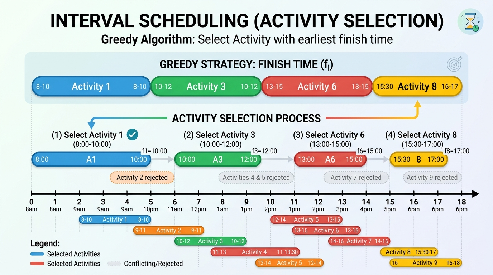

# Pattern 24: Greedy Algorithms

A <b>greedy algorithm</b> builds an answer one decision at a time, and at every step it takes whatever looks best <i>right now</i> without ever reconsidering. That is the whole technique. There is no memo table, no recursion tree, no backtracking — just a single sweep and a running answer. Which is exactly why greedy solutions are so short, so fast, and so easy to get catastrophically wrong.

The only interesting question in this entire pattern is: <b>when is a locally-optimal choice also globally optimal?</b>

The formal answer has a name — the <b>greedy-choice property</b>. A problem has it when there is <i>always</i> an optimal solution that agrees with the greedy pick at the current step. Note the phrasing: not "the greedy pick is in every optimal solution", but "some optimal solution contains the greedy pick". That weaker statement is enough, and it is what makes the standard proof work. The proof shape is called an <b>exchange argument</b> and it goes like this:

1. Assume some optimal solution `OPT` that does <i>not</i> contain your greedy choice `g`.
2. Show you can swap `g` into `OPT`, throwing out whatever `g` displaces.
3. Show the result is still valid and <b>no worse</b> than `OPT`.
4. Therefore an optimal solution containing `g` exists, so taking `g` costs you nothing. Recurse on the smaller problem.

If you can run that argument, greedy is provably correct. If you cannot, you almost certainly have a bug and not a proof gap.



### How to sanity-check a greedy instinct

Interview-speed heuristics, in the order you should reach for them:

1. <b>Try to break it by hand on tiny inputs.</b> Two or three elements is usually enough. Greedy failures are almost never subtle — they show up at `N = 3`.
2. <b>Look for a "trap" shape.</b> Greedy dies when a locally attractive choice <i>consumes a resource</i> that two better choices needed. Ask: "can taking the big shiny thing now block me from taking two medium things later?" If yes, you need <b>Dynamic Programming</b>.
3. <b>Brute-force it.</b> Write the exponential/DP answer for `N <= 12`, write the greedy answer, and diff them over random inputs. This is the single most valuable 5 minutes you can spend, and it is what separates "I think this is greedy" from "this is greedy".
4. <b>Check whether the choice is reversible.</b> If a choice can be made in fractions or undone, greedy tends to work. If it is all-or-nothing, be suspicious.

### Greedy vs. Dynamic Programming

Greedy and <b>Dynamic Programming</b> (see <b>Pattern 15: 0-1 Knapsack</b>) both require <i>optimal substructure</i> — the optimal answer is built from optimal answers to subproblems. The difference is how many subproblems you have to look at:

- <b>DP</b> tries <i>every</i> choice at each step and keeps the best. Cost: `O(N * capacity)`, `O(N^2)`, or worse.
- <b>Greedy</b> commits to <i>one</i> choice at each step and never looks back. Cost: usually `O(N)` or `O(N * logN)` for the sort.

So greedy is DP with the branching factor collapsed to 1. You are allowed to collapse it only when the greedy-choice property holds. The cleanest illustration of the boundary is the knapsack family:

- <b>Fractional knapsack</b> — you may take <i>part</i> of an item. Sort by `value / weight` ratio, take the best ratio until the bag is full, and slice the last item to fit. This is <b>provably optimal</b>: if your solution ever leaves a higher-ratio gram out while including a lower-ratio gram, swap one gram for the other and the total value strictly rises. That is the exchange argument, and it works precisely <i>because</i> you can move a single gram.
- <b>0/1 knapsack</b> — an item is all-or-nothing. The exchange argument collapses, because you cannot swap "one gram". A single fat, high-ratio item can occupy room that two lower-ratio items would have used more profitably. Greedy-by-ratio is now just a heuristic, and <b>Pattern 15: 0-1 Knapsack</b> exists because the only correct approach is DP.

### Two concrete failures, so you learn to distrust the instinct

The instinct you must specifically distrust is <b>"take the biggest thing that fits"</b>. Here it is failing twice.

<b>Coin change.</b> Everyone's mental model of making change is greedy — grab the largest coin that fits — and with real US denominations `[1, 5, 10, 25]` it happens to be correct. Change the coin system to `[1, 15, 25]` and ask for `30`:

- Greedy takes `25`, then is stuck paying `1 + 1 + 1 + 1 + 1` → <b>6 coins</b>.
- The optimum is `15 + 15` → <b>2 coins</b>.

Greedy is off by a factor of three, on a five-line problem, with an input a child could check. Note the trap shape from heuristic #2: the big coin `25` consumed budget that two `15`s needed.

<b>0/1 knapsack.</b> Capacity `10`, items `(weight 6, value 30)`, `(weight 5, value 20)`, `(weight 5, value 20)`. Ratios are `5.0`, `4.0`, `4.0`, so greedy grabs the `6/30` item first and then has only `4` units of room left — nothing else fits, total `30`. The optimum ignores the best ratio entirely and takes both `5/20` items for `40`. If items were divisible, greedy would score `46` and be exactly right.

````js
//A) Coin change: the greedy instinct fails on the coin system [1, 15, 25]
function greedyCoinCount(coins, amount) {
  const sorted = [...coins].sort((a, b) => b - a)
  let remaining = amount
  let count = 0

  for (const coin of sorted) {
    //always grab the biggest coin that still fits -- the greedy choice
    while (remaining >= coin) {
      remaining -= coin
      count++
    }
  }
  return remaining === 0 ? count : -1
}

function dpCoinCount(coins, amount) {
  //Dynamic Programming: consider every coin at every sub-amount
  const dp = new Array(amount + 1).fill(Infinity)
  dp[0] = 0

  for (let a = 1; a <= amount; a++) {
    for (const coin of coins) {
      if (coin <= a && dp[a - coin] + 1 < dp[a]) {
        dp[a] = dp[a - coin] + 1
      }
    }
  }
  return dp[amount] === Infinity ? -1 : dp[amount]
}

console.log(`greedy coins for 30: ${greedyCoinCount([1, 15, 25], 30)}`)
//greedy coins for 30: 6
console.log(`optimal coins for 30: ${dpCoinCount([1, 15, 25], 30)}`)
//optimal coins for 30: 2

//B) Knapsack: greedy by value/weight ratio is exact when items are divisible,
//   and wrong the moment they are not
const items = [
  { weight: 6, value: 30 },
  { weight: 5, value: 20 },
  { weight: 5, value: 20 },
]

function fractionalKnapsackGreedy(items, capacity) {
  const sorted = [...items].sort((a, b) => b.value / b.weight - a.value / a.weight)
  let room = capacity
  let value = 0

  for (const item of sorted) {
    if (room === 0) break
    const take = Math.min(item.weight, room)
    value += (item.value / item.weight) * take
    room -= take
  }
  return value
}

function zeroOneKnapsackGreedy(items, capacity) {
  const sorted = [...items].sort((a, b) => b.value / b.weight - a.value / a.weight)
  let room = capacity
  let value = 0

  for (const item of sorted) {
    //an item is all-or-nothing, so a fat high-ratio item can block two better ones
    if (item.weight <= room) {
      room -= item.weight
      value += item.value
    }
  }
  return value
}

function zeroOneKnapsackDP(items, capacity) {
  const dp = new Array(capacity + 1).fill(0)

  for (const item of items) {
    for (let c = capacity; c >= item.weight; c--) {
      dp[c] = Math.max(dp[c], dp[c - item.weight] + item.value)
    }
  }
  return dp[capacity]
}

console.log(`fractional knapsack (greedy is exact): ${fractionalKnapsackGreedy(items, 10)}`)
//fractional knapsack (greedy is exact): 46
console.log(`0/1 knapsack, greedy by ratio: ${zeroOneKnapsackGreedy(items, 10)}`)
//0/1 knapsack, greedy by ratio: 30
console.log(`0/1 knapsack, true optimum via DP: ${zeroOneKnapsackDP(items, 10)}`)
//0/1 knapsack, true optimum via DP: 40
````

### Where greedy reliably works

Three families cover nearly every greedy interview question:

1. <b>Sort, then sweep.</b> The hard part is choosing the sort key, and the sort key <i>is</i> the greedy choice. <b>Interval scheduling</b> lives here: to keep the maximum number of non-overlapping intervals you sort on `endTime`, because finishing earliest leaves the most room for everyone else. This is the same machinery as <b>Pattern 04: Merge Intervals</b> — same six overlap cases, same sort-first reflex — except there we sorted on `startTime` to <i>merge</i>, and here we sort on `endTime` to <i>select</i>. Worth internalizing that difference; it is a common interview trip-wire.
2. <b>Running best / running frontier.</b> Keep one or two scalars as you scan (<b>Maximum Subarray</b>, <b>Jump Game</b>, <b>Gas Station</b>). No sorting, `O(N)` time, `O(1)` space.
3. <b>Two-pass sweeps.</b> When each element is constrained from <i>both</i> sides, one greedy pass cannot see both. Sweep left-to-right satisfying one family of constraints, then right-to-left satisfying the other, and combine with a `max` (<b>Candy</b>). This trick generalizes far beyond `Candy` and is the highest-value idea in this pattern.

## Best Time to Buy and Sell Stock II (medium)
https://leetcode.com/problems/best-time-to-buy-and-sell-stock-ii/

> Given an array `prices` where `prices[i]` is the price of a stock on the `ith` day, find the <b>maximum profit</b> you can achieve. You may complete <b>as many transactions as you like</b>, but you may only hold at most one share at a time. You may buy and sell on the same day.

The instinct is to hunt for the "real" valleys and peaks — buy at each local minimum, sell at each local maximum. That works, but it is fiddly to implement and completely unnecessary.

Here is the reframe that makes this a one-liner. Any profitable trade from day `i` to day `j` telescopes into the sum of its daily deltas:

    prices[j] - prices[i] = (prices[i+1] - prices[i]) + (prices[i+2] - prices[i+1]) + ... + (prices[j] - prices[j-1])

Because we have unlimited transactions, holding across a multi-day rise earns exactly the same as selling and re-buying every single day of that rise. So the entire problem decomposes into independent daily decisions: for each adjacent pair, either we hold the stock overnight (banking `prices[i] - prices[i-1]`) or we do not (banking `0`).

<b>Why the greedy choice is safe:</b> the daily deltas are <i>independent</i> — nothing about taking day `i`'s gain constrains day `j`'s, since we always start and end each day flat if we want to. The maximum of a sum of independent terms is the sum of each term's maximum, so taking `max(0, delta)` on every day is optimal by construction. There is no resource being consumed, which is precisely the condition under which greedy cannot fail. Contrast this with <i>Best Time to Buy and Sell Stock III</i>, where you are capped at two transactions: now the transaction count <i>is</i> a consumable resource, the deltas stop being independent, and the problem becomes DP.

````js
function maxProfit(prices) {
  if (prices == null || prices.length < 2) return 0

  let profit = 0

  for (let i = 1; i < prices.length; i++) {
    //every rise from yesterday to today is a trade we can bank
    if (prices[i] > prices[i - 1]) {
      profit += prices[i] - prices[i - 1]
    }
  }
  return profit
}

console.log(maxProfit([7, 1, 5, 3, 6, 4]))
//7
//Buy at 1 sell at 5 (+4), buy at 3 sell at 6 (+3).

console.log(maxProfit([1, 2, 3, 4, 5]))
//4
//One monotonic rise: buying at 1 and selling at 5 equals summing all four daily deltas.

console.log(maxProfit([7, 6, 4, 3, 1]))
//0
//Prices only fall, so the best move is to never trade.

console.log(maxProfit([5]))
//0

console.log(maxProfit([]))
//0
````

- The <b>time complexity</b> of the above algorithm is `O(N)`, where `N` is the number of days, as we make a single pass over `prices`.
- The algorithm runs in constant space `O(1)`.

## Maximum Subarray (medium)
https://leetcode.com/problems/maximum-subarray/

> Given an integer array `nums`, find the <b>contiguous subarray</b> containing at least one number which has the <b>largest sum</b>, and return that sum.

This is <b>Kadane's algorithm</b>, and it is the cleanest greedy-meets-DP problem in the canon. Scan left to right holding one value: `maxEndingHere`, the largest sum of any subarray that <i>ends exactly at the current index</i>. At each new element `nums[i]` there are only two candidates for that subarray:

1. Extend the best subarray ending at `i-1` → `maxEndingHere + nums[i]`
2. Throw it away and start a brand new subarray at `i` → `nums[i]`

Take the larger. Then fold the result into a separate `maxSoFar`. The greedy insight, stated plainly: <b>if the running sum ever goes negative, it can never help any future subarray</b>, so abandon it immediately. A negative prefix is pure liability — dropping it strictly improves anything built on top of it.

<b>Why the greedy choice is safe:</b> every subarray ends at exactly one index, so if we compute the true best-ending-at-`i` for all `i` and take the maximum, we have considered every subarray. And `maxEndingHere` really is exact at each step, because a best subarray ending at `i` either includes `nums[i-1]` — in which case its prefix must itself be a best subarray ending at `i-1`, or we could swap in the better prefix and improve — or it does not, in which case it is just `[nums[i]]`. Two exhaustive cases, so the local choice is the global one.

The bug that catches almost everyone: initializing `maxSoFar = 0`. On an <b>all-negative</b> array that returns `0`, which corresponds to the empty subarray — but the problem demands <i>at least one number</i>, so the true answer is the largest single element. Seed both running values with `nums[0]` and start the loop at `i = 1`, and the all-negative case falls out for free.

````js
function maxSubArray(nums) {
  if (nums == null || nums.length === 0) return 0

  //seed BOTH running values with the first element, never with 0
  let maxEndingHere = nums[0]
  let maxSoFar = nums[0]

  for (let i = 1; i < nums.length; i++) {
    //greedy choice: either extend the previous subarray or start fresh at nums[i]
    maxEndingHere = Math.max(nums[i], maxEndingHere + nums[i])
    maxSoFar = Math.max(maxSoFar, maxEndingHere)
  }
  return maxSoFar
}

console.log(maxSubArray([-2, 1, -3, 4, -1, 2, 1, -5, 4]))
//6
//The subarray [4, -1, 2, 1] has the largest sum.

console.log(maxSubArray([1]))
//1

console.log(maxSubArray([5, 4, -1, 7, 8]))
//23
//The whole array is the answer; the -1 dip is worth paying for.

console.log(maxSubArray([-3, -1, -7, -4]))
//-1
//ALL NEGATIVE: the answer is the largest single element, NOT 0.

console.log(maxSubArray([-1]))
//-1

console.log(maxSubArray([-2, -1]))
//-1
````

- The <b>time complexity</b> of the above algorithm is `O(N)`, where `N` is the number of elements in `nums`, since we touch every element exactly once.
- The algorithm runs in constant space `O(1)` — we keep two scalars regardless of input size.

## Jump Game (medium)
https://leetcode.com/problems/jump-game/

> You are given an integer array `nums`. You start at the first index, and `nums[i]` is the <b>maximum</b> jump length from index `i`. Return `true` if you can reach the last index, otherwise `false`.

The brute-force instinct is to explore every jump length from every index, which is exponential; the DP instinct is a `reachable[i]` boolean table filled in `O(N^2)`. Both are wasted effort, because reachability here has a beautifully simple structure.

The key observation: since `nums[i]` is a <i>maximum</i> and not a fixed distance, from index `i` you can land on <b>any</b> index in `[i+1, i+nums[i]]`. That means the set of reachable indices is always a <b>contiguous prefix</b> `[0, farthest]` — there are no islands and no gaps. So we only need to track one number: `farthest`, the furthest index reachable so far. Walk forward, and at each `i` update `farthest = max(farthest, i + nums[i])`. If we ever stand on an `i` that is beyond `farthest`, the prefix has stopped growing and a wall of unreachable indices lies ahead — return `false`.

<b>Why the greedy choice is safe:</b> we never decide <i>which</i> jump to take, we only track the frontier, and taking a maximum can never overshoot the truth — `farthest` is exactly `max(i + nums[i])` over all reachable `i`, which is by definition the furthest anything can reach. There is no trade-off to get wrong because reaching further is never worse than reaching less far. This is the "running frontier" family, and it is the safest greedy shape there is: the greedy quantity is <i>monotone</i>, so there is nothing to sacrifice.

Watch the single-element case: `[0]` is `true`, because we start on the last index and are already done without jumping at all.

````js
function canJump(nums) {
  if (nums == null || nums.length === 0) return false

  //the furthest index we know we can reach
  let farthest = 0

  for (let i = 0; i < nums.length; i++) {
    if (i > farthest) {
      //we fell into a hole: i is past everything reachable
      return false
    }
    farthest = Math.max(farthest, i + nums[i])

    if (farthest >= nums.length - 1) return true
  }
  return true
}

console.log(canJump([2, 3, 1, 1, 4]))
//true
//Jump 1 step to index 1, then 3 steps to the last index.

console.log(canJump([3, 2, 1, 0, 4]))
//false
//Whatever we do we land on index 3, which holds a 0 and traps us.

console.log(canJump([0]))
//true
//SINGLE ELEMENT: we already start on the last index, so no jump is needed.

console.log(canJump([0, 1]))
//false
//A leading 0 with more array left is an immediate dead end.

console.log(canJump([2, 0, 0]))
//true

console.log(canJump([1, 0, 1, 0]))
//false
````

- The <b>time complexity</b> of the above algorithm is `O(N)`, where `N` is the number of elements in `nums`, as we scan the array once.
- The algorithm runs in constant space `O(1)`.

## Jump Game II (medium)
https://leetcode.com/problems/jump-game-ii/

> You are given an integer array `nums` where `nums[i]` is the maximum jump length from index `i`. Return the <b>minimum number of jumps</b> required to reach the last index. The input guarantees the last index is reachable.

Now we want the <i>count</i> of jumps, not just feasibility. The clarifying frame is <b>Breadth First Search on levels</b>: think of the indices as nodes, one jump as one edge, and "minimum jumps" as "shortest path". BFS would process level 0 (`{0}`), then level 1 (everything one jump from index `0`), then level 2, and so on — and the answer is the level number at which the last index first appears.

The whole point is that we never need an actual queue. Because reachability is contiguous (as established in <b>Jump Game</b>), <b>each BFS level is itself a contiguous range of indices</b>. So a level is fully described by two integers: where it ends, and how far the next level will stretch. That is exactly what `currentLevelEnd` and `farthest` are. We walk forward widening `farthest` with each index we pass; the moment `i` reaches `currentLevelEnd` we have exhausted the current level, so we spend one jump and promote `farthest` to be the new level boundary.

<b>Why the greedy choice is safe:</b> this is not really a heuristic at all, it is BFS with the queue compressed into a range — and BFS is exactly correct for shortest paths in an unweighted graph. Concretely, the greedy claim is that from the current level you should always take the jump reaching furthest. That is safe because the reachable set from a level is a contiguous range: a further-reaching jump gives a range that is a strict <i>superset</i> of any shorter jump's range, so it can never lose. (Note this greedy is about the <i>frontier</i>, not about jumping as far as possible from index `0` and repeating — that variant is a genuinely different and incorrect algorithm.)

The subtle detail is the loop bound `i < n - 1`. Stopping one short of the end prevents an off-by-one where standing on the last index triggers a spurious extra jump.

````js
function minJumps(nums) {
  if (nums == null || nums.length < 2) return 0

  const n = nums.length
  let jumps = 0
  let currentLevelEnd = 0
  let farthest = 0

  //we stop at n-2: once we are standing on the last index we are done
  for (let i = 0; i < n - 1; i++) {
    //widen the next level with everything reachable from i
    farthest = Math.max(farthest, i + nums[i])

    if (i === currentLevelEnd) {
      //we have consumed the whole current level, so spend one jump
      jumps++
      currentLevelEnd = farthest

      if (currentLevelEnd >= n - 1) break
    }
  }
  return jumps
}

console.log(minJumps([2, 3, 1, 1, 4]))
//2
//Jump 1 step to index 1, then 3 steps to the last index.

console.log(minJumps([2, 3, 0, 1, 4]))
//2

console.log(minJumps([1, 1, 1, 1]))
//3
//Every jump covers exactly one index, so we need n-1 of them.

console.log(minJumps([1, 2]))
//1

console.log(minJumps([0]))
//0
//SINGLE ELEMENT: we are already at the last index, so zero jumps.

console.log(minJumps([5, 1, 1, 1, 1, 1]))
//1
````

- The <b>time complexity</b> of the above algorithm is `O(N)`, where `N` is the number of elements in `nums`. Each index is visited once even though we are conceptually running a BFS, because the levels are contiguous and never revisited.
- The algorithm runs in constant space `O(1)` — this is the payoff for compressing the BFS queue into two integers.

## Gas Station (medium)
https://leetcode.com/problems/gas-station/

> There are `N` gas stations in a circle. `gas[i]` is the fuel available at station `i`, and `cost[i]` is the fuel needed to travel from station `i` to station `i+1`. You begin with an empty tank at one station of your choosing. Return the <b>starting station's index</b> from which you can complete the circuit once in the clockwise direction, or `-1` if that is impossible. The answer is guaranteed to be unique.

Brute force tries each of the `N` stations as a start and simulates the loop: `O(N^2)`. The greedy solution answers it in one pass with two accumulators, and it rests on two independent claims.

<b>Claim 1 — feasibility.</b> Let `gain[i] = gas[i] - cost[i]`. If `sum(gain) < 0` the whole circuit burns more fuel than it produces, so no start can work: return `-1`. If `sum(gain) >= 0` then <i>some</i> valid start must exist. Since the answer is unique, our single candidate must be it — which is why we can return `start` without verifying it.

<b>Claim 2 — why the reset-start trick is correct.</b> This is the part worth being able to say out loud. Suppose we begin at station `start`, drive forward, and the tank first goes negative when arriving at station `i+1`. The claim is that <b>every station in `start..i` can be eliminated as a candidate</b>, so the next candidate is `i+1`.

Why? Take any intermediate station `k` with `start < k <= i`. We know that when we passed through `k` on our run from `start`, our tank was non-negative (otherwise `i+1` would not have been the <i>first</i> failure). So a driver starting fresh at `k` — with an empty tank — arrives at each subsequent station with <i>less than or equal</i> fuel than we had, since we arrived at `k` carrying a non-negative surplus and they carry nothing. We ran dry going from `i` to `i+1`; a driver with no more fuel than us runs dry at the same place or earlier. So `k` fails too. Every station in `start..i` is therefore dead, and we lose nothing by jumping the candidate all the way to `i+1`.

That is a proper exchange-style argument, and it is what makes the single pass legitimate rather than lucky. It also explains why we reset `tank = 0` but keep `totalSurplus` accumulating: `tank` is the simulation of the <i>current</i> candidate, while `totalSurplus` is the global feasibility test from Claim 1, which must see every station exactly once.

````js
function canCompleteCircuit(gas, cost) {
  let totalSurplus = 0
  let tank = 0
  let start = 0

  for (let i = 0; i < gas.length; i++) {
    const gain = gas[i] - cost[i]

    totalSurplus += gain
    tank += gain

    if (tank < 0) {
      //every station from start..i is disqualified, so restart at i+1
      start = i + 1
      tank = 0
    }
  }
  //a tour exists only if the whole loop produces at least as much gas as it burns
  return totalSurplus >= 0 ? start : -1
}

console.log(canCompleteCircuit([1, 2, 3, 4, 5], [3, 4, 5, 1, 2]))
//3
//Starting at index 3 is the only way around the circle.

console.log(canCompleteCircuit([2, 3, 4], [3, 4, 3]))
//-1
//IMPOSSIBLE CASE: total gas is 9 but total cost is 10, so no start works.

console.log(canCompleteCircuit([5], [4]))
//0

console.log(canCompleteCircuit([3], [4]))
//-1
//IMPOSSIBLE CASE: a single station that cannot even reach itself.

console.log(canCompleteCircuit([3, 1, 1], [1, 2, 2]))
//0

console.log(canCompleteCircuit([1, 1, 1], [1, 1, 1]))
//0
//Exactly break-even, which still counts as completable.
````

- The <b>time complexity</b> of the above algorithm is `O(N)`, where `N` is the number of gas stations, since we make a single pass and never re-simulate a discarded prefix.
- The algorithm runs in constant space `O(1)`.

## Partition Labels (medium)
https://leetcode.com/problems/partition-labels/

> You are given a string `s`. Partition it into <b>as many parts as possible</b> so that <b>each letter appears in at most one part</b>. Return a list of the sizes of those parts.

"As many parts as possible" is the greedy signal: we want to cut as early as we are legally allowed to, every single time.

When can we cut? A part is valid only if no letter inside it appears anywhere later in the string. So precompute `lastIndex[c]`, the final position of each character, in one pass. Then sweep with a `start` and an `end`. At each index `i`, seeing character `s[i]` forces the current part to stretch at least to `lastIndex[s[i]]`, so `end = max(end, lastIndex[s[i]])`. When `i` finally catches up to `end`, every character in `[start..end]` has had its last occurrence inside the window, so cutting here is legal — and we cut immediately.

<b>Why the greedy choice is safe:</b> the boundaries are not really a choice at all. `end` is the smallest index at which a cut is <i>possible</i> given the characters seen so far, so cutting there is forced if we want maximum parts. The exchange argument: suppose an optimal partition's first part ended later than our `end`. Splitting that longer part at our `end` yields two valid parts where there was one — every letter in `[start..end]` is confined to that window by construction, and the remainder is untouched — so the count goes <i>up</i>, contradicting optimality. Therefore the earliest legal cut is always in an optimal solution, and the same argument recurses on the remaining suffix.

Notice that the extending step is the exact same `end = max(end, ...)` frontier move as <b>Jump Game</b>, and the cut condition `i === end` is the same "level exhausted" test as <b>Jump Game II</b>. Once you see the frontier shape you see it everywhere.

````js
function partitionLabels(s) {
  if (s == null || s.length === 0) return []

  //last index at which each character appears
  const lastIndex = {}
  for (let i = 0; i < s.length; i++) {
    lastIndex[s[i]] = i
  }

  const result = []
  let start = 0
  let end = 0

  for (let i = 0; i < s.length; i++) {
    //the current piece must stretch at least as far as this character's last home
    end = Math.max(end, lastIndex[s[i]])

    if (i === end) {
      //nothing inside [start..end] reappears later, so cut here
      result.push(end - start + 1)
      start = i + 1
    }
  }
  return result
}

console.log(partitionLabels('ababcbacadefegdehijhklij'))
//[ 9, 7, 8 ]
//The parts are "ababcbaca", "defegde", "hijhklij".

console.log(partitionLabels('eccbbbbdec'))
//[ 10 ]
//The trailing 'c' and 'e' force the whole string into one part.

console.log(partitionLabels('a'))
//[ 1 ]

console.log(partitionLabels('abcdef'))
//[ 1, 1, 1, 1, 1, 1 ]
//All characters are distinct, so every one of them is its own part.

console.log(partitionLabels('abac'))
//[ 3, 1 ]
````

- The <b>time complexity</b> of the above algorithm is `O(N)`, where `N` is the length of `s`. We make two passes over the string, and both are linear.
- The <b>space complexity</b> is `O(1)` if the alphabet is fixed — the `lastIndex` map holds at most 26 entries for lowercase input — or `O(K)` in general, where `K` is the size of the character set. The output list is not counted.

## Non-overlapping Intervals (medium)
https://leetcode.com/problems/non-overlapping-intervals/

> Given an array of `intervals` where `intervals[i] = [start, end]`, return the <b>minimum number of intervals you need to remove</b> to make the rest non-overlapping.

First, flip the objective. "Remove the fewest" is the same as "<b>keep the most</b>", so the answer is `intervals.length - maxKept`. Keeping the maximum number of mutually non-overlapping intervals is the textbook <b>interval scheduling</b> problem, and it is the flagship example of the sort-then-sweep greedy family.

The whole problem reduces to picking the right sort key, and there are three tempting candidates:

- <b>Sort by `startTime`</b> (the <b>Pattern 04: Merge Intervals</b> reflex) — <i>wrong</i> for selection. One interval that starts early and runs forever, like `[1, 100]`, would be picked first and would swallow the entire timeline.
- <b>Sort by duration</b>, shortest first — also wrong. A short interval sitting right at the junction of two others can block both of them.
- <b>Sort by `endTime`</b> — <i>correct</i>. Always keep the interval that frees up the timeline soonest.

Then sweep: keep the first interval, and keep each subsequent interval whose `start >= lastEnd`. Note the `>=` rather than `>`: touching endpoints like `[1,2]` and `[2,3]` do not count as overlapping here, exactly the distinction called out in <b>Conflicting Appointments</b> in <b>Pattern 04: Merge Intervals</b>.

<b>Why the greedy choice is safe:</b> the exchange argument is short and clean. Let `g` be the interval with the earliest `endTime`, and let `OPT` be an optimal selection whose first interval is `f`. Since `g` ends no later than `f`, swapping `f` out for `g` cannot create a new conflict — everything in `OPT` after `f` started at or after `f.end >= g.end`, so it is still compatible with `g`. The swapped set has the same size and remains valid, so an optimal solution containing `g` exists. Take `g`, discard everything that overlaps it, and recurse on the rest.

This is worth contrasting with <b>Pattern 04</b> directly: there we sorted on `startTime` because we were <i>merging</i> intervals into their union, and start order is what makes a single left-to-right merge sweep work. Here we are <i>selecting</i> a subset, and the resource being consumed is the timeline going forward — so the right key is whichever interval releases that resource earliest. Same pattern family, opposite sort key, and interviewers love the distinction.

````js
function eraseOverlapIntervals(intervals) {
  if (intervals == null || intervals.length < 2) return 0

  //sort on endTime: the interval that frees the timeline soonest comes first
  intervals.sort((a, b) => a[1] - b[1])

  let kept = 1
  let lastEnd = intervals[0][1]

  for (let i = 1; i < intervals.length; i++) {
    if (intervals[i][0] >= lastEnd) {
      //no overlap with the last interval we kept, so keep this one too
      kept++
      lastEnd = intervals[i][1]
    }
    //otherwise we simply drop intervals[i] -- it is the removal we are counting
  }
  return intervals.length - kept
}

console.log(eraseOverlapIntervals([[1, 2], [2, 3], [3, 4], [1, 3]]))
//1
//Removing [1,3] leaves [1,2], [2,3], [3,4] non-overlapping.

console.log(eraseOverlapIntervals([[1, 2], [1, 2], [1, 2]]))
//2
//Two of the three identical intervals must go.

console.log(eraseOverlapIntervals([[1, 2], [2, 3]]))
//0
//Touching endpoints do not count as an overlap.

console.log(eraseOverlapIntervals([[1, 100], [11, 22], [1, 11], [2, 12]]))
//2
//Sorting by endTime keeps [1,11] and [11,22]; the greedy sort key is the whole trick here.

console.log(eraseOverlapIntervals([[1, 2]]))
//0
````

- The <b>time complexity</b> of the above algorithm is `O(N * logN)`, where `N` is the number of intervals. The sweep itself is `O(N)`, but the sort dominates.
- The <b>space complexity</b> is `O(N)` for the sort, or `O(logN)` for an in-place sort implementation. We allocate nothing ourselves.

## Candy (hard)
https://leetcode.com/problems/candy/

> There are `N` children standing in a line, each with a rating value in `ratings`. You must give each child <b>at least one candy</b>, and any child with a <b>higher rating than an adjacent neighbour</b> must get <b>more candies</b> than that neighbour. Return the <b>minimum total number of candies</b> you need.

This is where the pattern pays off, because the naive greedy sweep <b>does not work</b>, and understanding why teaches you the most transferable trick in this whole file.

Try one left-to-right pass. At each child you compare against the left neighbour and bump if the rating rose. But the constraint is <i>symmetric</i> — a child must also out-candy a lower-rated neighbour on the <b>right</b>. A single forward pass is structurally blind to the future: on a descending run like `[3, 2, 1]` the forward pass assigns `[1, 1, 1]`, and the first child needs `3` in the correct answer. You cannot know how much the first child needs until you know how long the descent behind it runs.

The resolution is a <b>two-pass sweep</b>. Each child sits under two independent families of constraints — one from the left, one from the right — so satisfy each family in the direction where it is a simple local rule, then combine:

1. Start everyone at `1`, satisfying the "at least one candy" floor.
2. <b>Left to right:</b> if `ratings[i] > ratings[i-1]`, set `candies[i] = candies[i-1] + 1`. After this pass every <i>left-side</i> constraint holds and each is satisfied as tightly as possible.
3. <b>Right to left:</b> if `ratings[i] > ratings[i+1]`, set `candies[i] = max(candies[i], candies[i+1] + 1)`. The `max` is the entire crux — it raises `candies[i]` to satisfy the right-side rule while <b>never lowering</b> it, so nothing from pass 2 is broken.
4. Sum.

<b>Why the greedy choice is safe:</b> two things have to be true, and both are. <i>Validity</i>: after pass 3 every constraint holds. Left-side constraints were established in pass 2 and pass 3 only ever increases values, and increasing `candies[i]` cannot violate `candies[i] > candies[i-1]`. <i>Minimality</i>: for each child, `candies[i]` ends up as `max(1, longest ascending run ending at i from the left, longest ascending run ending at i from the right)`, and each of those three terms is a hard <i>lower bound</i> that any valid assignment must independently satisfy — a strictly increasing chain of `L` ratings forces `L` distinct increasing candy counts starting from at least `1`. Since we hand every child exactly the maximum of its own unavoidable lower bounds, no valid assignment can give any child less. A per-element solution that matches the per-element lower bound everywhere is optimal, so the total is minimal.

That last argument is the general shape for two-pass greedy: <b>show each element's final value equals the maximum of its independent lower bounds.</b> When that holds, no coordination between elements is needed and DP is unnecessary.

````js
function candy(ratings) {
  if (ratings == null || ratings.length === 0) return 0

  const n = ratings.length
  //everybody is entitled to one candy
  const candies = new Array(n).fill(1)

  //pass 1, left to right: satisfy every "higher than my left neighbour" rule
  for (let i = 1; i < n; i++) {
    if (ratings[i] > ratings[i - 1]) {
      candies[i] = candies[i - 1] + 1
    }
  }

  //pass 2, right to left: satisfy the mirror rule without breaking pass 1
  for (let i = n - 2; i >= 0; i--) {
    if (ratings[i] > ratings[i + 1]) {
      candies[i] = Math.max(candies[i], candies[i + 1] + 1)
    }
  }

  return candies.reduce((total, c) => total + c, 0)
}

console.log(candy([1, 0, 2]))
//5
//The distribution is [2, 1, 2].

console.log(candy([1, 2, 2]))
//4
//The distribution is [1, 2, 1]; the third child ties the second, so it gets the minimum.

console.log(candy([1, 3, 2, 2, 1]))
//7
//The distribution is [1, 2, 1, 2, 1].

console.log(candy([1]))
//1

console.log(candy([1, 2, 3, 4, 5]))
//15
//A pure ascent needs 1+2+3+4+5.

console.log(candy([5, 4, 3, 2, 1]))
//15
//A pure descent needs the same total, but only the backward pass discovers it.

console.log(candy([2, 2, 2]))
//3
//Equal ratings impose no constraint at all, so everyone gets the floor of 1.
````

- The <b>time complexity</b> of the above algorithm is `O(N)`, where `N` is the number of children. We make three linear passes — forward, backward, and the sum — which is still `O(N)`.
- The <b>space complexity</b> is `O(N)` for the `candies` array. Unlike the running-frontier problems above, a two-pass sweep needs to remember its first pass, so constant space is not available here.

## Pattern Summary

| Problem | Greedy choice | Sort needed? | Time |
| --- | --- | --- | --- |
| Best Time to Buy and Sell Stock II | Bank every positive daily delta | no | `O(N)` |
| Maximum Subarray | Drop the running sum when it goes negative | no | `O(N)` |
| Jump Game | Track the furthest reachable index | no | `O(N)` |
| Jump Game II | Exhaust each BFS level, then jump | no | `O(N)` |
| Gas Station | Restart the candidate after any deficit | no | `O(N)` |
| Partition Labels | Cut at the earliest legal boundary | no | `O(N)` |
| Non-overlapping Intervals | Keep the interval ending soonest | yes, on `endTime` | `O(N * logN)` |
| Candy | Satisfy each side in its own pass, combine with `max` | no | `O(N)` |

The three reflexes to walk out with: <b>ask what resource the choice consumes</b> (if a locally attractive pick can block two better picks, reach for <b>Pattern 15: 0-1 Knapsack</b> and DP instead); <b>the sort key is the greedy choice</b>, so if greedy needs a sort, that key is the whole problem; and <b>when constraints come from both sides, sweep twice and combine with `max`</b>.

###### #Greedy #JavaScript #GrokkingTheCodingInterviewPatterns #LeetCode #DataStructures #Algorithms
