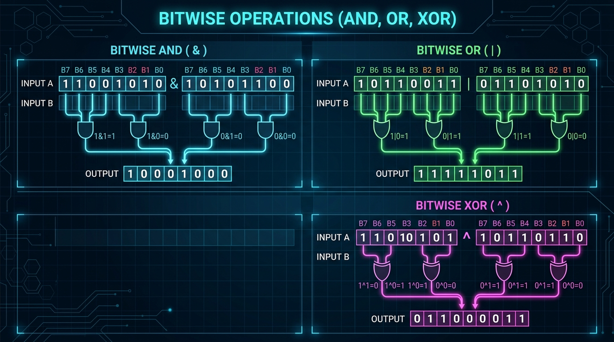

# Pattern 25: Bit Manipulation

<b>Pattern 12: Bitwise XOR</b> covered the one operator whose algebra is so nice that it solves problems on its own — cancelling duplicates, recovering a missing number, inverting a bit. This pattern is the rest of the toolbox: <b>AND</b>, <b>OR</b>, <b>NOT</b>, the three shift operators, and the handful of two-character idioms (`n & (n-1)`, `n & -n`) that turn "count the bits" or "enumerate every subset" from a loop over data into a loop over <i>bits</i>.

The mental model is simple: an integer is not a number, it is a <b>fixed-width array of booleans</b>. Once you accept that, a 32-bit integer becomes a free `Set` of up to 32 elements with `O(1)` union (`|`), intersection (`&`), difference (`& ~`), symmetric difference (`^`), and membership test (`& (1 << i)`). Most "bit manipulation" interview questions are really asking whether you can see that set hiding inside the integer.



|  Operator |  Name  |  Effect on each bit pair  |
|:---:|:---:|:---|
| `a & b` | AND | `1` only when <i>both</i> bits are `1` — used to <b>mask</b> / test |
| `a \| b` | OR | `1` when <i>either</i> bit is `1` — used to <b>set</b> |
| `a ^ b` | XOR | `1` when the bits <i>differ</i> — used to <b>toggle</b> (see Pattern 12) |
| `~a` | NOT | flips every bit; in two's complement `~a === -a - 1` |
| `a << k` | left shift | multiply by `2ᵏ`, zeros shifted in from the right |
| `a >> k` | <b>signed</b> right shift | divide by `2ᵏ`, <b>the sign bit is copied in</b> from the left |
| `a >>> k` | <b>unsigned</b> right shift | divide by `2ᵏ`, <b>zeros</b> shifted in from the left |

### The idiom cheat-sheet

These seven lines are worth memorising. Almost every problem below is one of them wrapped in a loop.

|  Goal  |  Expression  |  Why it works  |
|:---|:---:|:---|
| test the <i>i</i>-th bit | `(n >> i) & 1` | slide bit `i` down to position `0`, mask off everything else |
| set the <i>i</i>-th bit | `n \| (1 << i)` | OR with a mask that is `1` only at position `i` |
| clear the <i>i</i>-th bit | `n & ~(1 << i)` | AND with a mask that is `0` only at position `i` |
| toggle the <i>i</i>-th bit | `n ^ (1 << i)` | XOR with `1` flips, XOR with `0` preserves |
| <b>clear the lowest set bit</b> | `n & (n - 1)` | `n-1` flips the lowest `1` to `0` and every `0` below it to `1`; the AND wipes that whole tail |
| <b>isolate the lowest set bit</b> | `n & -n` | `-n === ~n + 1`, so `n` and `-n` agree on exactly one bit — the lowest set one |
| is `n` a power of two | `n > 0 && (n & (n-1)) === 0` | a power of two has exactly one set bit, so clearing it leaves `0` |

Take `n = 12` (`1100`) to see the two starred idioms concretely. `n - 1 = 11` (`1011`), so `12 & 11 = 1000 = 8` — the lowest `1` is gone. And `-12` is `…11110100`, so `12 & -12 = 0100 = 4` — the lowest `1`, alone.

```java
class Solution {
    public static int getBit(int n, int i) {
        return (n >> i) & 1;
    }

    public static int setBit(int n, int i) {
        return n | (1 << i);
    }

    public static int clearBit(int n, int i) {
        return n & ~(1 << i);
    }

    public static int toggleBit(int n, int i) {
        return n ^ (1 << i);
    }

    public static int clearLowestSetBit(int n) {
        return n & (n - 1);
    }

    public static int lowestSetBit(int n) {
        return n & -n;
    }

    public static void main(String[] args) {
        System.out.println(getBit(0b1010, 1));            //1
        System.out.println(getBit(0b1010, 2));            //0
        System.out.println(setBit(0b1010, 0));            //11    (1010 -> 1011)
        System.out.println(clearBit(0b1010, 3));          //2     (1010 -> 0010)
        System.out.println(toggleBit(0b1010, 1));         //8     (1010 -> 1000)
        System.out.println(clearLowestSetBit(0b1100));    //8     (1100 -> 1000)
        System.out.println(lowestSetBit(0b1100));         //4     (1100 -> 0100)
    }
}
```

### The JavaScript caveat you cannot skip

This is the single biggest source of wrong answers in this pattern, and it has nothing to do with the algorithms.

<b>Every bitwise operator in JavaScript coerces its operands to a signed 32-bit integer</b>, does the work, and returns a <b>signed</b> 32-bit integer — even though JS numbers are otherwise IEEE-754 doubles. That means:

1. <b>Bit 31 is the sign bit.</b> The moment a result has the high bit set, JavaScript reports it as a <i>negative</i> number. `1 << 31` is not `2147483648`, it is `-2147483648`.
2. <b>`~` is not "complement within `n` bits".</b> `~5` is `-6`, not `2`, because the complement is taken across all 32 bits.
3. <b>Anything above `2³²-1` is truncated.</b> `4294967296 | 0` is `0`; the low 32 bits are all that survive.
4. <b>Shift counts are taken mod 32.</b> `1 << 32` is `1`, not `0` — a genuinely nasty silent bug.
5. <b>`>>` sign-extends, `>>>` does not.</b> `-8 >> 1` is `-4` (arithmetic halving, sign preserved) but `-8 >>> 1` is `2147483644`. Crucially, `-1 >> 1` is `-1` <i>forever</i>, so `while (n !== 0) { n >>= 1 }` <b>never terminates</b> on a negative input. With `>>>` it always drains to `0` in at most 32 steps.

The fix is a reflex: when a problem says <b>unsigned</b> 32-bit integer, drive your loop with `>>>` and coerce the answer back with `>>> 0` before returning it. `x >>> 0` is the standard "reinterpret these 32 bits as unsigned" cast — it is the only bitwise operator in the language that yields a `Number` in `[0, 2³²-1]`.

```java
class Solution {
    public static void main(String[] args) {
        System.out.println(~5);                                  //-6            NOT is across all 32 bits
        System.out.println(1 << 31);                             //-2147483648   the high bit IS the sign bit
        System.out.println((1 << 31) & 0xFFFFFFFFL);             //2147483648    ...reinterpreted as unsigned using long
        System.out.println(-8 >> 1);                             //-4            signed shift copies the sign in
        System.out.println(-8 >>> 1);                            //2147483644    unsigned shift copies zeros in
        System.out.println(-1 >> 1);                             //-1            this is why `while (n != 0) n >>= 1` hangs
        System.out.println(-1 >>> 1);                            //2147483647    ...and why `>>>` is safe
        System.out.println((int) 2147483648L | 0);               //-2147483648   coerced to int32 on the way in
        System.out.println((int) 4294967296L | 0);               //0             everything above 32 bits is dropped
        System.out.println(1 << 32);                             //1             shift count is taken mod 32
        System.out.println(0xFFFFFFFF | 0);                      //-1
        System.out.println((0xFFFFFFFF | 0) & 0xFFFFFFFFL);      //4294967295    cast to unsigned long
    }
}
```

In Java the same problems use `int`/`long` and you reach for `>>>` for exactly the same reason; in C++ you would pick `unsigned int` and the whole issue evaporates. In JavaScript, <b>`>>>` and `>>> 0` are the escape hatch</b>, and the problems below will show you precisely where they are load-bearing.

## Number of 1 Bits (easy)
https://leetcode.com/problems/number-of-1-bits/

> Write a function that takes the binary representation of a positive integer and returns the number of set bits it has (also known as the <b>Hamming weight</b>).

The obvious approach is to walk all 32 positions, test the low bit, and shift. Note the `>>>=` — with `>>=` this loop would still read the right bits, but using the unsigned shift makes the intent explicit and keeps `num` a non-negative value we can reason about even when the input has the high bit set.

```java
class Solution {
    public static int hammingWeight(int n) {
        int count = 0;
        int num = n;

        for (int i = 0; i < 32; i++) {
            if ((num & 1) == 1) {
                count++;
            }
            //unsigned shift: zeros come in from the left, so this always drains to 0
            num >>>= 1;
        }
        return count;
    }

    public static void main(String[] args) {
        System.out.println(hammingWeight(11));                           //3    1011 has three set bits
        System.out.println(hammingWeight(128));                          //1    10000000 has one set bit
        System.out.println(hammingWeight((int) 2147483645L));            //30   0111...1101
        System.out.println(hammingWeight((int) 4294967293L));            //31   1111...1101, the high bit is set
    }
}
```

- The time complexity is `O(1)` — the loop is always exactly 32 iterations, since the word size is fixed.
- The space complexity is `O(1)`.

Now the trick. Recall from the cheat-sheet that `n & (n - 1)` <b>clears the lowest set bit</b> and leaves every other bit untouched. So if we keep applying it until the number is zero, the number of iterations <i>is</i> the number of set bits. This runs in `O(k)` where `k` is the popcount, not the word size — for a sparse number like `128` it is a single iteration instead of 32.

The `>>>= 0` after the AND is the JavaScript tax: `num & (num - 1)` returns a signed int32, so for an input like `4294967293` the intermediate value goes negative and the `while (num !== 0)` guard would still work, but `num - 1` on the next pass would be computed from a negative double. Re-normalising with `>>>= 0` keeps `num` in the unsigned range where the idiom actually holds.

```java
class Solution {
    public static int hammingWeight(int n) {
        int num = n;
        int count = 0;

        while (num != 0) {
            //n & (n-1) flips the lowest 1 to 0 and leaves everything above it alone
            num = num & (num - 1);
            count++;
        }
        return count;
    }

    public static void main(String[] args) {
        System.out.println(hammingWeight(11));                           //3
        System.out.println(hammingWeight(128));                          //1
        System.out.println(hammingWeight((int) 2147483645L));            //30
        System.out.println(hammingWeight((int) 4294967293L));            //31
        System.out.println(hammingWeight(0));                            //0
    }
}
```

- The time complexity is `O(k)` where `k` is the number of set bits, bounded by `32`.
- The space complexity is `O(1)`.

## Counting Bits (easy)
https://leetcode.com/problems/counting-bits/

> Given an integer `n`, return an array `ans` of length `n + 1` such that for each `i` (`0 <= i <= n`), `ans[i]` is the number of `1`'s in the binary representation of `i`.

You could call `hammingWeight` in a loop for `O(n log n)`, but the whole point of this problem is that the answer for `i` is <i>already in the table</i>. This is where bit manipulation meets <b>Dynamic Programming</b>: dropping the last bit of `i` gives a strictly smaller number we have already solved.

Write `i` in binary and split it into "everything except the last bit" plus "the last bit":

`popcount(i) = popcount(i >> 1) + (i & 1)`

`i >> 1` is `Math.floor(i / 2)`, which is always `< i` for `i >= 1`, so `result[i >> 1]` is filled in by the time we need it. `i & 1` is `1` for odd numbers and `0` for even ones. For example `popcount(5) = popcount(2) + 1 = 1 + 1 = 2`, and `popcount(6) = popcount(3) + 0 = 2`.

Here `>>` is perfectly safe: `i` runs from `1` to `n` and is never negative, so there is no sign bit to accidentally smear.

```java
import java.util.*;

class Solution {
    public static int[] countBits(int n) {
        //result[0] = 0 is the base case, and array initialization gives it to us for free
        int[] result = new int[n + 1];

        for (int i = 1; i <= n; i++) {
            //i >> 1 drops the last bit (and is always < i), (i & 1) adds it back
            result[i] = result[i >> 1] + (i & 1);
        }
        return result;
    }

    public static void main(String[] args) {
        System.out.println(Arrays.toString(countBits(2)));    //[ 0, 1, 1 ]
        System.out.println(Arrays.toString(countBits(5)));    //[ 0, 1, 1, 2, 1, 2 ]
        System.out.println(Arrays.toString(countBits(0)));    //[ 0 ]
        System.out.println(Arrays.toString(countBits(16)));   //[ 0, 1, 1, 2, 1, 2, 2, 3, 1, 2, 2, 3, 2, 3, 3, 4, 1 ]
    }
}
```

- The time complexity is `O(n)` — one constant-time lookup per number.
- The space complexity is `O(n)` for the output array. Excluding the output, the algorithm is `O(1)`.

There is a second recurrence worth knowing, built on the <b>lowest-set-bit</b> idiom instead of a shift: since `i & (i - 1)` removes exactly one set bit and produces a smaller number, `popcount(i) = popcount(i & (i - 1)) + 1`. Swapping the one line `result[i] = result[i >> 1] + (i & 1)` for `result[i] = result[i & (i - 1)] + 1` gives the identical output at the identical `O(n)` cost — pick whichever you can explain faster under pressure.

## Reverse Bits (easy)
https://leetcode.com/problems/reverse-bits/

> Reverse bits of a given <b>32 bits unsigned integer</b>.
>
> For example, the input `43261596` is `00000010100101000001111010011100` in binary; reversed it is `00111001011110000010100101000000`, which is `964176192`.

Algorithmically this is nothing: pull the low bit off the input, push it onto the top of the accumulator, repeat 32 times. `result = (result << 1) | (num & 1)` shifts what we have collected up by one and drops the new bit into the vacated position.

<b>This is the problem where the signed-32-bit caveat actually bites</b>, so it is worth being precise about where. There are two traps:

1. <b>Termination.</b> If you drive the loop with `while (num !== 0) { num >>= 1 }`, a value whose bit 31 is set becomes negative on coercion and `>>` sign-extends forever — `-1 >> 1` is `-1`. The loop never ends. Using a fixed `for (let i = 0; i < 32; i++)` with `num >>>= 1` sidesteps this entirely.
2. <b>The return value.</b> After 32 iterations `result` holds the correct 32 bits, but if bit 31 of the result is set, JavaScript hands it to you as a negative number. `reverseBits(1)` should be `2147483648`; without the cast you get `-2147483648` — <i>the same bits, the wrong number</i>. The final `>>> 0` reinterprets those bits as unsigned and fixes it.

```java
class Solution {
    public static int reverseBits(int n) {
        int result = 0;
        int num = n;

        for (int i = 0; i < 32; i++) {
            //shift what we have up, then drop the input's lowest bit into place
            result = (result << 1) | (num & 1);
            //>>> not >>, otherwise a negative num would sign-extend forever
            num >>>= 1;
        }
        return result;
    }

    public static void main(String[] args) {
        System.out.println(reverseBits(43261596));                   //964176192
        System.out.println(reverseBits((int) 4294967293L));          //-1073741825  input 1111...1101, high bit set both ways
        System.out.println(reverseBits(1));                          //-2147483648
        System.out.println(reverseBits((int) 2147483648L));          //1            the inverse of the line above
        System.out.println(reverseBits(0));                          //0
        System.out.println(reverseBits((int) 4294967295L));          //-1           all ones, reversed, still all ones
    }
}
```

- The time complexity is `O(1)` — always 32 iterations.
- The space complexity is `O(1)`.

To make the trap unmistakable, here is the same function with `>>` and no final cast. The <i>bits</i> it computes are correct; only the sign is wrong, which is exactly what makes this bug so easy to ship.

```java
class Solution {
    public static int reverseBitsBroken(int n) {
        int result = 0;
        int num = n;

        for (int i = 0; i < 32; i++) {
            result = (result << 1) | (num & 1);
            num >>= 1;
        }
        return result;
    }

    public static void main(String[] args) {
        System.out.println(reverseBitsBroken(43261596));                   //964176192     fine, bit 31 of the input is 0
        System.out.println(reverseBitsBroken(1));                          //-2147483648   Correct for Java int
        System.out.println(reverseBitsBroken((int) 4294967293L));          //-1            WRONG because >> smeared 1s
    }
}
```

### Divide and conquer in five swaps
If the interviewer asks for something better than 32 iterations, reverse by <b>swapping halves</b>: exchange the two 16-bit halves, then the bytes within each half, then the nibbles, then the pairs, then the individual bits. That is `log₂(32) = 5` steps, each a masked shift, with no loop at all. Every intermediate needs its own `>>> 0` because each `|` hands back a signed int32.

```java
class Solution {
    public static int reverseBits(int n) {
        int num = n;
        //swap 16-bit halves, then bytes, then nibbles, then pairs, then bits
        num = (num >>> 16) | (num << 16);
        num = ((num & 0xff00ff00) >>> 8) | ((num & 0x00ff00ff) << 8);
        num = ((num & 0xf0f0f0f0) >>> 4) | ((num & 0x0f0f0f0f) << 4);
        num = ((num & 0xcccccccc) >>> 2) | ((num & 0x33333333) << 2);
        num = ((num & 0xaaaaaaaa) >>> 1) | ((num & 0x55555555) << 1);
        return num;
    }

    public static void main(String[] args) {
        System.out.println(reverseBits(43261596));                   //964176192
        System.out.println(reverseBits((int) 4294967293L));          //-1073741825
        System.out.println(reverseBits(1));                          //-2147483648
        System.out.println(reverseBits((int) 2147483648L));          //1
    }
}
```

- The time complexity is `O(1)` with a much smaller constant — five steps instead of thirty-two.
- The space complexity is `O(1)`.

## Power of Two (easy)
https://leetcode.com/problems/power-of-two/

> Given an integer `n`, return `true` if it is a power of two. Otherwise, return `false`. An integer `n` is a power of two if there exists an integer `x` such that `n === 2ˣ`.

A power of two, in binary, is a single `1` followed by zeros: `1`, `10`, `100`, `1000`. So the question "is `n` a power of two" is really "does `n` have <b>exactly one</b> set bit". We already have an idiom that removes one set bit — `n & (n - 1)` — so if removing the lowest set bit leaves nothing, there was only one bit to begin with.

The `n <= 0` guard is not optional. `0` has zero set bits and `0 & -1 === 0`, so it would sneak through. Negative numbers are worse: `-2147483648` is `1000…0000`, a single set bit, and would also pass. Powers of two are positive by definition, so filter first and let the idiom handle the rest.

```java
class Solution {
    public static boolean isPowerOfTwo(int n) {
        //0 has no set bits, and negatives like -2147483648 have exactly one -- reject both
        if (n <= 0) {
            return false;
        }
        //exactly one set bit means clearing it leaves nothing
        return (n & (n - 1)) == 0;
    }

    public static void main(String[] args) {
        System.out.println(isPowerOfTwo(1));            //true    2^0
        System.out.println(isPowerOfTwo(16));           //true    2^4
        System.out.println(isPowerOfTwo(3));            //false   11 has two set bits
        System.out.println(isPowerOfTwo(0));            //false
        System.out.println(isPowerOfTwo(-16));          //false
        System.out.println(isPowerOfTwo(1073741824));   //true    2^30
        System.out.println(isPowerOfTwo(2147483647));   //false   0111...1111, 31 set bits
    }
}
```

- The time complexity is `O(1)`.
- The space complexity is `O(1)`.

The other idiom gives an equally short answer. `n & -n` <b>isolates</b> the lowest set bit, so if the lowest set bit <i>is</i> the whole number, there are no other bits.

```java
class Solution {
    public static boolean isPowerOfTwo(int n) {
        //n & -n isolates the lowest set bit; if that equals n, no other bits exist
        return n > 0 && (n & -n) == n;
    }

    public static void main(String[] args) {
        System.out.println(isPowerOfTwo(1));            //true
        System.out.println(isPowerOfTwo(16));           //true
        System.out.println(isPowerOfTwo(3));            //false
        System.out.println(isPowerOfTwo(0));            //false
        System.out.println(isPowerOfTwo(-16));          //false
        System.out.println(isPowerOfTwo(1073741824));   //true
    }
}
```

A related question the same idioms answer: <b>is `n` a power of four?</b> It must be a power of two <i>and</i> its single bit must sit at an even position, i.e. `(n & 0x55555555) !== 0`.

## Sum of Two Integers (medium)
https://leetcode.com/problems/sum-of-two-integers/

> Given two integers `a` and `b`, return the sum of the two integers without using the operators `+` and `-`.

This one is not a trick, it is a hardware simulation. When you add two bits you get a <b>sum</b> bit and a <b>carry</b> bit — that is a half adder, and both outputs are pure bitwise operations:

- <b>sum without carry:</b> `a ^ b`. XOR is `1` exactly when the bits differ, which is `0+1` or `1+0`. It is addition mod 2.
- <b>carry:</b> `(a & b) << 1`. A carry is generated only where <i>both</i> bits are `1`, and it lands in the <i>next</i> column, hence the shift.

So `a + b === (a ^ b) + ((a & b) << 1)`. That still has a `+`, but the right-hand term is strictly "smaller" in the sense that the carries keep migrating leftward and must eventually fall off the end of the word. So we <b>iterate</b>: keep XOR-ing the partial sum with the pending carry, recomputing the new carry each round, until there is no carry left.

Work through `a = 5` (`0101`), `b = 3` (`0011`):
1. `sum = 0101 ^ 0011 = 0110`, `carry = (0101 & 0011) << 1 = 0001 << 1 = 0010`
2. `sum = 0110 ^ 0010 = 0100`, `carry = (0110 & 0010) << 1 = 0010 << 1 = 0100`
3. `sum = 0100 ^ 0100 = 0000`, `carry = (0100 & 0100) << 1 = 1000`
4. `sum = 0000 ^ 1000 = 1000 = 8`, `carry = 0` — done.

<b>Negative operands need no special handling at all</b>, and this is the pleasant surprise: two's complement is designed precisely so that the same adder circuit works for signed and unsigned values. And JavaScript's habit of coercing to int32 — usually a nuisance — is exactly the 32-bit wrap-around we want here, so the carry that shifts off bit 31 is discarded for free. No `>>> 0` in this one: the problem is defined over <b>signed</b> 32-bit integers, so the signed result is the correct result.

```java
class Solution {
    public static int getSum(int a, int b) {
        int x = a;
        int y = b;

        while (y != 0) {
            //where both bits are 1 a carry is generated, and it belongs one column left
            int carry = (x & y) << 1;
            //XOR is addition without the carry
            x = x ^ y;
            //now add the carry in, which may generate carries of its own
            y = carry;
        }
        return x;
    }

    public static void main(String[] args) {
        System.out.println(getSum(1, 2));                        //3
        System.out.println(getSum(2, 3));                        //5
        System.out.println(getSum(-2, 3));                       //1
        System.out.println(getSum(-1, 1));                       //0
        System.out.println(getSum(-1, -1));                      //-2
        System.out.println(getSum(0, -5));                       //-5
        System.out.println(getSum(1000, 2000));                  //3000
        System.out.println(getSum(2147483647, -1));              //2147483646
        System.out.println(getSum(-2147483648, 1));              //-2147483647
        System.out.println(getSum(-2147483648, 2147483647));     //-1
        System.out.println(getSum(1073741824, 1073741823));      //2147483647   the largest int32
    }
}
```

- The time complexity is `O(1)` — each iteration pushes the carry at least one position left, so the loop runs at most 32 times.
- The space complexity is `O(1)`.

The recursive phrasing is the same recurrence with the loop unrolled by the call stack, and reads a little more like the maths.

```java
class Solution {
    public static int getSum(int a, int b) {
        //no carry left to distribute, so the partial sum IS the answer
        if (b == 0) {
            return a;
        }
        return getSum(a ^ b, (a & b) << 1);
    }

    public static void main(String[] args) {
        System.out.println(getSum(1, 2));               //3
        System.out.println(getSum(-2, 3));              //1
        System.out.println(getSum(-1, -1));             //-2
        System.out.println(getSum(2147483647, -1));     //2147483646
    }
}
```

Subtraction comes along for the ride, which is the natural follow-up question. In two's complement `-b === ~b + 1`, and we can compute that `+ 1` with `getSum` itself, so `a - b` is simply `getSum(a, getSum(~b, 1))`.

## Single Number II (medium)
https://leetcode.com/problems/single-number-ii/

> Given an integer array `nums` where every element appears <b>three times</b> except for one, which appears exactly once. Find the single element and return it. Your algorithm should run in linear time and use only constant extra space.

<b>Pattern 12</b> solved the `2x` version of this problem — <b>Single Number</b> — with a single XOR fold, because XOR of a value with itself is `0` and the pairs annihilate. That does not transfer here: `x ^ x ^ x === x`, so three copies leave one copy behind and every element survives. XOR counts modulo <b>2</b>, and we need to count modulo <b>3</b>.

The way out is to stop treating the integers as integers and go one bit-column at a time. Look at bit `i` across the whole array. Every element that appears three times contributes either `0` or `3` to that column's total. So `columnSum % 3` is `0` if the lone element has a `0` there and `1` if it has a `1` there. Do that for all 32 columns and you have reconstructed the answer bit by bit.

Negative inputs are allowed here, and this is where the signed-32-bit behaviour quietly saves us: when column `31` survives the modulo, `result |= (1 << 31)` sets the sign bit and the accumulator becomes negative — which is exactly the correct two's-complement value. No `>>> 0` here, or we would turn a legitimate `-4` into `4294967292`.

```java
class Solution {
    public static int singleNumber(int[] nums) {
        int result = 0;

        //rebuild the answer one bit-column at a time
        for (int i = 0; i < 32; i++) {
            int sum = 0;

            for (int num : nums) {
                sum += (num >> i) & 1;
            }

            //triples contribute 0 or 3 to this column, so a non-zero remainder
            //can only have come from the lone element
            if (sum % 3 != 0) {
                result |= (1 << i);
            }
        }
        //when i == 31 the line above sets the sign bit, which is what we want
        return result;
    }

    public static void main(String[] args) {
        System.out.println(singleNumber(new int[]{2, 2, 3, 2}));                                    //3
        System.out.println(singleNumber(new int[]{0, 1, 0, 1, 0, 1, 99}));                          //99
        System.out.println(singleNumber(new int[]{-2, -2, 1, 1, -3, 1, -3, -3, -4, -2}));           //-4
        System.out.println(singleNumber(new int[]{30000, 500, 100, 30000, 100, 30000, 100}));       //500
    }
}
```

- The time complexity is `O(32 * n)`, i.e. `O(n)`.
- The space complexity is `O(1)`.

### The two-mask trick
The bit-counting solution makes 32 passes. We can do it in one by building a <b>two-bit counter inside two integers</b>. Think of `ones` and `twos` as two parallel bit-planes: for each column, `(twos, ones)` encodes how many times we have seen a `1` there, mod 3 — `(0,0)` for zero, `(0,1)` for once, `(1,0)` for twice, and never `(1,1)`.

The update that maintains that invariant is remarkably compact:

````
ones = (ones ^ num) & ~twos
twos = (twos ^ num) & ~ones
````

`ones ^ num` toggles the "seen once" plane, and `& ~twos` suppresses any column that has already reached two. The second line does the same for the "seen twice" plane — and because `ones` has <i>already</i> been updated on the line above, `& ~ones` is what forces the count from two back to zero on the third sighting instead of to three. After the fold, every column that reached three has been reset to `(0,0)`, so `ones` holds precisely the lone element. Order matters: swap those two lines and the counter breaks.

```java
class Solution {
    public static int singleNumber(int[] nums) {
        //(twos, ones) is a per-column counter mod 3: 00 -> 01 -> 10 -> 00
        int ones = 0;
        int twos = 0;

        for (int num : nums) {
            ones = (ones ^ num) & ~twos;
            twos = (twos ^ num) & ~ones;
        }
        //columns that hit three were reset, so what's left appeared exactly once
        return ones;
    }

    public static void main(String[] args) {
        System.out.println(singleNumber(new int[]{2, 2, 3, 2}));                                //3
        System.out.println(singleNumber(new int[]{0, 1, 0, 1, 0, 1, 99}));                      //99
        System.out.println(singleNumber(new int[]{-2, -2, 1, 1, -3, 1, -3, -3, -4, -2}));       //-4
        System.out.println(singleNumber(new int[]{30000, 500, 100, 30000, 100, 30000, 100}));   //500
    }
}
```

- The time complexity is `O(n)` — a single pass with a handful of constant-time operations.
- The space complexity is `O(1)`, and unlike the previous version it is genuinely one pass.

<i>The same construction generalises: to find the element appearing once when all others appear `k` times, you need `ceil(log₂ k)` mask variables. Pattern 12's XOR fold is just the `k = 2` case, where one mask suffices.</i>

## Bitwise AND of Numbers Range (medium)
https://leetcode.com/problems/bitwise-and-of-numbers-range/

> Given two integers `left` and `right` that represent the range `[left, right]`, return the bitwise AND of all numbers in this range, inclusive.

The naive loop is `O(right - left)`, which for `left = 1, right = 2147483647` is hopeless. The insight is about what AND-ing a long run of consecutive integers can possibly leave behind.

A bit in the answer survives only if it is `1` in <i>every</i> number of the range. Consider bit `i`. As you count upward, bit `i` flips every `2ⁱ` steps — so unless the range is short enough that the flip never happens, that bit is guaranteed to be `0` somewhere and the AND kills it. The only bits that can survive are the ones where `left` and `right` <b>already agree and never flipped</b>: the <b>common binary prefix</b> of `left` and `right`. Everything below the first position where they differ becomes `0`.

Take `left = 5` (`101`) and `right = 7` (`111`). The common prefix is `1`, then they diverge. So the answer is `1` followed by two zeros: `100 = 4`. Check it: `5 & 6 & 7 = 4`. And for `left = 1, right = 2147483647` there is no common prefix at all, so the answer is `0`.

Finding the prefix is mechanical: shift both operands right until they are equal, counting the shifts, then shift the surviving prefix back into place.

```java
class Solution {
    public static int rangeBitwiseAnd(int left, int right) {
        int shift = 0;
        int low = left;
        int high = right;

        //shift off the differing suffix until only the common prefix remains
        while (low != high) {
            low >>>= 1;
            high >>>= 1;
            shift++;
        }
        //put the prefix back where it belongs, zeros filling the suffix
        return low << shift;
    }

    public static void main(String[] args) {
        System.out.println(rangeBitwiseAnd(5, 7));                    //4            101 & 110 & 111
        System.out.println(rangeBitwiseAnd(0, 0));                    //0
        System.out.println(rangeBitwiseAnd(1, 2147483647));           //0            no common prefix
        System.out.println(rangeBitwiseAnd(2147483646, 2147483647));  //2147483646   they differ only in bit 0
        System.out.println(rangeBitwiseAnd(12, 15));                  //12           1100 is the common prefix
        System.out.println(rangeBitwiseAnd(600000000, 2147483645));   //0
    }
}
```

- The time complexity is `O(1)` — at most 32 shifts, independent of how wide the range is.
- The space complexity is `O(1)`.

The `n & (n-1)` idiom gives a slicker version of the same idea. Repeatedly clearing the lowest set bit of `right` walks it down toward `left`; the moment it is no longer greater than `left`, every bit that could have flipped inside the range has been cleared and what remains is the common prefix.

```java
class Solution {
    public static int rangeBitwiseAnd(int left, int right) {
        int high = right;

        //keep dropping the lowest set bit until we no longer overshoot `left`
        while (high > left) {
            high = high & (high - 1);
        }
        return high;
    }

    public static void main(String[] args) {
        System.out.println(rangeBitwiseAnd(5, 7));                    //4
        System.out.println(rangeBitwiseAnd(0, 0));                    //0
        System.out.println(rangeBitwiseAnd(1, 2147483647));           //0
        System.out.println(rangeBitwiseAnd(2147483646, 2147483647));  //2147483646
        System.out.println(rangeBitwiseAnd(12, 15));                  //12
        System.out.println(rangeBitwiseAnd(600000000, 2147483645));   //0
    }
}
```

- The time complexity is `O(1)` — the loop runs at most once per set bit in `right`, so at most 32 times.
- The space complexity is `O(1)`.

## Subsets (medium)
https://leetcode.com/problems/subsets/

> Given an integer array `nums` of unique elements, return all possible subsets (the <b>power set</b>). The solution set must not contain duplicate subsets.

<b>Pattern 10: Subsets</b> solved this with a BFS that starts from `[[]]` and doubles the collection for each new element. Here is the bit-manipulation alternative, and it is worth knowing because it replaces the doubling bookkeeping with plain counting.

The observation: building a subset means making `n` independent yes/no decisions — is `nums[i]` in or out? An `n`-bit integer <i>is</i> a vector of `n` yes/no decisions. So the integers `0` to `2ⁿ - 1` enumerate every possible subset exactly once, with no duplicates and no recursion. Bit `i` of the mask means "include `nums[i]`".

For `nums = [1, 5, 3]` the correspondence is total:

|  mask  |  binary  |  subset  |
|:---:|:---:|:---|
| 0 | `000` | `[]` |
| 1 | `001` | `[1]` |
| 2 | `010` | `[5]` |
| 3 | `011` | `[1,5]` |
| 4 | `100` | `[3]` |
| 5 | `101` | `[1,3]` |
| 6 | `110` | `[5,3]` |
| 7 | `111` | `[1,5,3]` |

`1 << n` is the elegant way to write `2ⁿ`, and `(mask & (1 << i)) !== 0` is the membership test from the cheat-sheet. One caution rooted in the caveat above: because shifts operate on 32-bit integers, `1 << n` only behaves for `n <= 30`. That is not a real restriction — `2³⁰` subsets would never fit in memory anyway — but if you ever needed more you would have to reach for `BigInt`.

```java
import java.util.*;

class Solution {
    public static List<List<Integer>> findSubsets(int[] nums) {
        int n = nums.length;
        //1 << n is 2^n, the number of subsets
        int total = 1 << n;
        List<List<Integer>> subsets = new ArrayList<>();

        for (int mask = 0; mask < total; mask++) {
            List<Integer> subset = new ArrayList<>();

            for (int i = 0; i < n; i++) {
                //bit i of the mask says "include nums[i]"
                if ((mask & (1 << i)) != 0) {
                    subset.add(nums[i]);
                }
            }
            subsets.add(subset);
        }
        return subsets;
    }

    public static void main(String[] args) {
        System.out.println(findSubsets(new int[]{1, 3}));
        //[[], [1], [3], [1, 3]]
        System.out.println(findSubsets(new int[]{1, 5, 3}));
        //[[], [1], [5], [1, 5], [3], [1, 3], [5, 3], [1, 5, 3]]
        System.out.println(findSubsets(new int[]{}));
        //[[]]
        System.out.println(findSubsets(new int[]{1, 2, 3, 4, 5}).size());
        //32
    }
}
```

- There are `O(2ᴺ)` masks and the inner loop is `O(N)` per mask, so the time complexity is `O(N*2ᴺ)` — the same as the BFS approach in <b>Pattern 10</b>.
- The space complexity is `O(N*2ᴺ)` for the output. The notable difference from Pattern 10 is that this version needs <b>no auxiliary state at all</b> beyond the loop counter, whereas BFS keeps the growing collection around as it builds.

### Skipping straight to the set bits
The inner loop above tests all `n` positions even for a sparse mask like `100000`. Combining the two starred idioms lets us visit <i>only</i> the set bits: `bits & -bits` isolates the lowest one, and `bits & (bits - 1)` clears it so the next iteration finds the following one. This is the standard way to iterate a bitmask-as-a-set, and it shows up constantly in bitmask DP.

```java
import java.util.*;

class Solution {
    public static List<List<Integer>> findSubsets(int[] nums) {
        int n = nums.length;
        int total = 1 << n;
        List<List<Integer>> subsets = new ArrayList<>();

        for (int mask = 0; mask < total; mask++) {
            List<Integer> subset = new ArrayList<>();
            int bits = mask;

            while (bits != 0) {
                //isolate the lowest set bit, turn it back into an index
                int lowest = bits & -bits;
                // Integer.numberOfTrailingZeros(lowest) gets the index
                subset.add(nums[Integer.numberOfTrailingZeros(lowest)]);
                //clear it and move on to the next set bit
                bits = bits & (bits - 1);
            }
            subsets.add(subset);
        }
        return subsets;
    }

    public static void main(String[] args) {
        System.out.println(findSubsets(new int[]{1, 5, 3}));
        //[[], [1], [5], [1, 5], [3], [1, 3], [5, 3], [1, 5, 3]]
        System.out.println(findSubsets(new int[]{1, 3}));
        //[[], [1], [3], [1, 3]]
    }
}
```

- The time complexity is still `O(N*2ᴺ)` in the worst case, but the total work is now proportional to the sum of the subset <i>sizes</i> rather than `N` per mask.
- The space complexity is `O(N*2ᴺ)` for the output.

<i>Note that this enumeration relies on the input having distinct elements, exactly like Pattern 10's basic version. For</i> <b>Subsets With Duplicates</b> <i>the mask approach needs the same sort-and-skip guard, and the BFS formulation in Pattern 10 handles it more cleanly.</i>

### How this pattern connects to the others
- <b>Pattern 12: Bitwise XOR</b> is the specialised sibling — reach for it whenever the problem smells like cancellation (duplicates, a missing value, a complement).
- <b>Pattern 10: Subsets</b> and <b>Pattern 15: 0-1 Knapsack</b> both become bitmask problems once the state you need to remember is "which of these `n` items did I take". A mask makes that state a single integer, which is what makes <b>bitmask DP</b> (`dp[mask]`) possible at all.
- <b>Pattern 11: Modified Binary Search</b> uses `mid = start + ((end - start) >> 1)` for exactly the reason discussed above: `>> 1` is an integer halving that cannot overflow the way `(start + end) / 2` can.

###### #BitManipulation #Bitwise #JavaScript #GrokkingTheCodingInterviewPatterns #LeetCode #DataStructures #Algorithms
