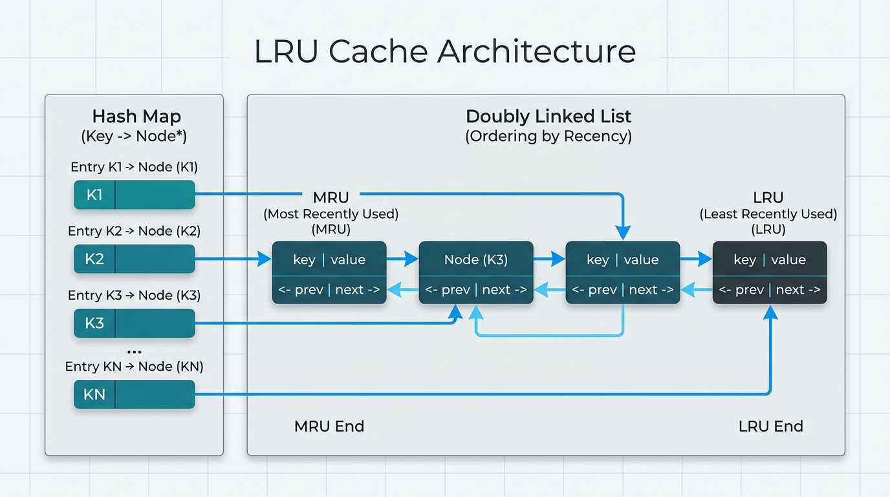

# Pattern 26: Data Structure Design

Most patterns in this collection answer the question <i>"what is the fastest way to compute this answer?"</i> <b>Data Structure Design</b> problems ask something different. You are not handed an input and asked for an output; you are handed an <b>API</b> — a list of method names — and told what each one has to <b>cost</b>. The constraint is never <i>"solve it"</i>, it is <i>"solve it in `O(1)` per operation"</i>. That target complexity <b>is</b> the problem.

This changes how you think. In an algorithm question you pick a data structure and then look for the trick. In a design question you work <b>backwards from the required complexity</b> to the structures that could possibly deliver it. If a problem demands `O(1)` lookup, a <b>hash map</b> is involved, because nothing else does `O(1)` lookup by key. If it also demands `O(1)` removal from the middle, a <b>doubly linked list</b> is involved, because arrays cannot delete from the middle in constant time. The design is not invented, it is deduced.

And here is the craft of the pattern. Almost no single structure hits every requirement on its own — each is fast at some things and hopeless at others:

- A <b>HashMap</b> gives `O(1)` lookup by key, but has no notion of <b>order</b> — it cannot tell you which entry was touched least recently.
- A <b>doubly linked list</b> gives `O(1)` insertion and `O(1)` removal of a node you are already holding, and maintains a strict order — but finding a node inside it takes `O(N)`.

Individually neither can implement an <b>LRU cache</b>. Together they can, in `O(1)`: keep the entries in a doubly linked list ordered by recency, and keep a hash map from `key` to <i>the list node holding that key</i>. The map's weakness (no order) is covered by the list; the list's weakness (no lookup) is covered by the map. That reciprocal arrangement — <b>two structures, each patching the other's hole</b> — is the whole pattern, and once you see it you will see it in every problem below.



You have met the idea already, in milder form. <b>[Pattern 09: Two Heaps](./✅%20%20Pattern%2009:%20Two%20Heaps.md)</b> combines a <b>Max Heap</b> and a <b>Min Heap</b> so the median of a stream sits at the boundary between them — neither heap can find the median, the pair can in `O(1)`. And <b>[Pattern 13: Top 'K' Elements](./✅%20Pattern%2013:%20Top%20'K'%20Elements.md)</b> ends with <i>Frequency Stack</i>, which pairs a <b>frequency map</b> with a <b>stack of stacks</b>. Both are really design problems in disguise; this pattern makes the disguise explicit.

### ❗ NOTE

Three habits that make these problems go smoothly in an interview:

1. <b>Restate the target complexity before writing anything.</b> "Every operation must be `O(1)` average" tells you which structures are even candidates.
2. <b>Use sentinel (dummy) nodes</b> in any linked list you hand-roll, and <b>store the node, not the value</b>, in your hash map. Almost all buggy linked-list code in interviews is a missing null check that a sentinel would have made impossible.
3. <b>Know what your language gives you free.</b> In <i>JavaScript</i>, a <b>[Map](https://developer.mozilla.org/en-US/docs/Web/JavaScript/Reference/Global_Objects/Map)</b> iterates in <b>insertion order</b> and can `delete` then re-`set` a key in `O(1)`, which quietly makes it an ordered hash map. Worth showing your interviewer that you know both the shortcut and the machinery it hides.

## Min Stack (easy)

https://leetcode.com/problems/min-stack/

> Design a stack that supports `push`, `pop`, `top`, and retrieving the minimum element, all in constant time.
>
> Implement the `MinStack` class:
>
> 1. `MinStack()` initializes the stack object.
> 2. `push(val)` pushes the element `val` onto the stack.
> 3. `pop()` removes the element on the top of the stack.
> 4. `top()` gets the top element of the stack.
> 5. `getMin()` retrieves the minimum element in the stack.
>
> Every operation must run in `O(1)` time.

The warm-up, and it teaches the pattern's core move in miniature.

A plain array already gives `O(1)` `push`, `pop` and `top`. The only method that does not fit is `getMin()`, which would cost `O(N)` if we scanned. So the whole design question is: <i>how do we make the minimum available in `O(1)`?</i>

The tempting answer is a single `min` variable. That works for `push` — a new minimum is just `Math.min(min, val)` — but it breaks on `pop`. If we pop the current minimum, the previous one is gone and we cannot recover it short of rescanning.

The fix is to notice that a stack's minimum is a <b>history</b>, not a single value, and that history has exactly the same shape as the stack itself. So we <b>carry the running minimum alongside each entry</b>. Pushing `val` also records what the minimum is at that moment; popping discards that entry's minimum with it, and the new top already knows the minimum of everything beneath it. This is the pattern in its simplest form: store a <b>pair</b> per slot, where the second half answers the query the first half cannot.

```java
import java.util.*;

class MinStack {
    private static class Node {
        int val;
        int min;
        Node(int val, int min) {
            this.val = val;
            this.min = min;
        }
    }
    
    //every entry carries the running minimum of the stack
    //at the moment that entry was pushed
    private Deque<Node> stack;

    public MinStack() {
        stack = new ArrayDeque<>();
    }

    public void push(int val) {
        int currentMin = stack.isEmpty() ? val : Math.min(val, getMin());
        stack.push(new Node(val, currentMin));
    }

    public void pop() {
        stack.pop();
    }

    public int top() {
        return stack.peek().val;
    }

    public int getMin() {
        //the top entry always knows the min of everything beneath it
        return stack.peek().min;
    }
}

class Solution {
    public static void main(String[] args) {
        // Input  ["MinStack","push","push","push","getMin","pop","top","getMin"]
        //        [[],[-2],[0],[-3],[],[],[],[]]
        // Output [null,null,null,null,-3,null,0,-2]

        MinStack minStack = new MinStack();
        minStack.push(-2);
        minStack.push(0);
        minStack.push(-3);
        System.out.println(minStack.getMin());
        //-3
        minStack.pop();
        System.out.println(minStack.top());
        //0
        System.out.println(minStack.getMin());
        //-2

        //duplicates are safe, because each copy of '2' recorded its own minimum
        MinStack stackOfDuplicates = new MinStack();
        stackOfDuplicates.push(2);
        stackOfDuplicates.push(2);
        stackOfDuplicates.push(5);
        System.out.println(stackOfDuplicates.getMin());
        //2
        stackOfDuplicates.pop();
        stackOfDuplicates.pop();
        System.out.println(stackOfDuplicates.getMin());
        //2
    }
}
```

- `push(val)` ➡️ `O(1)`. One `Math.min` and one array push.
- `pop()` ➡️ `O(1)`. `top()` ➡️ `O(1)`.
- `getMin()` ➡️ `O(1)`. We read a value we already computed, we never scan.
- <b>Space</b> ➡️ `O(N)`. Two numbers per element instead of one, still linear.

<b>Note:</b> a common variation keeps a second, parallel "min stack" and only pushes onto it when the incoming value is `<=` the current minimum. That saves space on average, but the `<=` (rather than `<`) is a classic off-by-one trap with duplicates. The paired version above cannot get that wrong.

## Design HashMap (medium)

https://leetcode.com/problems/design-hashmap/

> Design a HashMap without using any built-in hash table libraries.
>
> Implement the `MyHashMap` class:
>
> 1. `MyHashMap()` initializes the object with an empty map.
> 2. `put(key, value)` inserts a `(key, value)` pair. If the `key` already exists, update the corresponding `value`.
> 3. `get(key)` returns the `value` to which `key` is mapped, or `-1` if no mapping exists.
> 4. `remove(key)` removes the `key` and its value if the mapping exists.
>
> All operations should be `O(1)` on average.

Every other problem here <i>uses</i> a hash map. This one asks you to build the thing, which is worth doing once so the `O(1)` you keep claiming stops being magic.

An array gives `O(1)` access <b>by index</b>; a map needs `O(1)` access <b>by key</b>. The bridge is a <b>hash function</b> — a cheap deterministic function turning a key into an array index. For integer keys, `key % size` is enough.

But a hash function squeezes a large key space into a small array, so two keys will sometimes land on the same index. That is a <b>collision</b>, and handling it is the real design decision. The approach here is <b>separate chaining</b>: each slot — a <b>bucket</b> — holds a small list of every `[key, value]` pair that hashed to it. To `get`, we hash to the bucket in `O(1)` and walk that short list.

Again the two structures cover for each other: the array supplies `O(1)` indexing but cannot hold two things in one slot; the per-bucket list supplies unbounded storage but no fast indexing. The complexity is `O(1)` <i>on average</i> precisely because a good hash keeps chains short — with `N` keys over `B` buckets the average chain is `N/B`. A <b>prime</b> bucket count helps, since real inputs often share factors with round numbers like `1000` and would clump.

```java
import java.util.*;

class MyHashMap {
    //a prime bucket count spreads key % size more evenly
    private int size;
    private List<int[]>[] buckets;

    @SuppressWarnings("unchecked")
    public MyHashMap() {
        this.size = 1009;
        this.buckets = new List[size];
    }

    private int hash(int key) {
        return key % this.size;
    }

    public void put(int key, int value) {
        int index = hash(key);
        if (buckets[index] == null) {
            buckets[index] = new ArrayList<>();
        }

        List<int[]> bucket = buckets[index];
        for (int[] pair : bucket) {
            //key already in this chain, overwrite in place
            if (pair[0] == key) {
                pair[1] = value;
                return;
            }
        }
        bucket.add(new int[]{key, value});
    }

    public int get(int key) {
        List<int[]> bucket = buckets[hash(key)];
        if (bucket == null) return -1;

        for (int[] pair : bucket) {
            if (pair[0] == key) return pair[1];
        }
        return -1;
    }

    public void remove(int key) {
        List<int[]> bucket = buckets[hash(key)];
        if (bucket == null) return;

        for (int i = 0; i < bucket.size(); i++) {
            if (bucket.get(i)[0] == key) {
                bucket.remove(i);
                return;
            }
        }
    }
}

class Solution {
    public static void main(String[] args) {
        // Input  ["MyHashMap", "put", "put", "get", "get", "put", "get", "remove", "get"]
        //        [[], [1, 1], [2, 2], [1], [3], [2, 1], [2], [2], [2]]
        // Output [null, null, null, 1, -1, null, 1, null, -1]
        
        MyHashMap myHashMap = new MyHashMap();
        myHashMap.put(1, 1);
        myHashMap.put(2, 2);
        System.out.println(myHashMap.get(1));
        //1
        System.out.println(myHashMap.get(3));
        //-1
        myHashMap.put(2, 1);
        System.out.println(myHashMap.get(2));
        //1
        myHashMap.remove(2);
        System.out.println(myHashMap.get(2));
        //-1

        //two keys that collide into the same bucket: 5 and 5 + 1009
        MyHashMap collisionMap = new MyHashMap();
        collisionMap.put(5, 500);
        collisionMap.put(1014, 1400);
        System.out.println(collisionMap.get(5));
        //500
        System.out.println(collisionMap.get(1014));
        //1400
        collisionMap.remove(5);
        System.out.println(collisionMap.get(5));
        //-1
        //removing one key from a shared bucket leaves its chain-mate intact
        System.out.println(collisionMap.get(1014));
        //1400
    }
}
```

- `put(key, value)` ➡️ `O(1)` average, `O(N/B)` to walk the chain. Worst case `O(N)` if every key collides.
- `get(key)` ➡️ `O(1)` average, same reasoning. `remove(key)` ➡️ `O(1)` average.
- <b>Space</b> ➡️ `O(B + N)`, where `B` is the bucket count and `N` the stored keys.

<b>Note:</b> a production hash map also <b>resizes</b> — when `N/B` passes a load factor of roughly `0.75` it allocates a bigger bucket array and rehashes everything. That is `O(N)`, but because it happens rarely the <b>amortized</b> cost per `put` stays `O(1)`. Mentioning resizing and load factor is usually what separates a passing answer from a strong one here.

## Insert Delete GetRandom O(1) (medium)

https://leetcode.com/problems/insert-delete-getrandom-o1/

> Implement the `RandomizedSet` class:
>
> 1. `RandomizedSet()` initializes the object.
> 2. `insert(val)` inserts `val` if not present. Returns `true` if the item was not present, `false` otherwise.
> 3. `remove(val)` removes `val` if present. Returns `true` if the item was present, `false` otherwise.
> 4. `getRandom()` returns a random element from the current set. Each element must have the <b>same probability</b> of being returned.
>
> Each function must work in average `O(1)` time complexity.

A beautiful illustration of the pattern, because the two requirements look flatly incompatible.

`getRandom()` with uniform probability essentially forces an <b>array</b>: to pick uniformly you generate a random index and jump to it, and only a contiguous array indexes in `O(1)`. A hash map cannot do this — there is no way to ask it for "the 4th element" in constant time.

But an array cannot `insert` or `remove` a <b>value</b> in `O(1)`. Finding it costs `O(N)`, and even once found, `splice`-ing it out costs `O(N)` because everything after it shifts down.

So: array for `getRandom`, hash map for membership. We keep `values`, an array of the elements, and `indices`, a `Map` from each value to <b>its current position inside `values`</b>.

`insert` appends and records the new index. The clever part is `remove`, and it turns on one observation: <b>the set is unordered, so we are free to rearrange it.</b> Deleting from the middle of an array is expensive only because we insist on preserving order — and we do not have to. So instead of shifting, we <b>overwrite the hole with the last element and pop the tail</b>. Popping the last slot is `O(1)`, and the only bookkeeping is updating `indices` for the element we moved.

Note the ordering of the final lines: we `indices.set(lastValue, index)` <b>before</b> `indices.delete(val)`. If `val` happens to <i>be</i> the last element those two calls touch the same key, and this order lets the `delete` correctly have the last word. Reversing them leaves a stale index behind — exactly the kind of one-line bug this pattern is full of.

```java
import java.util.*;

class RandomizedSet {
    //values gives us O(1) indexing for getRandom()
    List<Integer> values;
    //indices maps value -> its position in this.values
    Map<Integer, Integer> indices;
    Random rand;

    public RandomizedSet() {
        values = new ArrayList<>();
        indices = new HashMap<>();
        rand = new Random();
    }

    public boolean insert(int val) {
        if (indices.containsKey(val)) return false;

        indices.put(val, values.size());
        values.add(val);
        return true;
    }

    public boolean remove(int val) {
        if (!indices.containsKey(val)) return false;

        int index = indices.get(val);
        int lastValue = values.get(values.size() - 1);

        //overwrite the hole with the last value, then pop the tail
        values.set(index, lastValue);
        indices.put(lastValue, index);

        values.remove(values.size() - 1);
        indices.remove(val);
        return true;
    }

    public int getRandom() {
        int randomIndex = rand.nextInt(values.size());
        return values.get(randomIndex);
    }
}

class Solution {
    public static void main(String[] args) {
        // Input  ["RandomizedSet", "insert", "remove", "insert", "getRandom", "remove", "insert", "getRandom"]
        //        [[], [1], [2], [2], [], [1], [2], []]
        // Output [null, true, false, true, 2, true, false, 2]

        RandomizedSet randomizedSet = new RandomizedSet();
        System.out.println(randomizedSet.insert(1));
        //true
        System.out.println(randomizedSet.remove(2));
        //false
        System.out.println(randomizedSet.insert(2));
        //true
        System.out.println(randomizedSet.remove(1));
        //true
        System.out.println(randomizedSet.insert(2));
        //false
        //the set is now {2}, so getRandom() can only ever return 2

        //getRandom() is random by definition, so assert membership, never a fixed value
        RandomizedSet set = new RandomizedSet();
        set.insert(10);
        set.insert(20);
        set.insert(30);
        set.remove(20);

        List<Integer> allowed = Arrays.asList(10, 30);
        boolean everyDrawIsAMember = true;
        for (int i = 0; i < 1000; i++) {
            if (!allowed.contains(set.getRandom())) everyDrawIsAMember = false;
        }
        System.out.println(everyDrawIsAMember);
        //true
        //removing 20 swapped 30 into its slot, so the array stays gap-free
        Collections.sort(set.values);
        System.out.println(set.values);
        //[ 10, 30 ]
    }
}
```

- `insert(val)` ➡️ `O(1)` average. One map write, one array push.
- `remove(val)` ➡️ `O(1)` average. Swap-with-last plus a `pop`, never a shift.
- `getRandom()` ➡️ `O(1)`. One index into the array.
- <b>Space</b> ➡️ `O(N)`. Each element is stored twice, once in the array and once as a map key.

## LRU Cache (medium)

https://leetcode.com/problems/lru-cache/

> Design a data structure that follows the constraints of a <b>Least Recently Used (LRU) cache</b>.
>
> Implement the `LRUCache` class:
>
> 1. `LRUCache(capacity)` initializes the cache with <b>positive</b> size `capacity`.
> 2. `get(key)` returns the value of the `key` if it exists, otherwise `-1`.
> 3. `put(key, value)` updates the value of the `key` if it exists. Otherwise adds the pair. If the number of keys exceeds `capacity`, <b>evict the least recently used key</b>.
>
> The functions `get` and `put` must each run in `O(1)` average time complexity.

The centrepiece of the pattern, probably the single most-asked design question in interviews, and the cleanest demonstration of two structures covering for one another.

Work backwards from the three requirements:

1. <b>Look up a key in `O(1)`.</b> Only a hash map does that.
2. <b>Know which key was used least recently, in `O(1)`.</b> A hash map has no order at all, so it cannot. We need something maintaining a recency ordering, where the "oldest" end is immediately reachable.
3. <b>Move an arbitrary key to the "most recent" position in `O(1)`.</b> This is the killer. A `get` counts as a use, so on every read some entry in the middle of the ordering must jump to the front. An array or a singly linked list cannot, because removing from the middle needs either shifting or a walk to find the predecessor.

Requirement 3 is what forces a <b>doubly linked list</b>: if a node knows both its `prev` and `next`, unlinking it is two pointer assignments — no traversal, `O(1)`. Requirement 1 is what forces the hash map. Neither can do this alone, but if the map stores `key -> the list node itself`, a `get` becomes: hash to the node `O(1)`, unlink it `O(1)`, relink it at the front `O(1)`.

We orient the list so `head.next` is the <b>most</b> recently used and `tail.prev` the <b>least</b>. Eviction is then just "remove `tail.prev`".

### Sentinel head and tail

The detail that decides whether this code works is the <b>sentinel nodes</b>. `this.head` and `this.tail` are permanent dummies holding no data, never removed. Because they always exist, `removeNode` can write `node.prev.next = node.next` with no null check at all — `node.prev` is guaranteed to exist even for the first real node, because its `prev` is the sentinel head.

Without sentinels you need branches for "list is empty", "node is the head", "node is the tail", and "node is both", and one of those four is where the bug will be. Two dummy nodes delete all four cases.

The order of the four pointer writes in `addToFront` also matters:

<pre>
before:   head &lt;-&gt; A &lt;-&gt; tail          (inserting new node N)

1. N.next = head.next                  N -&gt; A
2. N.prev = head                       N -&gt; head
3. head.next.prev = N                  A -&gt; N   (A's prev was head, now N)
4. head.next = N                       head -&gt; N

after:    head &lt;-&gt; N &lt;-&gt; A &lt;-&gt; tail
</pre>

Step 3 <b>must</b> precede step 4. Overwrite `head.next` first and you lose the reference to `A`, so step 3 would point `N.prev` back at `N` itself, silently corrupting the list. This is exactly where these solutions break.

```java
class DoublyLinkedNode {
    int key;
    int value;
    DoublyLinkedNode prev;
    DoublyLinkedNode next;

    public DoublyLinkedNode(int key, int value) {
        this.key = key;
        this.value = value;
        this.prev = null;
        this.next = null;
    }
}

class LRUCache {
    int capacity;
    //key -> node, so lookup is O(1)
    java.util.Map<Integer, DoublyLinkedNode> map;
    //sentinel head/tail so no insert or remove is ever a special case
    //head.next is the most recently used, tail.prev is the least
    DoublyLinkedNode head;
    DoublyLinkedNode tail;

    public LRUCache(int capacity) {
        this.capacity = capacity;
        this.map = new java.util.HashMap<>();
        this.head = new DoublyLinkedNode(-1, -1);
        this.tail = new DoublyLinkedNode(-1, -1);
        this.head.next = this.tail;
        this.tail.prev = this.head;
    }

    private void removeNode(DoublyLinkedNode node) {
        node.prev.next = node.next;
        node.next.prev = node.prev;
        node.prev = null;
        node.next = null;
    }

    private void addToFront(DoublyLinkedNode node) {
        node.next = this.head.next;
        node.prev = this.head;
        this.head.next.prev = node;
        this.head.next = node;
    }

    public int get(int key) {
        if (!this.map.containsKey(key)) return -1;

        DoublyLinkedNode node = this.map.get(key);
        //a read counts as a use, so move it back to the front
        this.removeNode(node);
        this.addToFront(node);
        return node.value;
    }

    public void put(int key, int value) {
        if (this.map.containsKey(key)) {
            DoublyLinkedNode node = this.map.get(key);
            node.value = value;
            this.removeNode(node);
            this.addToFront(node);
            return;
        }

        if (this.map.size() == this.capacity) {
            //evict from the tail, the least recently used end
            DoublyLinkedNode leastRecentlyUsed = this.tail.prev;
            this.removeNode(leastRecentlyUsed);
            //we need the node's own key to evict it from the map,
            //which is why every node stores its key alongside its value
            this.map.remove(leastRecentlyUsed.key);
        }

        DoublyLinkedNode node = new DoublyLinkedNode(key, value);
        this.map.put(key, node);
        this.addToFront(node);
    }

    //not part of the interview answer, just to inspect the list order
    public java.util.List<String> toArray() {
        java.util.List<String> order = new java.util.ArrayList<>();
        for (DoublyLinkedNode n = this.head.next; n != this.tail; n = n.next) {
            order.add(n.key + "=" + n.value);
        }
        return order;
    }
}

class Solution {
    public static void main(String[] args) {
        // Input  ["LRUCache", "put", "put", "get", "put", "get", "put", "get", "get", "get"]
        //        [[2], [1, 1], [2, 2], [1], [3, 3], [2], [4, 4], [1], [3], [4]]
        // Output [null, null, null, 1, null, -1, null, -1, 3, 4]

        LRUCache lruCache = new LRUCache(2);
        lruCache.put(1, 1);
        lruCache.put(2, 2);
        //cache is {1=1, 2=2}
        System.out.println(lruCache.get(1));
        //1
        //reading 1 makes it most recent, so 2 is now the eviction candidate
        lruCache.put(3, 3);
        //capacity reached, evicts key 2 -> cache is {1=1, 3=3}
        //3 is freshly inserted, so 1 is the next candidate
        System.out.println(lruCache.get(2));
        //-1
        lruCache.put(4, 4);
        //capacity reached, evicts key 1 -> cache is {3=3, 4=4}
        System.out.println(lruCache.get(1));
        //-1
        System.out.println(lruCache.get(3));
        //3
        System.out.println(lruCache.get(4));
        //4

        //most recent first: we read 3 then 4, so 4 sits at the front
        System.out.println(lruCache.toArray());
        //[ '4=4', '3=3' ]
    }
}
```

Note the small design decision inside `put`: each node stores its own `key`, not just its `value`. It looks redundant, since we reached the node <i>through</i> the key. But on eviction we start from the <b>list</b> — we grab `tail.prev` — and then have to delete that entry from the <b>map</b>. Without the `key` on the node there is no way to do that in `O(1)`. This is the second structure needing a back-reference into the first, and forgetting it is the most common reason an otherwise correct LRU fails.

- `get(key)` ➡️ `O(1)` average. One map lookup plus a constant number of pointer writes.
- `put(key, value)` ➡️ `O(1)` average. Same, plus at most one eviction, itself `O(1)`.
- <b>Space</b> ➡️ `O(capacity)`. The map and the list hold at most `capacity` entries between them, never more.

### A shorter approach using Java's `LinkedHashMap`

The verbose version above is what an interviewer usually wants, because it shows you know <i>why</i> a doubly linked list is required. But <i>Java</i> hands you most of that machinery for free.

A <b>`LinkedHashMap`</b> is not just a hash table — it <b>preserves access order</b> when configured, and automatically maintains an internal doubly linked list. That is precisely the "move to most recent" operation we built the list for. By passing `accessOrder = true` to its constructor and overriding `removeEldestEntry`, a `LinkedHashMap` manages the LRU logic internally. 

The cache collapses to a dozen lines. 

```java
import java.util.LinkedHashMap;
import java.util.Map;

class LRUCache {
    int capacity;
    LinkedHashMap<Integer, Integer> map;

    public LRUCache(int capacity) {
        this.capacity = capacity;
        // LinkedHashMap with accessOrder = true iterates in least-recently-accessed order
        this.map = new LinkedHashMap<Integer, Integer>(capacity, 0.75f, true) {
            @Override
            protected boolean removeEldestEntry(Map.Entry<Integer, Integer> eldest) {
                return size() > capacity;
            }
        };
    }

    public int get(int key) {
        return map.getOrDefault(key, -1);
    }

    public void put(int key, int value) {
        map.put(key, value);
    }
}

class Solution {
    public static void main(String[] args) {
        //the same official sequence, for the same expected output
        //[null, null, null, 1, null, -1, null, -1, 3, 4]
        
        LRUCache lruCache = new LRUCache(2);
        lruCache.put(1, 1);
        lruCache.put(2, 2);
        System.out.println(lruCache.get(1));
        //1
        lruCache.put(3, 3);
        System.out.println(lruCache.get(2));
        //-1
        lruCache.put(4, 4);
        System.out.println(lruCache.get(1));
        //-1
        System.out.println(lruCache.get(3));
        //3
        System.out.println(lruCache.get(4));
        //4

        //oldest first here, the mirror image of the linked-list version's order
        System.out.println(lruCache.map);
        //{ 3=3, 4=4 }
    }
}
```

- `get(key)` ➡️ `O(1)`. Internally it updates the linked list.
- `put(key, value)` ➡️ `O(1)`.
- <b>Space</b> ➡️ `O(capacity)`.

<b>Note:</b> You should still mention how the underlying linked list handles the ordering so the interviewer knows you understand the data structure.

## Time Based Key-Value Store (medium)

https://leetcode.com/problems/time-based-key-value-store/

> Design a time-based key-value data structure that can store multiple values for the same key at different timestamps, and retrieve the key's value at a certain timestamp.
>
> Implement the `TimeMap` class:
>
> 1. `TimeMap()` initializes the object.
> 2. `set(key, value, timestamp)` stores the key `key` with the value `value` at the given time `timestamp`.
> 3. `get(key, timestamp)` returns a value such that `set` was called previously with `timestamp_prev <= timestamp`. If there are multiple such values, it returns the one with the <b>largest</b> `timestamp_prev`. If there are none, it returns `""`.
>
> All the timestamps of `set` are strictly increasing.

Here the structures being combined are a <b>hash map</b> and a <b>sorted array searched by binary search</b> — and the interesting part is which requirement forces which.

The `key` dimension is easy: both operations are keyed by an exact string, so a hash map handles it in `O(1)`. The `timestamp` dimension is different. We are not asked for an exact match but for the <b>largest timestamp that does not exceed</b> the one requested. That is a <i>predecessor</i> query, and hash maps are useless for it — hashing destroys ordering, so you cannot ask a hash map "what is the nearest key below this one?"

Predecessor queries want <b>sorted order</b>, and sorted order wants <b>binary search</b>. So the design is a hash map whose <i>values</i> are sorted arrays: `key -> [[timestamp, value], ...]`.

And now the problem's last line stops looking like trivia and starts looking like a gift. <i>"All the timestamps of `set` are strictly increasing."</i> That means each key's array is <b>already sorted</b> simply by appending — we never sort and never insert into the middle. `set` stays `O(1)`, and `get` gets a sorted array to search for free.

The search itself is the <b>floor / upper-bound</b> variant from <b>[Pattern 11: Modified Binary Search](./✅%20%20Pattern%2011:%20Modified%20Binary%20Search.md)</b>, not a plain equality search — the exact `timestamp` may never have been `set` at all. The idiom: whenever `entries[mid][0] <= timestamp`, record that entry as a <b>candidate</b> and keep searching <b>right</b> for a later one; otherwise discard the right half. When the loop ends the last candidate is the answer. Because `result` starts as `""`, the "no valid value" case needs no extra handling — if every timestamp was too large we simply never recorded a candidate.

```java
import java.util.*;

class TimeMap {
    static class Pair {
        int timestamp;
        String value;
        Pair(int timestamp, String value) {
            this.timestamp = timestamp;
            this.value = value;
        }
    }

    //key -> array of [timestamp, value], kept sorted because
    //the problem guarantees strictly increasing timestamps per key
    Map<String, List<Pair>> store;

    public TimeMap() {
        store = new HashMap<>();
    }

    public void set(String key, String value, int timestamp) {
        if (!store.containsKey(key)) {
            store.put(key, new ArrayList<>());
        }
        store.get(key).add(new Pair(timestamp, value));
    }

    public String get(String key, int timestamp) {
        List<Pair> entries = store.get(key);
        if (entries == null) return "";

        //binary search for the rightmost entry with timestamp_prev <= timestamp
        int start = 0;
        int end = entries.size() - 1;
        String result = "";

        while (start <= end) {
            int mid = start + (end - start) / 2;

            if (entries.get(mid).timestamp <= timestamp) {
                //candidate answer, but keep looking right for a later one
                result = entries.get(mid).value;
                start = mid + 1;
            } else {
                end = mid - 1;
            }
        }

        return result;
    }
}

class Solution {
    public static void main(String[] args) {
        // Input  ["TimeMap", "set", "get", "get", "set", "get", "get"]
        //        [[], ["foo", "bar", 1], ["foo", 1], ["foo", 3], ["foo", "bar2", 4], ["foo", 4], ["foo", 5]]
        // Output [null, null, "bar", "bar", null, "bar2", "bar2"]

        TimeMap timeMap = new TimeMap();
        timeMap.set("foo", "bar", 1);
        System.out.println(timeMap.get("foo", 1));
        //bar
        //nothing was set at 3, so we fall back to the latest value at or before it
        System.out.println(timeMap.get("foo", 3));
        //bar
        timeMap.set("foo", "bar2", 4);
        System.out.println(timeMap.get("foo", 4));
        //bar2
        System.out.println(timeMap.get("foo", 5));
        //bar2

        //no value was set at or before the requested timestamp
        System.out.println("\"" + timeMap.get("foo", 0) + "\"");
        //""
        //the key was never set at all
        System.out.println("\"" + timeMap.get("missing", 10) + "\"");
        //""
    }
}
```

- `set(key, value, timestamp)` ➡️ `O(1)`. One map lookup and one array push, because the guaranteed increasing timestamps mean appending keeps the array sorted.
- `get(key, timestamp)` ➡️ `O(logM)`, where `M` is the number of values under that one key. The key lookup is `O(1)`; the `logM` is the binary search.
- <b>Space</b> ➡️ `O(N)`, where `N` is the total number of `set` calls across all keys.

<b>Note:</b> if timestamps were <b>not</b> guaranteed to arrive in increasing order this design would have to change. `set` would need to binary search for the insertion point and `splice` the entry in, making it `O(M)` because of the shifting — or you would reach for a balanced <b>BST</b> / skip list to get `O(logM)` on both. Saying that out loud shows you noticed the guarantee was doing real work.

## LFU Cache (hard)

https://leetcode.com/problems/lfu-cache/

> Design and implement a data structure for a <b>Least Frequently Used (LFU) cache</b>.
>
> Implement the `LFUCache` class:
>
> 1. `LFUCache(capacity)` initializes the object with the `capacity` of the data structure.
> 2. `get(key)` gets the value of the `key` if it exists, otherwise returns `-1`.
> 3. `put(key, value)` updates the value of the `key` if present, or inserts it if not. When the cache reaches `capacity`, it must invalidate and remove the <b>least frequently used</b> key before inserting a new item. When there is a <b>tie</b> (two or more keys with the same frequency), the <b>least recently used</b> key is invalidated.
> 4. The functions `get` and `put` must each run in `O(1)` average time complexity.

The hard payoff, and the same idea one level deeper.

An LRU cache orders entries along one dimension: recency. LFU needs <b>two</b>. The primary key is <b>frequency</b> (evict the least-used), and the tiebreaker is <b>recency</b> (among equally-used keys, evict the stalest). And `O(1)` rules out the obvious approaches immediately: you cannot scan for the minimum frequency, and you cannot keep entries in a heap ordered by frequency, because a heap update is `O(logN)`.

The insight is to handle the two dimensions with two <b>separate</b> mechanisms rather than one clever comparator:

- Group entries into <b>frequency buckets</b>. Bucket `f` holds every key used exactly `f` times.
- Inside each bucket, keep the keys in an <b>LRU list</b> — the very doubly linked list from the previous problem, most recent at the front.

Now eviction is `O(1)` in both dimensions at once: go to the bucket with the smallest frequency and remove that bucket's <b>tail</b>. The bucket choice handles "least frequently used"; the tail-of-list handles the recency tiebreak. <i>An LFU cache is a hash map of LRU caches.</i>

So we hold three things: `nodes`, a `Map` from key to node for `O(1)` lookup; `freqLists`, a `Map` from a frequency to the linked list of nodes at that frequency; and `minFreq`, the smallest frequency currently present.

### Why `minFreq++` is enough

Maintaining `minFreq` looks like it should be hard, and why it is not is what makes the whole thing `O(1)`. Only two events can change the minimum frequency:

1. <b>A brand new key is inserted.</b> Its frequency is `1`, the smallest possible, so `minFreq = 1` unconditionally.
2. <b>An existing key is used</b>, moving from bucket `f` to `f + 1`. This can only <i>raise</i> the minimum, and only if that key was the last one in bucket `f` <b>and</b> `f` was the minimum. In that case the new minimum is exactly `f + 1`, because the node we just promoted now lives there — so bucket `f + 1` is guaranteed non-empty.

That second case is the crucial one: the minimum can never jump by more than one, so we never search for it and a single `minFreq++` is always correct. Note also that we never delete empty buckets — an empty list is harmless, and skipping the cleanup keeps every operation constant-time. Eviction never needs to touch `minFreq` either, since we immediately insert a new node at frequency `1` afterwards and reset it.

```java
class LFUNode {
    int key;
    int value;
    int freq;
    LFUNode prev;
    LFUNode next;

    public LFUNode(int key, int value) {
        this.key = key;
        this.value = value;
        this.freq = 1;
        this.prev = null;
        this.next = null;
    }
}

//one LRU list per frequency bucket, front = most recently used
class LFUList {
    LFUNode head;
    LFUNode tail;
    int size;

    public LFUList() {
        this.head = new LFUNode(-1, -1);
        this.tail = new LFUNode(-1, -1);
        this.head.next = this.tail;
        this.tail.prev = this.head;
        this.size = 0;
    }

    public void addToFront(LFUNode node) {
        node.next = this.head.next;
        node.prev = this.head;
        this.head.next.prev = node;
        this.head.next = node;
        this.size++;
    }

    public void removeNode(LFUNode node) {
        node.prev.next = node.next;
        node.next.prev = node.prev;
        node.prev = null;
        node.next = null;
        this.size--;
    }

    public LFUNode removeLeastRecent() {
        if (this.size == 0) return null;
        LFUNode node = this.tail.prev;
        this.removeNode(node);
        return node;
    }

    public boolean isEmpty() {
        return this.size == 0;
    }
}

class LFUCache {
    int capacity;
    //key -> node
    java.util.Map<Integer, LFUNode> nodes;
    //frequency -> LFUList of every node with that frequency
    java.util.Map<Integer, LFUList> freqLists;
    //smallest frequency currently present, so eviction is O(1)
    int minFreq;

    public LFUCache(int capacity) {
        this.capacity = capacity;
        this.nodes = new java.util.HashMap<>();
        this.freqLists = new java.util.HashMap<>();
        this.minFreq = 0;
    }

    //promote a node from its bucket into the next one up
    private void touch(LFUNode node) {
        LFUList currentList = this.freqLists.get(node.freq);
        currentList.removeNode(node);

        //if we just emptied the minimum bucket, the new minimum is one higher
        if (currentList.isEmpty() && this.minFreq == node.freq) {
            this.minFreq++;
        }

        node.freq++;
        if (!this.freqLists.containsKey(node.freq)) {
            this.freqLists.put(node.freq, new LFUList());
        }
        this.freqLists.get(node.freq).addToFront(node);
    }

    public int get(int key) {
        if (!this.nodes.containsKey(key)) return -1;

        LFUNode node = this.nodes.get(key);
        this.touch(node);
        return node.value;
    }

    public void put(int key, int value) {
        if (this.capacity == 0) return;

        if (this.nodes.containsKey(key)) {
            LFUNode node = this.nodes.get(key);
            node.value = value;
            //an overwrite counts as a use, just like a read does
            this.touch(node);
            return;
        }

        if (this.nodes.size() == this.capacity) {
            //evict the least recently used node inside the least frequent bucket
            LFUList leastFrequentList = this.freqLists.get(this.minFreq);
            LFUNode evicted = leastFrequentList.removeLeastRecent();
            this.nodes.remove(evicted.key);
        }

        LFUNode node = new LFUNode(key, value);
        this.nodes.put(key, node);
        if (!this.freqLists.containsKey(1)) {
            this.freqLists.put(1, new LFUList());
        }
        this.freqLists.get(1).addToFront(node);
        //a brand new node always has frequency 1
        this.minFreq = 1;
    }

    //not part of the interview answer, just to inspect the buckets
    public java.util.Map<Integer, java.util.List<String>> toBuckets() {
        java.util.Map<Integer, java.util.List<String>> snapshot = new java.util.HashMap<>();
        for (java.util.Map.Entry<Integer, LFUList> entry : this.freqLists.entrySet()) {
            java.util.List<String> order = new java.util.ArrayList<>();
            LFUList list = entry.getValue();
            for (LFUNode n = list.head.next; n != list.tail; n = n.next) {
                order.add(n.key + "=" + n.value);
            }
            if (!order.isEmpty()) {
                snapshot.put(entry.getKey(), order);
            }
        }
        return snapshot;
    }
}

class Solution {
    public static void main(String[] args) {
        // Input  ["LFUCache", "put", "put", "get", "put", "get", "get", "put", "get", "get", "get"]
        //        [[2], [1, 1], [2, 2], [1], [3, 3], [2], [3], [4, 4], [1], [3], [4]]
        // Output [null, null, null, 1, null, -1, 3, null, -1, 3, 4]

        LFUCache lfuCache = new LFUCache(2);
        lfuCache.put(1, 1);
        lfuCache.put(2, 2);
        //bucket 1 holds [2, 1], minFreq is 1
        System.out.println(lfuCache.get(1));
        //1
        //key 1 moves up: bucket 1 holds [2], bucket 2 holds [1]
        lfuCache.put(3, 3);
        //full, so evict from bucket 1 -> key 2 goes
        //bucket 1 holds [3], bucket 2 holds [1], minFreq is 1
        System.out.println(lfuCache.get(2));
        //-1
        System.out.println(lfuCache.get(3));
        //3
        //bucket 1 is now empty and was the min, so minFreq becomes 2
        //bucket 2 holds [3, 1]
        lfuCache.put(4, 4);
        //full, so evict from bucket 2. Keys 1 and 3 tie on frequency,
        //and 1 is the least recently used of the two, so key 1 goes
        //bucket 1 holds [4], bucket 2 holds [3], minFreq is 1
        System.out.println(lfuCache.get(1));
        //-1
        System.out.println(lfuCache.get(3));
        //3
        System.out.println(lfuCache.get(4));
        //4

        //key 4 used twice, key 3 three times; empty bucket 1 is left in place
        System.out.println(lfuCache.toBuckets());
        //{ 2=[ 4=4 ], 3=[ 3=3 ] }
        System.out.println(lfuCache.minFreq);
        //2
    }
}
```

The `put(4, 4)` step is the one that actually tests the design, so it is worth pausing on. At that moment keys `1` and `3` both sit at frequency `2` — the frequency dimension cannot separate them. The tiebreak comes entirely from their order <i>inside</i> bucket 2, which reads `[3, 1]` because `3` was read more recently. Taking the list's tail therefore evicts `1`, exactly as specified. A design tracking frequency alone would be free to evict either, and would fail this test roughly half the time.

- `get(key)` ➡️ `O(1)` average. One map lookup, then `touch` does a constant number of pointer writes across two buckets.
- `put(key, value)` ➡️ `O(1)` average. Either a `touch`, or an eviction (`O(1)` — go to `minFreq`, take the tail) plus an insert at the front of bucket `1`.
- <b>Space</b> ➡️ `O(capacity)`. At most `capacity` nodes; the empty buckets left behind add at most `O(capacity)` more, since a bucket is only created when a node lands in it.

<b>Note:</b> the `this.capacity === 0` guard in `put` is not decoration. LeetCode's tests include a zero-capacity cache, and without it the code would try to evict from a bucket that does not exist and throw. Design problems tend to hide their edge cases in the constructor arguments rather than in the data.

###### #Design #DataStructureDesign #JavaScript #GrokkingTheCodingInterviewPatterns #LeetCode #DataStructures #Algorithms
